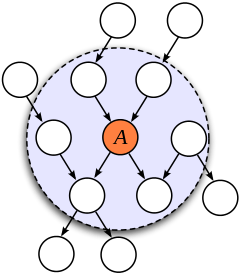
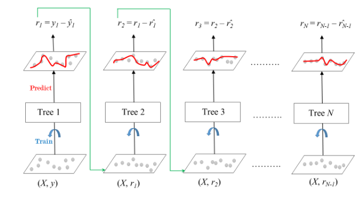

```{r setup, include=FALSE}
knitr::opts_chunk$set(echo = TRUE,
                      engine.path = list(dot='/opt/homebrew/bin/dot'))
library(twang)
library(reshape2)
```


\newcommand{\indep}{\perp \!\!\! \perp}
\newcommand{\nindep}{\not\!\perp \!\!\! \perp}

## Association vs Causation


- Question: What is causation?  Why is it important? (text)

$$\\[0.5in]$$

- Are the following causal questions or association questions?


- Question: Which cancer treatments are best for which patients?
  - A. Causal
  - B. Association
  - C. Not sure

$$\\[0.5in]$$

- Question: Are people who take daily vitamin C less likely to get sick?
  - A. Causal
  - B. Association
  - C. Not sure

$$\\[0.5in]$$

- Question: Will a national gun law result in fewer homicides?
  - A. Causal
  - B. Association
  - C. Not sure

$$\\[0.5in]$$

- Question: Does increasing minimum wage reduce job openings?
  - A. Causal
  - B. Association
  - C. Not sure

$$\\[0.5in]$$

- Historically, there has been a lot of writing about what causation is


- Causation in statistics: Will changing $X$ also change $Y$?


- Association: Does knowing $X$ help to predict $Y$?


- If $X$ causes $Y$, then $X\not\perp Y$ ($X$ and $Y$ are associated)


- But, the converse is not true: it is possible for $X\not\perp Y$ but $X$ and $Y$ do not cause each other


## Simpson's paradox

- How can statistics be misleading on causation?


- New infectious disease with high mortality rate


- Scientists develop an experimental treatment and give it to doctors to try out


```{r simpson paradox, echo=FALSE}
set.seed(1234)
size <- 1000
symptoms <- sample(c(0,1), size, replace = TRUE)
treatment <- rbinom(size, 1, 0.3 + 0.4*symptoms)
mortality <- rbinom(size, 1, 0.15 + 0.3*symptoms - 0.1*treatment)

symptoms <- ifelse(symptoms==1, 'severe', 'mild')
treatment <- ifelse(treatment==1, 'experimental', 'placebo')
mortality <- ifelse(mortality==1, 'died', 'alive')

df <- data.frame(treatment, symptoms, mortality)[sample(size),]
head(df, 20)
table(df$treatment)
table(df$symptoms)
table(df$mortality)
```

- The mortality rate for each group is below:
```{r mortalityTreatment}
table(df$treatment, df$mortality)[,2]/table(df$treatment)
```

- The death rate is higher in the experimental treatment group than the placebo group


- Question: Can we conclude that the experimental drug in not effective?
  - A. Yes
  - B. No
  - C. Not sure

$$\\[0.5in]$$


- Taking a closer look, we stratify death rate by symptom severity:

```{r stratified}
table(df$treatment, df$symptoms, df$mortality)[,,2]/table(df$treatment, df$symptoms)
```

- Someone with severe symptoms is much more likely to die than someone with mild symptoms


- But, in both groups, the experimental treatment was associated with fewer deaths


- Question: What might this indicate? (select all that apply)
  - A. Mortality is greater with severe disease
  - B. The treatment is effective
  - C. Treatment type and severity are associated
  - D. None of the above

$$\\[0.5in]$$


- Let's check if treatment type and severity are associated 

```{r treatment}
table(df$treatment, df$symptoms)
chisq.test(df$treatment, df$symptoms)
```

- Those with severe symptoms were more likely to be on the experimental treatment


- Timing matters here!  Was severity taken before or after treatment?


- Neither scenario below is conclusive from the data, but knowing the time ordering can help rule one out

```{dot benefit, out.width = "30%", echo=FALSE}
digraph G {
  Severity -> Treatment [ label = "?"];
  Treatment -> Severity [ label = "?"];
  Severity -> Mortality
  Treatment -> Mortality [constraint=false]
}
```


## Confounding

- Example: Sleeping with shoes on is associated with waking up with a headache


- Example: Yellow teeth and cancer are confounded by smoking


- [Confounding](https://en.wikipedia.org/wiki/Confounding): $X$ and $Y$ are confounded if they are both influenced by a third variable


- Example from last section: Assume that severity was taken before treatment was given

```{dot benefit2, out.width = "30%", echo=FALSE}
digraph G {
  Severity -> Treatment
  Severity -> Mortality
  Treatment -> Mortality [constraint=false]
}
```

- There are two "open" paths from treatment to mortality:
  - treatment $\leftarrow$ severity $\rightarrow$ mortality
  - treatment $\rightarrow$ mortality


- Looking at the total association between treatment and mortality (without severity) will use include assocations from both paths


- Controlling for severity "blocks" the `treatment <- severity -> mortality` pathway


- We're left with the direct causal path `treatment -> mortality`

### Confounding Simulations

```{dot confounding1, out.width = "30%", echo=FALSE}
digraph G {
  C -> X [ label = "2"];
  C -> Y [ label = "3"]
}
```

- Diagram above: `A` and `B` are confounded by `C` and have no direct causal relationship


- $X = 2C + \epsilon_X \Rightarrow C = 0.5X + 0.5\epsilon_X$, so $Y = 0.5 \cdot 3X + \text{noise}$

```{r confounding1r}
size <- 500
C <- 10*runif(size)
X <- 2*C + rnorm(size)
Y <- 3*C + rnorm(size)

summary(lm(Y~X))
summary(lm(Y~X+C))
```

```{dot confounding2, out.width = "30%", echo=FALSE}
digraph G {
  C -> X [ label = "2"];
  C -> Y [ label = "3"];
  X -> Y [ label = "5", constraint=false]
}
```

- Diagram above: `X` influences `Y` but the effect is confounded by `Z`.  That is, failing to account for `Z` in a regression will lead to an incorrect causal parameter estimate


- parameter = (counfounding bias) + (causal effect) = 1.5 + 5 = 6.5

```{r confounding2r}
Y <- 3*C + 5*X + rnorm(size)

summary(lm(Y~X))
summary(lm(Y~X+C))
```

- Note: the covariate causal effect math only works here because the simulated data is linear. In the real world, we typically can't assume linearity.  This math doesn't work without if the true data aren't linear.

- In most real-world datasets, there will always be the possibility of latent confounding

## Sampling Bias

- [Sampling Bias](https://en.wikipedia.org/wiki/Sampling_bias) occurs when sample is collected in such a way that some members of the intended population have a lower or higher sampling probability than others.


- Sampling bias can lead to incorrect estimates when variables of interest influence sampling


- Example: In 1936, the American Literary Digest sent out two million surveys to its readers and predicted that Alf Landon would beat incumbent president, Franklin Roosevelt, by a landslide, but the opposite happened.  This was because readers over-represented Republicans.


- [Example](https://catalogofbias.org/biases/collider-bias/): A researcher analysed data from 257 hospitalized individuals and detected an association between locomotor disease and respiratory disease (odds ratio 4.06).  The researcher repeated the analysis in a sample of 2783 individuals from the general population and found no association (odds ratio 1.06)

```{r sampleBias}
size <- 100
locomotor <- 10*runif(size)
respiratory <- 10*runif(size)
hospitalized <- rbinom(size, 1, (locomotor+respiratory)/20)==0
df_all <- data.frame(locomotor, respiratory, hospitalized)
library(ggplot2)
ggplot(df_all[hospitalized==TRUE,], aes(respiratory, locomotor)) + geom_point() + 
  geom_smooth(method = lm, se = FALSE)
```

```{r noSampBias}
ggplot(df_all, aes(respiratory, locomotor)) + geom_point(aes(color=hospitalized)) +
  stat_smooth(method=lm, se=FALSE)
```

- Sampling bias is an example of collider bias


- Here we are conditioning on hospitalization


- Even though locomotor and respiratory are independent, conditioning on a collider induces an association


- Conditioning on a collider "open" an association pathway

```{dot sampleCollider, out.width = "30%", echo=FALSE}
digraph G {
  locomotor -> hospitalized
  respiratory -> hospitalized
  hospitalized -> Sampling
}
```

### Statistical Dependency and Causation

- If $A$ and $B$ are random variables and associated (dependent) $A\not\perp B$, it's thought that there are 3 ways this can happen
  - Direct causation: 
  ```{dot, out.width = "10%", echo=FALSE}
digraph G {
  A -> B
}
  ``` 
  OR
  ```{dot, out.width = "10%", echo=FALSE}
digraph G {
  B -> A
}
  ```
  - $A$ and $B$ are unmeasured confounding:
  ```{dot, out.width = "20%", echo=FALSE}
digraph G {
  Confounder -> A
  Confounder -> B
}
  ```
  - Collider bias: $A$ and $B$ both influence sampling
  ```{dot, out.width = "20%", echo=FALSE}
digraph G {
  A -> Sampling
  B -> Sampling
}
  ```
  
  - If we only have data for $A$ and $B$, we cannot distinguish between these case without more assumptions


- If there are more variables, we figure out more using conditional independence
  - Thinking about if knowing one variable gives information another
  - Variables: Drank too much alcohol last night, Woke up with a hangover, Woke up with shoes on
  
  ```{dot, out.width = "30%", echo=FALSE}
digraph G {
  Alcohol -> Hangover
  Alcohol -> Shoes
}
  ```
  
  - Hangover$\perp$Shoes?
  - Hangover$\perp$Shoes$|$Alcohol?
    - Given that someone drank too much alcohol last night, does knowing that they woke up with their shoes on give any information about if they have a hangover?
    
  - Variables: Burglary, Earthquake, Home motion detector
  
  ```{dot, out.width = "30%", echo=FALSE}
digraph G {
  Burglary -> Detector
  Earthquake -> Detector
}
  ```

    - Burglary$\perp$Earthquake 
    - Burglary$\perp$Earthquake$|$Detector?
      - Given that the home motion detector alerted, does knowing that there was no earthquake give any information about a burglary?

| Structure | Path type | $A,C$ independent/dependent?  | $A,C$ conditionally independent/dependent given $B$ |
| --- | --- | --- | --- |
| Chain | $A \rightarrow B \rightarrow C$  | $A\not\perp C$ | $A\perp C|B$ |
| Other Chain | $A \leftarrow B \leftarrow C$ | $A\not\perp C$  | $A\perp C|B$ |
| Fork (Confounder) | $A \leftarrow B \rightarrow C$ |  $A\not\perp C$ |  $A\perp C|B$ |
| Collider | $A \rightarrow B \leftarrow C$ | $A\perp C$ | $A\not\perp C|B$ |


## GLMs, Causal Inference, and Prediction

- The goals for GLM inference models and causal inference models are similar in practice:
  - control for variables to approximate the causal influence of variables of interest
  - **if model assumptions are satisfied (linearity, no latent confounding, etc)**, standard GLMs will give causal parameter estimates
  - in this case, causal inference models *should* give similar parameter estimates to GLM estimates
  

```{dot regressionConfMany, out.width = "40%", echo=FALSE}
digraph G {
  C1 -> X;
  C1 -> Y;
  C2 -> X;
  C2 -> Y;
  C3 -> X;
  C3 -> Y;
  X -> Y [constraint=false];
  X -> D1;
  Y -> D1;
  X -> D2;
  Y -> D2;
  X -> D3;
  Y -> D3;
}
```

Question: If I want to use inference (causal or otherwise) to quantify the effect of $X$ on $Y$, which regression model should I use?

- A: Y ~ X
- B: Y ~ X + C1 + C2 + C3 + D1 + D2 + D3
- C: Y ~ X + C1 + C2 + C3
- D: Y ~ C1 + C2 + C3
-  E: Y ~ X + D1 + D2 + D3

$$\\[0.5in]$$

- For GLMs and causal inference, should **only** control for variables that can *cause* our outcome


- For GLMs and causal inference, **should not** control for variables that are caused by the outcome (this can lead to collider bias)

#### Causal Inference

- If we do not control for *all* confounding variables, any association between $X$ and $Y$ present through the confounder pathway (red in image below) will likely be included in the parameter quantified by a model
- In *any* inference, we want to quantify the true causal parameter
  - Causal inference models make this easier by relaxing some assumptions
    
```{dot regressionConf, out.width = "40%", echo=FALSE}
digraph G {
  Confounders -> X [color="red"];
  Confounders -> Y [color="red"];
  X -> Y [ label = "True Causal Parameter", constraint=false]
}
```
    
- Assumption of linear relationships within the data are likely not true (or at least hard to verify)
- Causal inference models make it possible to control for confounding variables in a non-linear setting
- Goal: Estimate a causal parameter of interest (when there are not linear relationships)
  - Causal parameters in our simulations are the parameters in the Bayesian network (DAG)
  - Causal parameter interpretation: if we were to change $X$, we should be able to use the causal parameter to accurately predict $Y$
  - Recall: when we did not control for confounding variables, the parameter estimates did not match the DAG
- Assumptions: no latent confounding (we have all confounding variables included in the data)

#### Prediction

- use all useful information in data to make a prediction
- we can use causes and effects
- we also want to use colliders because they also provide information
- General rule: use [Markov Blanket](https://en.wikipedia.org/wiki/Markov_blanket)
- For prediction, all variables in Markov blanket are useful for prediction, but not causation
   - If we changes causes, we should see changes in outcome
   - If we change variables in collider, we should not
- Note: Prediction methods try to find all variables in Markov blanket
  - This will depend on signal/noise ratio and model assumptions
- Given Markov Blanket, all other variables are conditionally independent from outcome
- If we *know* causal Bayesian network underlying a dataset, we should include all variables in Markov blanket and no others
  - Including variables not in Markov Blanket will be noise variables (given the Markov Blanket)
  


In the image above, the Markov Blanket of $A$ is the set of white variable within the large circle

Questions:

```{dot compnet, out.width = "70%", echo=FALSE}
digraph G {
  A -> D
  A -> E
  B -> E
  C -> G
  D -> H
  E -> G
  F -> G
  F -> I
  G -> H
  G -> I
}
```

In the graph above, $D$ and $G$ are associated ($D \nindep G$)

- A. True
- B. False
- C. Not sure

$$\\[0.5in]$$
In the graph above, $D \indep G |E$

- A. True
- B. False
- C. Not sure

$$\\[0.5in]$$
In the graph above, $D \indep G |E, H$

- A. True
- B. False
- C. Not sure

$$\\[0.5in]$$

In the graph above, which variables should be used for inference on $G$ as the outcome? (text using capitals, no space, no comma, alphabetical order)

$$\\[0.5in]$$

In the graph above, which variables should be used for predicting $G$? (text using capitals, no space, no comma, alphabetical order)

$$\\[0.5in]$$
Using the graph above, which variables should be significant in the following regression $G\sim A+B+C+D+E+F+H+I$ (text using capitals, no space, no comma, alphabetical order)

## Evaluating Work Training Programs

- Manpower Demonstration Research Corporation was a federally and privately funded program implemented in the mid-1970s to provide work experience for a period of 6-18 months to individuals who faced economic and social problems prior to enrollment


- Program occurred between in 1976 and 1977


- Those selected to join the program participated in various types of work such as restaurant and construction


- Pre-treatment information was collected - earnings, education, age, ethnicity, marital status


- All observations here are from men


- See [Dehejia, R.H. and Wahba, S. (1999). Causal Effects in Nonexperimental Studies: Re-Evaluating the Evaluation of Training Programs. Journal of the American Statistical Association 94: 1053-1062](https://www.tandfonline.com/doi/pdf/10.1080/01621459.1999.10473858?casa_token=dsAisSiC-v4AAAAA:Auzr8KHp8-iB9Gy3T5o9hL-usKjKR1rne_TUvZDkHUCcI31OlVk_c0vwikXNTwQVYIKhhgSKqKXRJw)

- Goal: Determine causal efficacy of program on earnings

- Must control for potentially nonlinear confounding


```{r ses}
library(ggplot2)
data(lalonde)
dim(lalonde)
names(lalonde)
table(lalonde$treat)
lalonde$treat <- ifelse(lalonde$treat == 1, TRUE, FALSE)

#age
tapply(lalonde$age, lalonde$treat, mean)
t.test(lalonde$age ~ lalonde$treat)
ggplot(lalonde, aes(x=age, fill=treat)) +  geom_density(alpha=0.25)

#educ
tapply(lalonde$educ, lalonde$treat, mean)
t.test(lalonde$educ ~ lalonde$treat)
ggplot(lalonde, aes(x=educ, fill=treat)) + geom_density(alpha=0.25)

#black
table(lalonde$black, lalonde$treat)
chisq.test(lalonde$black, lalonde$treat)
ggplot(lalonde, aes(x=black, fill=treat)) + geom_bar(position = 'dodge')

#hispan
table(lalonde$hispan, lalonde$treat)
chisq.test(lalonde$hispan, lalonde$treat)
ggplot(lalonde, aes(x=hispan, fill=treat)) +  geom_bar(position = 'dodge')

#married
table(lalonde$married, lalonde$treat)
chisq.test(lalonde$married, lalonde$treat)
ggplot(lalonde, aes(x=married, fill=treat)) +  geom_bar(position = 'dodge')

#nodegree
table(lalonde$nodegree, lalonde$treat)
chisq.test(lalonde$nodegree, lalonde$treat)
ggplot(lalonde, aes(x=nodegree, fill=treat)) +  geom_bar(position = 'dodge')

#re74
tapply(lalonde$re74, lalonde$treat, mean)
t.test(lalonde$re74 ~ lalonde$treat)
ggplot(lalonde, aes(x=re74, fill=treat)) +  geom_density(alpha=0.25)

#re75
tapply(lalonde$re75, lalonde$treat, mean)
t.test(lalonde$re75 ~ lalonde$treat)
ggplot(lalonde, aes(x=re75, fill=treat)) +  geom_density(alpha=0.25)
```

- Question: Is this a good way to present this information?
  - A. Yes
  - B. No

$$\\[0.5in]$$

- Question: How could this be improved? (conversation)

$$\\[0.5in]$$

## Quantifying Causal Effect with Counterfactuals
- Let $Y_i^1$ be the outcome under treatment for observation $i$ and let $Y_i^0$ be the outcome without treatment for observation $i$.


- Counterfactual results would be the results if the treatment were changed


- Common example: Does taking vitamin C prevent sickness:
  - $Y_i^1 = 1$ if $i$ were to take vitamin C and stays healthy
  - $Y_i^1 = 0$ if $i$ were to take vitamin C and gets sick
   - $Y_i^0 = 1$ if $i$ were not to take vitamin C and stays healthy
  - $Y_i^0 = 0$ if $i$ were not to take vitamin C and gets sick


- The causal effect for observation $i$ is
\[Y_i^1 - Y_i^0\]


- Unfortunately, it's not possible to any individual's with and without treatment


```{r counterfactual data, echo=FALSE}
set.seed(1234)
A <- c(rep(0,4), rep(1,4))
Y0 <- rbinom(4, 1, 0.3)
Y1 <- rbinom(4, 1, 0.7)
Y <- c(Y0, Y1)
Y0 <- c(Y0, rep(NA,4))
Y1 <- c(rep(NA,4), Y1)
data <-data.frame(A,Y, Y0, Y1)
data
```

- In a population, the average causal effect (ATE) is
\[\text{ATE} = E\left[Y^1 - Y^0\right] = E[Y^1] - E[Y^0]\]


- Estimated as
\[\widehat{\text{ATE}} = \frac{1}{n} \sum_{i=1}^n\left(Y_i^1 - Y_i^0\right)\]


- Question: Is $E(Y^1|A=1)$ different from $E(Y|A=1)$?
  - A. Yes
  - B. No
  - C. Not sure

$$\\[0.5in]$$


- $E(Y^1|A=1)$ is the causal effect of treatment while $E(Y|A=1)$ is the association


- $Y^1 = Y^{A=1}$ and $Y^0 = Y^{A=0}$ assumes that $A$ is not influenced by any variables, measured or latent we are able to choose the counterfactual scenario


```{dot counterfactual, out.width = "30%", echo=FALSE}
digraph G {
  C -> A [color="lightgray"];
  C -> Y [];
  A -> Y [ label = "ATE", constraint=false]
}
```


- No other variables influence $A$ when we consider $Y^1, Y^0$


- ATE can be interpreted as the average difference in outcome within the population that is attributed to $A$


- There may be other reasons $Y$ differs from person to person, like age, severity, etc


- Conditional Average Causal Effect (CATE): if $Z$ is another covariate,
\[\text{CATE}_z = E[Y^1|Z=z] - E[Y^0|Z=z]\]
is the average causal effect for group $Z=z$.

## Randomized Controlled Experiments or Trials

- When does a parameter estimate have a causal interpretation?


- Consider vaccine trails: a population is randomized to receive a test vaccine or placebo


- Single or double blind: participants (and sometimes researcher) are not told which group they are in


- Because of randomization, confounding is not possible and with a large enough sample, the two group will be statistically identical other than vaccine treatment


- Any difference in infection acquisition can be attributed to vaccination.


- Can estimate ATE:
    \[\begin{align}
    \widehat{\text{ATE}}
    &= E[Y^{\text{vaccine}}] - E[Y^{\text{placebo}}] \\
    &= \frac{1}{n} \sum_{i=1}^n Y_i^{\text{vaccine}} - \frac{1}{m} \sum_{j=1}^m Y_j^{\text{placebo}}
    \end{align}\]


- $H_0: \widehat{\text{ATE}} = 0, H_1: \widehat{\text{ATE}} > 0$


- Two sample t-test is sufficient

```{dot randomized, out.width = "40%", echo=FALSE}
digraph G {
  Randomization -> X [constraint=false]
  Confounders -> X [color="red", style=dotted];
  Confounders -> Y;
  X -> Y [ label = "True Causal Parameter", constraint=false]
}
```

- Randomization: what would the treatment and control populations look like for the work training data if treatment were randomized?

```{r randomization}
set.seed(1234)
lalonde$random <- sample(rep(c(TRUE, FALSE), length.out=dim(lalonde)[1]))
ggplot(lalonde, aes(x=treat, fill=random)) + geom_bar(position = 'dodge')
ggplot(lalonde, aes(x=age, fill=random)) +  geom_density(alpha=0.25)
ggplot(lalonde, aes(x=black, fill=random)) + geom_bar(position = 'dodge')
ggplot(lalonde, aes(x=hispan, fill=random)) + geom_bar(position = 'dodge')
ggplot(lalonde, aes(x=married, fill=random)) + geom_bar(position = 'dodge')
ggplot(lalonde, aes(x=nodegree, fill=random)) + geom_bar(position = 'dodge')
ggplot(lalonde, aes(x=re74, fill=random)) +  geom_density(alpha=0.25)
ggplot(lalonde, aes(x=re78, fill=random)) +  geom_density(alpha=0.25)
```


Questions:

What type of bias does causal inference attempt to eliminate? (select all that apply)

  - A. Collider bias
  - B. Confounder bias
  - C. Sampling bias
  - D. Small sample bias
  - E. Missing data bias

$$\\[0.5in]$$

Randomizing treatments ensures there is no (select all that apply)

  - A. Collider bias
  - B. Confounder bias
  - C. Sampling bias
  - D. Small sample bias
  - E. Missing data bias

$$\\[0.5in]$$
Average treatment effect (ATE) quantifies what? (text/conversation)

$$\\[0.5in]$$

If $Y$ is the outcome and $A$ the treatment, how can one interpret $E[Y^1 | A=0]$?

  - A. Expected value of $Y$ given no treatment
  - B. Expected value of $Y$ given treatment
  - C. Expected value of $Y$ if given treatment
  - D. Expected value of $Y$ if given treatment rather than no treatment

$$\\[0.5in]$$

A UM research wants to understand the impact of a low-calorie vs a low-fat/low-carb diet on weight loss among UM students.


If she advertises enrollment for her study among UM athletes and follows each participant, collecting diet information and weight over time, what are possible sources of statistical association between diet and weight loss in her data? (select all that apply)

  - A. Sampling
  - B. Causation
  - C. Confounding
  - D. Noise
  - E. Outside influences on weight

$$\\[0.5in]$$

If she advertises enrollment for her study among UM athletes, randomizes diet type for each participant, and collects weight over time, what are possible sources of statistical association between diet and weight loss in her data? (select all that apply)

  - A. Sampling
  - B. Causation
  - C. Confounding
  - D. Noise
  - E. Outside influences on weight

$$\\[0.5in]$$
Given that there is confounding, how can we stop remove its bias from our parameter estimate? (select all that apply)
  
  - A. If linear, control for confounders in GLM
  - B. Use random forest
  - C. Weight sample observations
  - D. Randomize treatment
  - E. Find instrumental variable

$$\\[0.5in]$$


## Observation weighting when treatment not randomized


- In observational data, the population receiving a treatment is difficult to compare to the other groups because of possible confounding


- In the first example, the treatment and non-treatment populations had different severity levels, so are hard to compare directly
```{r treatment2}
table(df$treatment, df$symptoms)
chisq.test(df$treatment, df$symptoms)
ggplot(df, aes(x=symptoms, fill=treatment)) +  geom_bar(position = 'dodge')
```


- This plot shows that symptoms and treatment are associated


- If severity was used to assign treatment and if symptoms influences outcomes, then there will be confounding


- On the other hand, if symptoms and treatment were independent, then it is not possible for symptoms to confound


- If symptoms and treatment are independent, then the treatment and placebo populations to be generated from the same distribution


- Similarly, for comparison, we want the treatment and placebo populations to be generated from the same distribution


- This blocks any association between confounders and treatment

```{dot block, out.width = "40%", echo=FALSE}
digraph G {
  Confounders -> X [color="red", style=dotted];
  Confounders -> Y;
  X -> Y [ label = "True Causal Parameter", constraint=false]
}
```


- Propensity scores (PS) indicate propensity for an observation to be in the the treatment group


- Propensity score are sometimes call inverse probability treatment weights


- If a covariate influences (causes) an observation's chances of getting treatment, it may confound the result


- Question: To be a confounder, what must also happen? (text)

$$\\[0.5in]$$


- PS use (observed) variables to weight observations by calculating on their probability of receiving treatment: $$\text{PS}_i = \frac{1}{P(A=1 | C = x_i)}$$


- Question: If a variable is unobserved (not in the data), can it still confound?
  - A. Yes
  - B. No
  - C. Not sure

$$\\[0.5in]$$

- PS tries to make the populations look as if treatment were randomized


- In standard regression, each observation contributes that same weight to the parameter estimates


- PS makes it so that each observation contributes a weight which is inversely proportional to its probability of treatment


- Question: Which plot is more likely to use inverse probability treatment weights? (choose A or B)

```{r iptw question, echo=FALSE}
set.seed(1234)
n_obs <- 1000
A1 <- rbinom(n_obs, 1, 0.5)
X <- rnorm(n_obs, A1)
A <- ifelse(A1==1, "Treatment", "Control")
B <- ifelse(rbinom(n_obs, 1, 0.5), "Treatment", "Control")
qex <- data.frame(A, B, X)

p1 <- ggplot(qex, aes(x=X, fill=A)) +  geom_density(alpha=0.25) + 
  ggtitle("A") + theme(legend.title = element_blank())
p2 <- ggplot(qex, aes(x=X, fill=B)) +  geom_density(alpha=0.25) + 
  ggtitle("B") + theme(legend.title = element_blank())

library(patchwork)
p1 + p2
```

$$\\[0.5in]$$

- Another way to think about inverse probability weighting is **balancing** variables so that all variable distributions look similar in treatment groups after weighting


- Side note: Sometimes people are matched on covariates.  


- What is a possible draw back of matching?  (conversation)

$$\\[0.5in]$$

### Propensity Score Method


Two-Steps:

1. Fit propensity scores for treatment ($A$) using pre-treatment covariates


2. Use propensity score to estimate ATE (average treatment effect) of $A$ on $Y$


Assumptions:

1. Sufficient overlap: For all $i$
\[0 < P(A=1|C=x_i) < 1\]


2.  No unknown confounders: $A \indep Y^t | X$ for $t=0,1$
  

Probability of Treatment: For each observation, $i$, let
$$p_i = P(A=1|C=x_i) = P(i \text{ gets treatment}|x_i)$$

the associated weight is
\[w_i = \begin{cases}
\frac{1}{p_i} & \text{when }A=1 \\
\frac{1}{1-p_i} & \text{when }A=0
\end{cases}\]


Propensity score Theorem
\[(Y^0,Y^1) \perp A | X \Rightarrow (Y^0, Y^1) \perp A | w(X)\]


- Note: This is saying that getting treatment or not is independent of what the response would have been in a counterfactual setting


- Once the weights are estimates, ATE for a binary treatment is estimated as
$$\widehat{\text{ATE}} = \frac{\sum_{i=1}^n A_iY_iw_i}{\sum_{i=1}^n A_iw_i} -\frac{\sum_{i=1}^n (1-A_i)Y_iw_i}{\sum_{i=1}^n (1-A_i)w_i}$$

- Why not use regression to control for confounders [McCaffrey et all 2013](https://onlinelibrary.wiley.com/doi/pdf/10.1002/sim.5753?casa_token=-_Iuef6qRG0AAAAA:jACp_crwgA9QTkHCNfDi-4lJuMDbCXkHDocwRzvvnky5S6rPDQ-j-Cn8QtXNvK5eCKz0ziJ5cURXTw):


1. By summarizing all pretreatment variables to a single score, propensity scores are an important dimension reduction tool for evaluating treatment effects. This characteristic of propensity scores is particularly advantageous over standard adjustment methods when there exists a potentially large number of pretreatment covariates.


2. Propensity score methods derive from a formal model for causal inference, the potential outcomes framework, so that causal questions can be well defined and explicitly specified and not conflated with the modeling approach as they are with traditional regression approaches.


3. Propensity score methods do not require modeling the mean for the outcome. This can help avoid bias from misspecification of that model.


4. Propensity score methods avoid extrapolating beyond the observed data unlike parametric regression modeling for outcomes, which extrapolate whenever the treatment and control groups are disparate on pretreatment variables.


5. Propensity score adjustments can be implemented using only the pretreatment covariates and treatment assignments of study participants without any use of the outcomes. This feature of propensity score adjustments is valuable because it eliminates the potential for the choice of model specification for pretreatment variables to be influenced by its impact on the estimated treatment effect.


### Estimating Weights

- There is no one standard method for model selection in the context of estimating propensity scores for IPTW for multiple treatments


- It's much more common to use non-parametric methods for estimating probabilities


- Note that in this context, we care more about the prediction value than the interpretation of parameter estimates


- Let's compare logistic regression and generalized boosted models (GBM) to estimate observation weights


- Question: Why might logistic regression be a **bad** choice for estimating weights?
  - A: Not cross-validated
  - B: Assumes $\text{logit}(E[Y|X])$ is a linear function of parameters
  - C: It's difficult to test many possible interactions
  - D: B and C
  - E: All of the above

$$\\[0.5in]$$

**Logistic Regression**

- This example is for teaching purposes, it is recommended to not use logistic regression for estimating propensity scores


```{r logisticPropensity}
prop.mod <- glm(treat ~ age + educ+  black + hispan + married + nodegree + re74 + re75, data=lalonde, family=binomial())
summary(prop.mod)
treat_prop_logistic <- predict(prop.mod, newdata = lalonde[,-1], type = 'response')
lalonde$logistic_prob <- treat_prop_logistic
lalonde$logistic_weight <- ifelse(lalonde$treat, 1/(1-treat_prop_logistic), 1/treat_prop_logistic)
head(lalonde)
hist(lalonde$logistic_weight)
boxplot(logistic_prob ~ treat, data=lalonde)
```

- Assessing covariate balance after weighting
\[PSB_k = \frac{| \bar X_{k1} - \bar X_{k0}|}{\widehat \sigma_k}\]
where $$\bar X_{kt} = \frac{\sum_{i=1}^n I(A=t) X_{ki} w_i }{ \sum_{i=1}^n I(A=t) w_i}$$

**Boosting**

- A problem with logistic regression for estimating weights is that can be challenging to get a good model fit


- Boosting makes this a lot easier and automatic


- We already talked about AdaBoost and a little about general boosting


For a reference, in AdaBoost


- each lazy learner is fitted to the data with weights that depend on the last model's performance


- all of the lazy learners are scored depending on their performance


For general boosting


- Observations are *not* weighted


- We use learners (models) like regression or trees that are more complex than lazy learner


- Similar to AdaBoost, we must choose the number of sequential learner to use, $M$


- Each learner tries to predict the *error* of the previous model


- Error: in the literature, the error is the negative gradient of the loss function with respect to the model evaluated at an observation: \[-\frac{\partial L(y_i,f(x_i))}{\partial f(x_i)}\]


- For a continuous outcomes, this is $y_i-f(x_i)$ for continuous outcomes where $f$ is a continuous learner


- For a binary outcomes, this is $I(y_i=1)-p(x_i)$ where $p$ is a learner like logistic regression model or decision tree


- For categorical outcomes, this is $I(y_i=\text{Category }k)-p_k(x_i)$ where $p_k$ is models the probability of category $k$


- Learning rate: to avoid over fitting, we reduce the contribution of each learner by $0<\nu<1$


- Trees are the most common learner to use for boosting, usually with between 8 and 32 terminal leaves



Image from geeksforgeeks


**Gradient Tree Boosting Algorithm from ESL**
  
1. Initialize $f_0(x)=\arg\min_\gamma \sum_{i=1}^n L(y_i,\gamma)$


2. For $m=1$ to $M$:
    1. For $i=1,\dots,n$ compute the error $$r_{im}=-\left[\frac{\partial L(y_i,f(x_i))}{\partial f(x_i)}\right]_{f=f_{m-1}}$$
    2. Fit a regression tree to the errors, $r_{im}$ with terminal regions $R_{jm}$ where $j=1,\dots, J_m$
    3. For $j=1,\dots, J_m$ compute $$\gamma_{jm}=\arg\min_\gamma \sum_{x_i\in R_{jm}} L(y_i,f_{m-1}(x_i)+\gamma)$$
    4. Update $f_m(x)=f_{m-1}(x)+\nu\sum_{j=1}^{J_m} \gamma_{jm}I(x\in R_{jm})$


3. Output $\hat f(x)=f_M(x)$

**Generalized Boosting for Propensity Scores**


- For causal inference, we want to weight the observation to make the treatment and control groups look as if they were randomized


- Using inverse probabilities from boosting model, we want to use as many trees as we need to achieve balance in the covariates


- Ideally, we want the distributions of each covariate in the treatment and control groups to be similar (mean, variance, skew, shape, etc)


- Clearly this is rarely possible, so we might restrict balance to mean and/or standard deviation for example


- Assessing covariate balance with *standardize bias* estimation
\[SB_k = \frac{|\bar X_{k1} - \bar X_{k0}|}{\hat \sigma_k}\]


- Generally, standardized mean differences of less than 0.20are considered small, 0.40 are considered moderate, and 0.60 are considered large


- This cutoff can change within fields and between investigator


- McCaffery et al: $SB>0.2$ is problematic


- Below the `twang` R package automatically add mores trees until a stopping rule based on balance it met


- `twang` chooses propensity scores based on the boosted model with the best balance


- see [twang documentation](https://cran.r-project.org/web/packages/twang/twang.pdf)


```{r boosted}
boosted.mod <- ps(treat ~ age + educ + black + hispan + married + nodegree + re74 + re75,
                  data=lalonde,
                  estimand = "ATE",
                  n.trees = 5000, 
                  interaction.depth=2, 
                  perm.test.iters=0, 
                  verbose=FALSE, 
                  stop.method = c("es.mean"))
summary(boosted.mod)
summary(boosted.mod$gbm.obj,
        n.trees=boosted.mod$desc$es.mean.ATE$n.trees, 
        plot=FALSE)
lalonde$boosted <- get.weights(boosted.mod)
hist(lalonde$boosted)
plot(boosted.mod)
plot(boosted.mod, plots=2)
plot(boosted.mod, plots=3)
bal.table(boosted.mod)
```

## Estimating Average Treatment Effect (ATE)


- Want $E[Y^1] - E[Y^0]$


- Treatment population mean estimate for $t=0,1$:
\[\widehat\mu_t = \frac{\sum_{i=1}^n I(T_i=t) Y_i w_i(t)}{\sum_{i=1}^n I(T_i=t) w_i(t)}\]


- Estimate $E[Y^1] - E[Y^0]$ as $$\widehat{\text{ATE}} = \widehat\mu_1-\widehat\mu_0$$


- We can use a weighted *t-test* to evaluate $\widehat{\text{ATE}}$


- McCaffery et all suggests using `svyglm` which achieves the same goal

```{r ps analysis}
library(survey)
design <- svydesign(ids=~1, weights=~boosted, data=lalonde)
glm1 <- svyglm(re78 ~ treat, design=design)
summary(glm1)
```


- This indicates that there is no causal effect from being in the work program vs not


- What would we have gotten if we would have used linear regression?


```{r linear regression}
summary(lm(re78 ~ treat + age + educ+  black + hispan + married + nodegree + re74 + re75, data=lalonde))
```


- According to this model, the work program boosted post-treatment earnings by $1548 on average which is borderline significant


- Question: Which model should we trust?

  - A. Propensity score model
  - B. Linear Model
  - C. Other

$$\\[0.5in]$$

#### Unmeasured confounding and mediating variables

- Goal: Quantify causal effect of $A$ on $Y$

- Below: Let $A$ be the treatment, $Y$ the outcome, $X$ measured confounders, $W$ non-confounding variables, $U$ unmeasured confounders

```{dot unmeasured, out.width = "30%", echo=FALSE}
digraph G {
  U [shape=plaintext]
  X -> A
  W -> A
  X -> Y
  U -> A [style = dotted]
  U -> Y [style = dotted]
  A -> Y
}
```

- Question: If there are variables like $U$ (unmeasured confounders), is it possible to use propensity score to determine the causal effect of $A$ on $Y$?

  - A. Yes
  - B. No
  - C. Not sure

$$\\[0.5in]$$

- Question: Assume there are no unmeasured confounders, will using $W$ and $X$ to estimate propensity scores give an accurate causal estimate?

  - A. Yes
  - B. No
  - C. Not sure

$$\\[0.5in]$$

- Question: Assume there are no unmeasured confounders, will only using $X$ to estimate propensity scores give an accurate causal estimate?

  - A. Yes
  - B. No
  - C. Not sure

$$\\[0.5in]$$

- If there are unmeasured confounders, propensity score methods will not give accurate causal estimates for the effect of treatment on outcome


- Including non-confounding, pre-treatment variables in the propensity score analysis, does not bias causal estimates for the effect of treatment on outcome


- Below: Let $A$ be the treatment, $Y$ the outcome, $X$ measured confounders, $W$ non-confounding variables, $M$ mediating variables

```{dot mediated, out.width = "20%", echo=FALSE}
digraph G {
  X -> A
  W -> A
  X -> Y
  A -> M
  M -> Y
  A -> Y
}
```

- Question: Will using $W$, $X$, and $M$ to estimate propensity scores give an accurate causal estimate?

  - A. Yes
  - B. No
  - C. Not sure

$$\\[0.5in]$$

- Including a mediating variable in the propensity score analysis will block the causal pathway through that variable


- Generally, we do not want to do this but there may be times where it is warrented

```{dot vaccine behavior, out.width = "30%", echo=FALSE}
digraph G {
  Confounders -> Vaccine
  Confounders -> Sick
  Vaccine -> Behavior
  Behavior -> Sick
  Vaccine -> Sick
}
```

- Example: Vaccines may influence our behavior but also may prevent sickness


- If we want to remove the effect of behavior from the analysis, we can control for it (include it in our propensity score analysis)


### Causal Inference Models Using Instrumental Variables

- Consider the following Bayesian network where the numbers indicate linear parameters, for example $A = 2 Z + C + \epsilon_A$


- Want to determine the causal effect of $A$ on $Y$


```{dot instrumental example, out.width = "50%", echo=FALSE}
digraph G {
  Z -> A [label = "2"]
  C -> A [label = "1"]
  C -> Y [label = "5"]
  A -> Y [label = "3"]
  {rank = same; Z; A; Y}
}
```


- Question: From the Bayesian network, what is the causal effect of $A$ on $Y$? (numeric answer)

$$\\[0.5in]$$

- Question: Regressing $Y$ on $A$ (in R, $Y \sim A$) would include confounding in the parameter corresponding to $A$

  - A. True
  - B. False
  - C. Not sure

$$\\[0.5in]$$

- Question: Regression $Y$ on $Z$ (in R, $Y\sim Z$) would include confounding in the parameter corresponding $Z$

  - A. True
  - B. False
  - C. Not sure

$$\\[0.5in]$$

- Question: Regression $Y$ on $Z$ (in R, $Y\sim Z$) should have what value for the parameter corresponding $Z$ (numeric)


$$\\[0.5in]$$

- Question: Regression $A$ on $Z$ (in R, $A\sim Z$) should have what value for the parameter corresponding $A$ (numeric)


$$\\[0.5in]$$
```{r instrument experiment}
set.seed(1234)
n_obs <- 100000

Z <- 400 * rnorm(n_obs)
C <- 500 * rnorm(n_obs)

A <- 2 * Z + 1 * C + rnorm(n_obs)
Y <- 3 * A + 5 * C + rnorm(n_obs)

summary(lm(Y ~ A ))
summary(lm(Y ~ Z))
summary(lm(A ~ Z))
```

```{r causal paramter}
summary(lm(Y ~ Z))$coefficients[2,1]/summary(lm(A ~ Z))$coefficients[2,1]
```

#### Instrumental Variables Big Picture

```{dot instrumental, out.width = "50%", echo=FALSE}
digraph G {
  Instrument -> Treatment [label = "a"]
  Confounders -> Treatment
  Confounders -> Outcome
  Treatment -> Outcome [label = "b"]
  {rank = same; Instrument; Treatment; Outcome}
}
```


Three steps:

1. Regress Treatment onto Instrument (i.e. treatment as dependent variable) to get $\widehat a$
2. Regress Outcome onto Instrument (i.e. outcome as dependent variable) to estimate $\widehat{ab}$
3. Divide $\frac{\widehat{ab}}{\widehat a}$ to get $\widehat b$

Assumptions:

```{dot instrumental assumptions, out.width = "50%", echo=FALSE}
digraph G {
  Instrument -> Treatment
  Confounders -> Treatment
  Confounders -> Outcome
  Treatment -> Outcome
  Instrument -> Confounders [color="red", style=dotted];
  Instrument -> Outcome [color="red", style=dotted];
  {rank = same; Instrument; Treatment; Outcome}
}
```

- The instrument does not affect any confounders


- The instrument only affects the outcome through the treatment


- Linearity


#### Minimum wage: Causal Inference and Economics


- Minimum wage is the legal minimum that an employer can pay a worker


- This topic has a contentious history


- The US established a minimum wage during the Great Depression


- But, the federal minimum wage is not tied to inflation, so the actual value of minimum wage decreases over time if not increased by politicians 


Image from medium.com


- In 1992, 79% of economists responded that having a minimum wage increases unemployment among young and low-skilled workers in a survey of the American Economics Association


- Using the classical supply and demand model, the idea driving this reasoning was that if the price of labor is increased, then the employers will buy less labor, resulting in fewer jobs


- On the other hand, paying employees meager wages while making considerable profit can seem like exploitation


- Does this classical model accurately describe the minimum wage and number of jobs dynamic?


- Just like any model, the supply and demand model requires assumptions


- Further, consider factories vs restaurants: 

  - Factories face international competition to keep prices low and can more easily automate jobs
  - Restaurant face local competition and cannot easily automate jobs


- In 1992, New Jersey raised its minimum wage from $4.25/hr to $5.05/hr while Pennsylvania kept its minimum wage at $4.25/hr


- David Card and Alan Krueger at Princeton University used this opportunity to study employment at fast-food restaurants in both states before the April increase and again several months later


- The increase in the wage floor did not lead to jobs being lost in New Jersey; employment in the restaurants they looked at went up


- Results in this [paper](https://www.nber.org/system/files/working_papers/w4509/w4509.pdf)


- Some economists (46%) now think that some labor markets are better characterized by a monopsony market structure: one dominant buyer purchases from many sellers, and so is able to lower prices (wages)


- By increases wages, more people may have been willing to work, at a higher wage


- A following study in 2017, looking at aggregate employment data on average hours and earnings found that increasing the minimum wage in Seattle to $15 led to reducing worker hours and subsequently pay


- Another study in 2018 in Seattle looking at tax data found that after the increase, workers gained earnings on a weekly basis but only because they worked more jobs


- These studies show the impact that data can have on policy


- This material was taken from this [article](https://www.economist.com/schools-brief/2020/08/15/what-harm-do-minimum-wages-do)


#### Earnings after moving


- Using natural randomization: In 1973 the Eldfell volcano in Iceland on the island of Heimaey erupted, destroying about 400 homes. 


- The Icelandic government compensated those who lost their homes, many never returned. 


- An [economics paper](https://www.nber.org/papers/w22392.pdf) showed that, among people less than 25 years old at the time of the eruption, those who had moved averaged four more years of schooling and earnings $27,000 greater per year than those from families who had kept their home.


- Because those who lost their homes was naturally randomized, this paper used instrumental variables


- The treatment was moving away and the outcome was later earnings


- Losing home $\rightarrow$ moving away $\rightarrow$ later earnings


- Instrument $\rightarrow$ Treatment $\rightarrow$ Effect


- Instrument can only influence effect through treatment (no direct arrow from instrument to effect)


- We are not going to focus on instrumental variables analysis here


- Used when there is a natural experiment

### Regression with knowledge of causal structure


- There are times when researchers have a good understand of the causal relationships between variables


- When this is the case, this information can (and should) be used to create model


- Consider the game of baseball and prediction


```{dot causalReg1, out.width = "10%", echo=FALSE}
digraph G{
  A -> Y
  X -> A
}
```


- Question: Assuming linearity holds in the graph above, what methods would accurately modeling $Y$? (choose all that apply)

  - A. GLM using only $A$
  - B. GLM using $A$ and $X$
  - C. Instrumental variable analysis with $X$ as instrument
  - D. Propensity scoring using $X$
  - E. Random forest using $X$ and $A$

$$\\[0.5in]$$

- Question: Again assuming linearity holds in the graph above, which model would be best for accurately modeling $Y$ (choose one)

  - A. GLM using only $A$
  - B. GLM using $A$ and $X$
  - C. Instrumental variable analysis with $X$ as instrument
  - D. Propensity scoring using $X$
  - E. Random forest using $X$ and $A$

$$\\[0.5in]$$
```{dot hardexample, out.width = "30%", echo=FALSE}
digraph G{
  A -> Y
  C1 -> A
  C1 -> Y
  C2 -> A
  C3 -> Y
  C2 -> C1
  C3 -> C1
  C4 -> A
  C4 -> Y
  C5 -> A
}
```


- Now, we want to quantify the causal impact of $A$ on $Y$ without assuming linearity


- Question: Would using $C1, C2, C3, C4, C5$ for propensity score weighting accurately quantify the effect of $A$ on $Y$?

  - A. Yes
  - B. No

$$\\[0.5in]$$

- Question: Would using $C1, C2, C3, C4$ for propensity score weighting accurately quantify the effect of $A$ on $Y$?

  - A. Yes
  - B. No

$$\\[0.5in]$$

- Question: Would using $C1, C4$ for propensity score weighting accurately quantify the effect of $A$ on $Y$?

  - A. Yes
  - B. No

$$\\[0.5in]$$

- Question: Would using $C1, C2, C4$ for propensity score weighting accurately quantify the effect of $A$ on $Y$?

  - A. Yes
  - B. No

$$\\[0.5in]$$
- Question: Would using $C5$ as an instrumental variable accurately quantify the effect of $A$ on $Y$?

  - A. Yes
  - B. No

$$\\[0.5in]$$
- Question: If we want to predict $Y$, which variables do we **not** need?

  - A. $C1$
  - B. $C2$
  - C. $C3$
  - D. $C4$
  - E. $C5$

$$\\[0.5in]$$

```{dot regnetwork, out.width = "30%", echo=FALSE}
digraph G{
  A -> M1
  M1 -> M2
  M2 -> Y
  A -> Y
  C1 -> C2
  C1 -> C3
  C2 -> A
  C3 -> Y
  A -> D1
  D1 -> D2
  Y -> D3
  D3 -> D2
}
```

- We want to isolate the causal effect of A on Y


- Would conditioning on $C2$ only accurately quantify the causal effect of A on Y?

  - A. Yes
  - B. No

$$\\[0.5in]$$

- Would conditioning on $C3$ accurately quantify the causal effect of A on Y?

  - A. Yes
  - B. No

$$\\[0.5in]$$

- Would conditioning on $C1$ and $D1$ accurately quantify the causal effect of A on Y?

  - A. Yes
  - B. No

$$\\[0.5in]$$

- Would conditioning on $C1$ and $D2$ accurately quantify the causal effect of A on Y?

  - A. Yes
  - B. No

$$\\[0.5in]$$

- Would conditioning on $C1$ and $M2$ accurately quantify the causal effect of A on Y?

  - A. Yes
  - B. No

$$\\[0.5in]$$

## Writing tips

- Intro paragraph:
  - Give the big picture in one sentence.  What is the general application field?
  - What is the problem you are attempting to answer?
  - How will you answer it?
  - In one sentence, what did you find?
- Give the baseline characteristics of the data after cleaning
  - How many observations with salient brake down
  - A table is a very efficient way to summarize data:
  
| | Total (n)       | Treatment (n1) | Control (n2)  | p-value |
| ---- | ------------- | ------------- | ----- | ---- |
| Covariate 1 | mean (sd)      | mean (sd) | mean (sd) | <0.001 |
| Covariate 2 | %  | %  |   % | 0.34 |
| Covariate 3 | median (q1, q3) |  median (q1, q3)   |  median (q1, q3) | 0.02 |

- Present you most important model (or models)
  - Clearly interpret the parameter of interest and its connection to the larger question that is being asked
  - A lot of this material is technical.  You're job is to understand the larger statistical picture and communicate it in an easy to understand way to someone who does not have any background in statistics an who probably does not do math regularly
- Example: how would you describe IPW to a client?
  1. Why do we use IPW in the first place?
  2. What does IPW do?
  3. How does IPW attempt to allow a causal interpretation for ATE?
- Conclusion:
  - Restate what you attempted to answer
  - State any potential limitation
  - Reiterate findings
- Don't
  - try to explain d-separation or Bayesian networks
  - think of a statistician as your audience
- Do
  - rely on intuition about causation
  - use your understanding of causal modeling to answer the question

