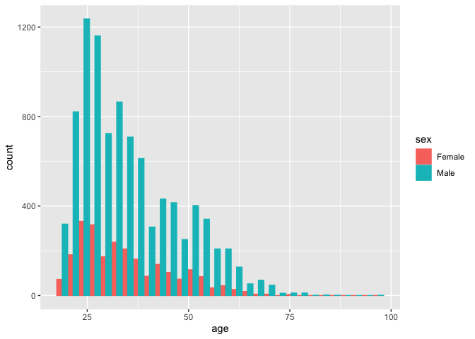
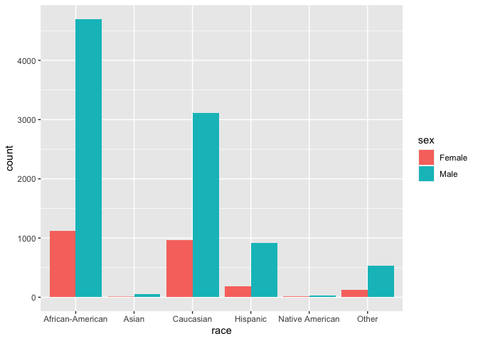
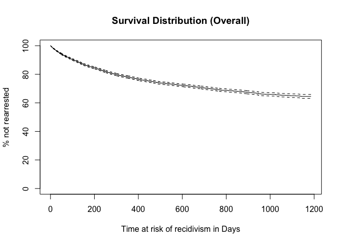
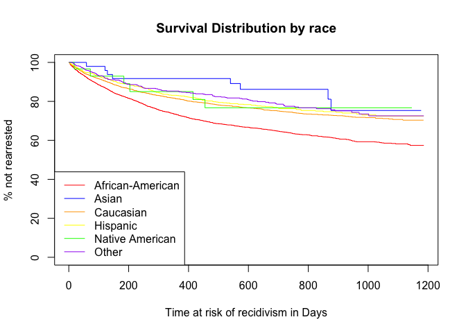

## Consulting Skills Focus

- In real life consulting, the client will frequently understand the data and surrounding research better than the statistician.
- Analysis should center around a well-defined research question that drive the analysis and the data should be able to provide insight on the question of interest.
- Bias and data analysis: We all have bias.  This can influence data analysis.  A data analyst, we should do our best to objectively present the data.  When necessary to make assumptions, state them explicitly.  
- Researchers frequently want "positive results."  Usually this means significant p-values.  Variable selection is a simple way to change p-values, p-hacking.  It's common to need to change variables in a model be it should be done a principled way.

## Case Study Background

- US has more inmates, proportional to population size, than any other country.   While Black Americans make up 13% of the total US population, they account for 40% of incarcerated population in the US.

Image from [Wikipedia](https://en.wikipedia.org/wiki/Incarceration_in_the_United_States#/media/File:Prisoners_world_map_png2.png)
- In the US justice system, machine learning algorithms are sometimes used to assess a criminal defendant's risk of recidivism (arrest due to committing a future crime) are being used.
- Correctional Offenders Management Profiling for Alternative Sanctions (COMPAS) is the most widespread of these algorithms.
- Its goal according to COMPAS creators: assess "not just risk but also nearly two dozen so-called “criminogenic needs” that relate to the major theories of criminality, including “criminal personality,” “social isolation,” “substance abuse” and “residence/stability.” Defendants are ranked low, medium or high risk in each category."
- In 2014, then U.S. Attorney General Eric Holder warned that the risk scores might be injecting bias into the courts. He called for the U.S. Sentencing Commission to study their use. “Although these measures were crafted with the best of intentions, I am concerned that they inadvertently undermine our efforts to ensure individualized and equal justice,” he said, adding, “they may exacerbate unwarranted and unjust disparities that are already far too common in our criminal justice system and in our society.”
- The [questionnaire](https://www.documentcloud.org/documents/2702103-Sample-Risk-Assessment-COMPAS-CORE.html) for determining COMPAS does not directly ask for race, but some people question inherent racial bias in the algorithm.
- The COMPAS algorithm is proprietary and not available.
- More information in a [2016 ProPublica article](https://www.propublica.org/article/machine-bias-risk-assessments-in-criminal-sentencing).


## Data

- ProPublica requested two years of COMPAS scores from Broward County Sheriff's Office in Florida
- Discarded all but pre-trial COMPAS score assessments
- ProPublica matched COMPAS scores with criminal records from Broward County Clerk's Office website
- COMPAS score screening date and (original) arrest date frequently differed.  If they are too far apart, that may indicate an error.  The `days_b_screening_arrest` variable gives this difference in days.
- `is_recid` is rearrest at any time.  `two_year_recid` is rearrest within two years.  Here, `-1` indicates a COMPAS record could not be found and should probably be discarded
- COMPAS generates a general score, `decile_score`, (1, 2,...,10) where 1 indicates a low risk and 10 indicates a high risk of recidivism.  There is also a violence score as well, `v_decile_score`.


```r
dat<-read.csv("./compas-scores.csv")
dim(dat)
```

```
## [1] 11757    47
```

```r
names(dat)
```

```
##  [1] "id"                      "name"                   
##  [3] "first"                   "last"                   
##  [5] "compas_screening_date"   "sex"                    
##  [7] "dob"                     "age"                    
##  [9] "age_cat"                 "race"                   
## [11] "juv_fel_count"           "decile_score"           
## [13] "juv_misd_count"          "juv_other_count"        
## [15] "priors_count"            "days_b_screening_arrest"
## [17] "c_jail_in"               "c_jail_out"             
## [19] "c_case_number"           "c_offense_date"         
## [21] "c_arrest_date"           "c_days_from_compas"     
## [23] "c_charge_degree"         "c_charge_desc"          
## [25] "is_recid"                "num_r_cases"            
## [27] "r_case_number"           "r_charge_degree"        
## [29] "r_days_from_arrest"      "r_offense_date"         
## [31] "r_charge_desc"           "r_jail_in"              
## [33] "r_jail_out"              "is_violent_recid"       
## [35] "num_vr_cases"            "vr_case_number"         
## [37] "vr_charge_degree"        "vr_offense_date"        
## [39] "vr_charge_desc"          "v_type_of_assessment"   
## [41] "v_decile_score"          "v_score_text"           
## [43] "v_screening_date"        "type_of_assessment"     
## [45] "decile_score.1"          "score_text"             
## [47] "screening_date"
```

```r
#head(dat)
#summary(dat)
```


```r
table(dat$sex)
```

```
## 
## Female   Male 
##   2421   9336
```

```r
table(dat$sex)/sum(!is.na(dat$sex))*100
```

```
## 
##   Female     Male 
## 20.59199 79.40801
```


```r
library(ggplot2)
ggplot(dat, aes(x=age, color=sex, fill=sex)) +
  geom_histogram(position="dodge")
```

```
## `stat_bin()` using `bins = 30`. Pick better value with `binwidth`.
```

<!-- -->


```r
ggplot(dat, aes(race)) +
  geom_bar(fill='blue')
```

<!-- -->

```r
ggplot(dat, aes(x=race, fill=sex)) +
  geom_bar(position='dodge')
```

<!-- -->


```r
ggplot(dat, aes(decile_score)) +
  geom_histogram()
```

```
## `stat_bin()` using `bins = 30`. Pick better value with `binwidth`.
```

<!-- -->

```r
table(!is.na(dat$decile_score))
```

```
## 
##  TRUE 
## 11757
```

General recommendations:

- Look at the raw data and different plots of the data before doing any modeling.
- Look for missing data and for values that might not make sense.
- Make sure you understand what observations (rows) are included in the data and which of those observations serve your data analysis goals
- Try to understand what the variables (columns) represent and which ones will serve your data analysis goals

## Quantifying racial bias

- Before doing any analysis, let's look at recidivism, COMPAS, and race


```r
df <- dat[dat$is_recid != -1,]
sum(is.na(df$race))
```

```
## [1] 0
```

```r
sum(is.na(df$is_recid))
```

```
## [1] 0
```

```r
table(df$race, df$is_recid)[,2]/t(table(df$race))*100
```

```
##       
##        African-American    Asian Caucasian Hispanic Native American    Other
##   [1,]         39.53827 20.75472  28.52279 25.86720        36.11111 24.79871
```
Above is the recidivism rate by race

- COMPAS also gave Black Americans greater scores on average:

```r
tapply(df$decile_score, df$race, mean)
```

```
## African-American            Asian        Caucasian         Hispanic 
##         5.326850         2.735849         3.647459         3.313181 
##  Native American            Other 
##         4.805556         2.813205
```
Is this the best way to present this information?

## How to model algorithmic bias?
- What does bias mean here?
- Would COMPAS give someone a greater score solely due to being Black, without changing anything else?
- Remember COMPAS doesn't ask for race directly.
- How could we quantify bias in this case?  Are race and COMPAS still associated after taking recidivism into account?
- It is tempting to use `decile_score ~ is_recid + race` to quantify the association between COMPAS and race while controlling for recidivism.

## Causation and Collider Bias


**Bayesian Network 1:**
<!--html_preserve--><div id="htmlwidget-3db91ffa7d96f84eb6ce" style="width:40%;height:40%;" class="grViz html-widget"></div>
<script type="application/json" data-for="htmlwidget-3db91ffa7d96f84eb6ce">{"x":{"diagram":"digraph flowchart {A -> B -> C [constraint=false]}","config":{"engine":"dot","options":null}},"evals":[],"jsHooks":[]}</script><!--/html_preserve-->

What would a regression model of `C ~ A + B` yield?


```r
set.seed(1234)
size <- 1000
A <- 6*rnorm(size)+50
B <- -2*A - 25 + rnorm(size)
C <- 5*B + 3 +rnorm(size)
summary(lm(C~A+B))
```

```
## 
## Call:
## lm(formula = C ~ A + B)
## 
## Residuals:
##      Min       1Q   Median       3Q      Max 
## -3.13161 -0.71957  0.03478  0.70215  3.05316 
## 
## Coefficients:
##             Estimate Std. Error t value Pr(>|t|)    
## (Intercept)  1.96001    0.87456   2.241   0.0252 *  
## A           -0.07084    0.06532  -1.085   0.2784    
## B            4.96310    0.03270 151.761   <2e-16 ***
## ---
## Signif. codes:  0 '***' 0.001 '**' 0.01 '*' 0.05 '.' 0.1 ' ' 1
## 
## Residual standard error: 1.013 on 997 degrees of freedom
## Multiple R-squared:  0.9997,	Adjusted R-squared:  0.9997 
## F-statistic: 1.739e+06 on 2 and 997 DF,  p-value: < 2.2e-16
```
What about this regression model: `C ~ A`?

```r
summary(lm(C~A))
```

```
## 
## Call:
## lm(formula = C ~ A)
## 
## Residuals:
##      Min       1Q   Median       3Q      Max 
## -15.9753  -3.4048  -0.0059   3.2714  16.5278 
## 
## Coefficients:
##               Estimate Std. Error t value Pr(>|t|)    
## (Intercept) -124.34246    1.31868  -94.29   <2e-16 ***
## A             -9.95096    0.02627 -378.80   <2e-16 ***
## ---
## Signif. codes:  0 '***' 0.001 '**' 0.01 '*' 0.05 '.' 0.1 ' ' 1
## 
## Residual standard error: 4.969 on 998 degrees of freedom
## Multiple R-squared:  0.9931,	Adjusted R-squared:  0.9931 
## F-statistic: 1.435e+05 on 1 and 998 DF,  p-value: < 2.2e-16
```

Does this coefficient and intercept estimate make sense?
$C = 5B + 3 + \epsilon_B = 5(-2A - 25 + \epsilon_A) = -10A - 122 + 5\epsilon_A + \epsilon_B$

**Bayesian Network 2:**
<!--html_preserve--><div id="htmlwidget-07179637e548ac48bb89" style="width:40%;height:40%;" class="grViz html-widget"></div>
<script type="application/json" data-for="htmlwidget-07179637e548ac48bb89">{"x":{"diagram":"digraph flowchart {A -> B; A -> C;}","config":{"engine":"dot","options":null}},"evals":[],"jsHooks":[]}</script><!--/html_preserve-->


```r
set.seed(1234)
size <- 1000
A <- 6*rnorm(size)+50
B <- -2*A - 25 + rnorm(size)
C <- 2*A +5 +rnorm(size)
summary(lm(C~A+B))
```

```
## 
## Call:
## lm(formula = C ~ A + B)
## 
## Residuals:
##      Min       1Q   Median       3Q      Max 
## -3.13161 -0.71957  0.03478  0.70215  3.05316 
## 
## Coefficients:
##             Estimate Std. Error t value Pr(>|t|)    
## (Intercept)  3.96001    0.87456   4.528 6.67e-06 ***
## A            1.92916    0.06532  29.533  < 2e-16 ***
## B           -0.03690    0.03270  -1.128    0.259    
## ---
## Signif. codes:  0 '***' 0.001 '**' 0.01 '*' 0.05 '.' 0.1 ' ' 1
## 
## Residual standard error: 1.013 on 997 degrees of freedom
## Multiple R-squared:  0.9929,	Adjusted R-squared:  0.9929 
## F-statistic: 6.996e+04 on 2 and 997 DF,  p-value: < 2.2e-16
```
What about this regression model: `C ~ A`?  Try it!

**Bayesian Network 3:**
<!--html_preserve--><div id="htmlwidget-6860a906ea9ddf7d2d41" style="width:40%;height:40%;" class="grViz html-widget"></div>
<script type="application/json" data-for="htmlwidget-6860a906ea9ddf7d2d41">{"x":{"diagram":"digraph flowchart {A -> C; B -> C;}","config":{"engine":"dot","options":null}},"evals":[],"jsHooks":[]}</script><!--/html_preserve-->


```r
set.seed(1234)
size <- 1000
A <- 6*rnorm(size)+50
B <- -2*rnorm(size) - 25 + rnorm(size)
C <- -4*A + 5*B + 3 +rnorm(size)
summary(lm(C~A+B))
```

```
## 
## Call:
## lm(formula = C ~ A + B)
## 
## Residuals:
##      Min       1Q   Median       3Q      Max 
## -3.03321 -0.68565  0.01655  0.66794  3.13811 
## 
## Coefficients:
##              Estimate Std. Error  t value Pr(>|t|)    
## (Intercept)  2.967859   0.430869    6.888    1e-11 ***
## A           -4.000487   0.005264 -759.946   <2e-16 ***
## B            4.998128   0.014068  355.283   <2e-16 ***
## ---
## Signif. codes:  0 '***' 0.001 '**' 0.01 '*' 0.05 '.' 0.1 ' ' 1
## 
## Residual standard error: 0.9947 on 997 degrees of freedom
## Multiple R-squared:  0.9986,	Adjusted R-squared:  0.9986 
## F-statistic: 3.641e+05 on 2 and 997 DF,  p-value: < 2.2e-16
```

**Bayesian Network 3 with `A` as the outcome:**

```r
summary(lm(A~B+C))
```

```
## 
## Call:
## lm(formula = A ~ B + C)
## 
## Residuals:
##      Min       1Q   Median       3Q      Max 
## -0.75638 -0.17022  0.00544  0.16841  0.80335 
## 
## Coefficients:
##               Estimate Std. Error  t value Pr(>|t|)    
## (Intercept)  0.8215779  0.1070244    7.677 3.89e-14 ***
## B            1.2470301  0.0039408  316.439  < 2e-16 ***
## C           -0.2495388  0.0003284 -759.946  < 2e-16 ***
## ---
## Signif. codes:  0 '***' 0.001 '**' 0.01 '*' 0.05 '.' 0.1 ' ' 1
## 
## Residual standard error: 0.2484 on 997 degrees of freedom
## Multiple R-squared:  0.9983,	Adjusted R-squared:  0.9983 
## F-statistic: 2.893e+05 on 2 and 997 DF,  p-value: < 2.2e-16
```

```r
summary(lm(A~B))
```

```
## 
## Call:
## lm(formula = A ~ B)
## 
## Residuals:
##      Min       1Q   Median       3Q      Max 
## -19.9644  -3.8309  -0.0804   3.8547  19.3418 
## 
## Coefficients:
##             Estimate Std. Error t value Pr(>|t|)    
## (Intercept) 46.99023    2.12137  22.151   <2e-16 ***
## B           -0.11401    0.08452  -1.349    0.178    
## ---
## Signif. codes:  0 '***' 0.001 '**' 0.01 '*' 0.05 '.' 0.1 ' ' 1
## 
## Residual standard error: 5.982 on 998 degrees of freedom
## Multiple R-squared:  0.00182,	Adjusted R-squared:  0.0008198 
## F-statistic:  1.82 on 1 and 998 DF,  p-value: 0.1777
```

- Even though `A` and `B` are independent, they are *conditionally dependent* if controlling for `C`.
- Why did this happen?  Does it make sense?
- Consider $A\sim \text{Bernoulli}(0.5), B\sim \text{Bernoulli}(0.5)$ (independent coin flips), and $C = A\cdot B$.  
- $A$ and $B$ are independent; that is, knowledge of $B$ give no information on the value of $A$. But, additional knowledge of $C$ does give information about the value of $A$.

**Scenario 4**
<!--html_preserve--><div id="htmlwidget-d4e2ed1793bbe008cc97" style="width:40%;height:480px;" class="grViz html-widget"></div>
<script type="application/json" data-for="htmlwidget-d4e2ed1793bbe008cc97">{"x":{"diagram":"digraph flowchart {A -> C; B -> C; A -> B}","config":{"engine":"dot","options":null}},"evals":[],"jsHooks":[]}</script><!--/html_preserve-->


```r
set.seed(1234)
size <- 1000
A <- 6*rnorm(size)+50
B <- A - 2*rnorm(size) - 25 + rnorm(size)
C <- -4*A + 5*B + 3 +rnorm(size)
summary(lm(C~A+B))
```

```
## 
## Call:
## lm(formula = C ~ A + B)
## 
## Residuals:
##      Min       1Q   Median       3Q      Max 
## -3.03321 -0.68565  0.01655  0.66794  3.13811 
## 
## Coefficients:
##             Estimate Std. Error  t value Pr(>|t|)    
## (Intercept)  2.96786    0.43087    6.888    1e-11 ***
## A           -3.99861    0.01481 -270.015   <2e-16 ***
## B            4.99813    0.01407  355.283   <2e-16 ***
## ---
## Signif. codes:  0 '***' 0.001 '**' 0.01 '*' 0.05 '.' 0.1 ' ' 1
## 
## Residual standard error: 0.9947 on 997 degrees of freedom
## Multiple R-squared:  0.9937,	Adjusted R-squared:  0.9937 
## F-statistic: 7.84e+04 on 2 and 997 DF,  p-value: < 2.2e-16
```

```r
summary(lm(C~A))
```

```
## 
## Call:
## lm(formula = C ~ A)
## 
## Residuals:
##     Min      1Q  Median      3Q     Max 
## -31.978  -7.970  -0.193   7.748  38.531 
## 
## Coefficients:
##               Estimate Std. Error t value Pr(>|t|)    
## (Intercept) -118.00904    2.98084  -39.59   <2e-16 ***
## A              0.91973    0.05938   15.49   <2e-16 ***
## ---
## Signif. codes:  0 '***' 0.001 '**' 0.01 '*' 0.05 '.' 0.1 ' ' 1
## 
## Residual standard error: 11.23 on 998 degrees of freedom
## Multiple R-squared:  0.1938,	Adjusted R-squared:  0.193 
## F-statistic: 239.9 on 1 and 998 DF,  p-value: < 2.2e-16
```

## COMPAS and possible collider bias

COMPAS uses [questionnaire](https://www.documentcloud.org/documents/2702103-Sample-Risk-Assessment-COMPAS-CORE.html) responses (Q in the diagram) to predict recidivism.  
<!--html_preserve--><div id="htmlwidget-7805ef81732293aacbb2" style="width:40%;height:480px;" class="grViz html-widget"></div>
<script type="application/json" data-for="htmlwidget-7805ef81732293aacbb2">{"x":{"diagram":"digraph flowchart {Race -> Q -> COMPAS; Q -> Recidivism; Race -> Recidivism}","config":{"engine":"dot","options":null}},"evals":[],"jsHooks":[]}</script><!--/html_preserve-->

Because COMPAS is used in sentencing, it may actually impact recidivism as well.
<!--html_preserve--><div id="htmlwidget-4a7cc72193daa55b0bc8" style="width:40%;height:480px;" class="grViz html-widget"></div>
<script type="application/json" data-for="htmlwidget-4a7cc72193daa55b0bc8">{"x":{"diagram":"digraph flowchart {Race -> Q -> COMPAS; Q -> Recidivism; COMPAS -> Recidivism; Race -> Recidivism}","config":{"engine":"dot","options":null}},"evals":[],"jsHooks":[]}</script><!--/html_preserve-->

One way to quantify racial bias in COMPAS would be to isolate the link between race and COMPAS that is not associated with recidivism.  But, it is not clear how to untangle this from potential collider bias.
<!--html_preserve--><div id="htmlwidget-142e8326f52b655747ba" style="width:40%;height:480px;" class="grViz html-widget"></div>
<script type="application/json" data-for="htmlwidget-142e8326f52b655747ba">{"x":{"diagram":"digraph flowchart {Race -> Q -> COMPAS; Q -> Recidivism; COMPAS -> Recidivism; Race -> Recidivism; Race-> COMPAS}","config":{"engine":"dot","options":null}},"evals":[],"jsHooks":[]}</script><!--/html_preserve-->

If we used `decile_score ~ is_recid + race` as a model to quantify bias, it seems very likely that there will be collider bias.


```r
summary(lm(decile_score ~ is_recid + race, data=df))
```

```
## 
## Call:
## lm(formula = decile_score ~ is_recid + race, data = df)
## 
## Residuals:
##    Min     1Q Median     3Q    Max 
## -7.225 -2.224 -0.225  1.776  7.555 
## 
## Coefficients:
##                     Estimate Std. Error t value Pr(>|t|)    
## (Intercept)          4.73952    0.04127 114.848  < 2e-16 ***
## is_recid             1.48548    0.05345  27.794  < 2e-16 ***
## raceAsian           -2.31198    0.36300  -6.369 1.98e-10 ***
## raceCaucasian       -1.51576    0.05569 -27.217  < 2e-16 ***
## raceHispanic        -1.81059    0.09033 -20.043  < 2e-16 ***
## raceNative American -0.47038    0.43961  -1.070    0.285    
## raceOther           -2.29469    0.11157 -20.566  < 2e-16 ***
## ---
## Signif. codes:  0 '***' 0.001 '**' 0.01 '*' 0.05 '.' 0.1 ' ' 1
## 
## Residual standard error: 2.629 on 11031 degrees of freedom
## Multiple R-squared:  0.1656,	Adjusted R-squared:  0.1652 
## F-statistic: 364.9 on 6 and 11031 DF,  p-value: < 2.2e-16
```

In the regression above, several race indicator variables are significant.  But, because collider bias is possible here, we *cannot* conclude that COMPAS is racially biased.

## Survival Analysis

- Survival analysis is a set of statistical methods for modeling the time until an event occurs, especially when follow up is not complete for each observation.
- Example: Testing a new terminal cancer treatment, participants are either given the standard or test treatment.  The goal is to prolong the patient's.  Each patient is followed until death from cancer.  During follow up some participants die from cancer but some drop out while others might die from something else.  Survival analysis allows us to use this data even though we do not have events for each participant.

**Set up**

Assume that $T$ is the time until an event randomly occurs.
For example, $T$ might be the duration from cancer treatment until remission or death.


Let $f(t)$ be a probability density function where $t$ is time, $T\sim f$ be a random variable, and let $F(t)=P(T<t)=\int_0^tf(x)dx$ be its cumulative distribution function.
Define the survival function as $S(t)=P(T>t)=1-F(t)$ and the hazard function as
\[
\lambda(t)=\lim_{h\rightarrow 0} \frac{P(t<T\leq t+h)}{P(T>t)}= \frac{f(t)}{S(t)} = -\frac{d\log S(t)}{dt}.
\]
Notice that $f(t)=\lambda(t)S(t)$.

The cumulative hazard function is defined as
\[
\Lambda(t)= \int_0^t\lambda(x)dx=-\int_0^td\log S(x)=-\log S(t).
\]
So,
\[
S(t)=\exp[-\Lambda(t)].
\]
Side note: If we model $\lambda(t)=\lambda$ (constant function), then $\Lambda(t)=\lambda t$. So, $f(t)=\lambda\exp(-\lambda t)$ is the exponential distribution.

**Censoring at Random**

With many of time-to-event studies, it is not always possible to wait for an event to occur for each participant before doing the analysis.  In a cancer study, for example, participants may drop out of the study before an event is observed or the study may close before each participant experiences an event.  This is call right censored data.
While in some cases, a participant does not contribute the entire time until the event occurs, intuitively, we should be able to make use of the time where the event did not occur.

](./Right_censoring.png)

- Let $f(t;\theta), \lambda(t;\theta)$, and $S(t;\theta)$ be the density, hazard, and survival functions with parameter $\theta$ for the time to the event of interest.
- We assume that censoring occurs at random (in independently from $f$), say it has cumulative distribution of $G(t;\phi)$ (with some parameter $\phi$) and density function, $g(t;\phi)$.
- Let $(t_1, \delta_1),\dots, (t_n,\delta_n)$ be a sample of size $n$ where $\delta_i$ indicates censoring and $t_i$ is the time to event or censor.  That is $t_i \sim f(t;\theta)$ when $\delta_i=1$ and $t_i \sim g(t;\phi)$ when $\delta_i=0$.
- The Likelihood is 
\[
\begin{align}
L(\theta,\phi) &= \prod_{i=1}^n [f(t_i;\theta)[1-G(t_i;\phi)]]^{\delta_i} [g(t_i;\phi)S(t_i;\theta)]^{1-\delta_i}\\
&=  \prod_{i=1}^n [f(t_i;\theta)]^{\delta_i}[S(t_i;\theta)]^{1-\delta_i} \prod_{i=1}^n [g(t_i;\phi)]^{1-\delta_1}[1-G(t_i;\phi)]^{\delta_i}\\
&= L(\theta) L(\phi) \propto L(\theta).
\end{align}
\]

- Unpacking this a bit, if we observe an event, its density is $f$ and censoring did not occur prior: $[f(t_i;\theta)[1-G(t_i;\phi)]]^{\delta_i}$.  
If we observe censoring, its density is $g$ and an event did not occur prior: $[g(t_i;\phi)S(t_i;\theta)]^{1-\delta_i}$.
But, we do not care about the censoring distribution, only the time to event distribution.

- Note that $L(\theta)=\prod_{i=1}^n [f(t_i;\theta)]^{\delta_i}[S(t_i;\theta)]^{1-\delta_i}= \prod_{i=1}^n \lambda(t_i)^{\delta_i} S(t_i)$ is what we actually care about here.

## Kaplan-Meier Estimator

- Consider estimating $S(t) = P(T>t)$ from the sample ordered by $t_i$, $(t_{1}, \delta_{1}), (t_{2}, \delta_{2}), \dots, (t_{n}, \delta_{n})$ and let $t_{(1)}, t_{(2)}, \dots, t_{(J)}$ be the ordered event times, where $\delta_i=1$.
- Because there are only $J$ points in time where events occur, we approximate $S(t)$ as a decreasing step function.
- $S(t_{(j)}) = P(T > t_{(j)}) = P(T > t_{(j)} | T > t_{(j-1)}) P(T > t_{(j-1)})$ because for $t > s, P(T>t) = P(T>t, T>s) = P(T>t|T>s)P(T>s)$.
- For $j = 1,\dots, J$, let $\pi_j = 1-P(T > t_{(j)} | T > t_{(j-1)})$ be the "instantaneous" probability of an event occurring at time $t_j$.
- Then 
\[
S(t_{(j)}) = (1-\pi_j)(1-\pi_{j-1}) \dots (1-\pi_2)(1-\pi_1).
\]
- Let $n_j = \#\{t_i \geq t_{(j)}\}$ be the number of participants who are still at risk (who haven't had an event or been censored) at time $t_{(j)}$.  Note that $n_j$ decreases as events occur or as they are censored.
- Let $d_j = \#\{t_i=t_{(j)}, \delta_i=1\}$ be the number of events that occur at time $t_{(j)}$.
- We can show that $\pi_j = \frac{d_j}{n_j}$ maximized the non-parametric likelihood.
- So, we can approximate the survival function as
\[
\hat S(t) = \prod_{j=1}^J \left( 1-\frac{d_j}{n_j}\right)^{I(t_{(j)}\leq t)}.
\]
- Using the delta-method, we can approxmiate the variance of the estimated survival function as 
\[
\hat V[\hat S(t)] = \hat S(t)^2 \sum_{j: t_{(j)}\leq t} \frac{d_j}{n_j(n_j-d_j)}
\]

This [video](https://www.youtube.com/watch?v=NDgn72ynHcM) clearly illustrates how to calculate the KM survival function.


```r
library(survival)
library(ggfortify)

dat <- read.csv(url('https://raw.githubusercontent.com/propublica/compas-analysis/master/cox-parsed.csv'))
names(dat)
```

```
##  [1] "id"                      "name"                   
##  [3] "first"                   "last"                   
##  [5] "compas_screening_date"   "sex"                    
##  [7] "dob"                     "age"                    
##  [9] "age_cat"                 "race"                   
## [11] "juv_fel_count"           "decile_score"           
## [13] "juv_misd_count"          "juv_other_count"        
## [15] "priors_count"            "days_b_screening_arrest"
## [17] "c_jail_in"               "c_jail_out"             
## [19] "c_case_number"           "c_offense_date"         
## [21] "c_arrest_date"           "c_days_from_compas"     
## [23] "c_charge_degree"         "c_charge_desc"          
## [25] "is_recid"                "r_case_number"          
## [27] "r_charge_degree"         "r_days_from_arrest"     
## [29] "r_offense_date"          "r_charge_desc"          
## [31] "r_jail_in"               "r_jail_out"             
## [33] "violent_recid"           "is_violent_recid"       
## [35] "vr_case_number"          "vr_charge_degree"       
## [37] "vr_offense_date"         "vr_charge_desc"         
## [39] "type_of_assessment"      "decile_score.1"         
## [41] "score_text"              "screening_date"         
## [43] "v_type_of_assessment"    "v_decile_score"         
## [45] "v_score_text"            "v_screening_date"       
## [47] "in_custody"              "out_custody"            
## [49] "priors_count.1"          "start"                  
## [51] "end"                     "event"
```

```r
dim(dat)
```

```
## [1] 13419    52
```

```r
dat2 <- dat[dat$end > dat$start,]
dim(dat2)
```

```
## [1] 13356    52
```

```r
dat3 <- dat2[!duplicated(dat2$id),]
dim(dat3)
```

```
## [1] 10325    52
```

```r
ph <- dat3[!is.na(dat3$decile_score),]
dim(ph)
```

```
## [1] 10325    52
```

```r
ph$t_atrisk <- ph$end - ph$start

survobj <- with(ph, Surv(t_atrisk, event))
fit0 <- survfit(survobj~1, data=ph)
# summary(fit0)
plot(fit0, xlab="Time at risk of recidivism in Days", 
   ylab="% not rearrested", yscale=100,
   main ="Survival Distribution (Overall)") 
```

<!-- -->

```r
fitr <- survfit(survobj~race, data=ph)
plot(fitr, xlab="Time at risk of recidivism in Days", 
   ylab="% not rearrested", yscale=100,
   main="Survival Distribution by race",
   col = c('red', 'blue', 'orange', 'yellow', 'green', 'purple')) 
legend('bottomleft', legend=levels(as.factor(ph$race)), col = c('red', 'blue', 'orange', 'yellow', 'green', 'purple'), lty=1)
```

<!-- -->

```r
survdiff(survobj~race, data=ph)
```

```
## Call:
## survdiff(formula = survobj ~ race, data = ph)
## 
##                          N Observed Expected (O-E)^2/E (O-E)^2/V
## race=African-American 5150     1608  1294.09    76.146   143.666
## race=Asian              51        8    16.21     4.159     4.187
## race=Caucasian        3576      815   996.20    32.959    51.627
## race=Hispanic          944      206   275.19    17.397    19.343
## race=Native American    32        6     8.25     0.616     0.618
## race=Other             572      118   171.05    16.453    17.557
## 
##  Chisq= 148  on 5 degrees of freedom, p= <2e-16
```

Note: I haven't used this package in a long time so I needed to look how to use the functions in [documentation](https://cran.r-project.org/web/packages/survival/survival.pdf).  As a consultant, you will probably need to read the documentation a lot.

## Cox proportional hazards model

It is difficult to work with censored data using generalized linear models.
Assuming that each individual hazard function is proportional to some common baseline hazard function makes the problem workable:
\[
\lambda(t|X_i) = \lambda_0(t) \exp(\beta X_i)
\]
where $X_i$ is the covariate vector for participant $i$ and $\beta$ is the parameter vector to be estimated.

Assume $Y_i$ is the response variable.
The likelihood for an observation is
\[
L_i(\beta) = \frac{\lambda(Y_i|X_i)}{\sum_{j:Y_j\geq Y_i} \lambda(Y_i|X_j)} = \frac{\lambda_0(Y_i)\exp(\beta X_i)}{\sum_{j:Y_j\geq Y_i} \lambda_0(Y_i) \exp(\beta X_j)} = \frac{\exp(\beta X_i)}{\sum_{j:Y_j\geq Y_i} \exp(\beta X_j)}.
\]
Notice that the baseline hazard function, $\lambda_0(t)$, cancels.  So, now we can use use an optimization technique to maximize this function.

The joint likelihood is $L(\beta) = \prod_{i: \delta_i=1} L_i(\beta)$ (over the observations with events occuring), with a log-likelihood of 

\[
\ell(\beta) = \sum_{i:\delta_i=1}\left(X_i\beta - \log \sum_{j:Y_j\geq Y_i} X_j\beta \right).
\]

To maximize the likelihood, we can use the Newton-Raphson method.


```r
summary(coxph(survobj~race, data=ph))
```

```
## Call:
## coxph(formula = survobj ~ race, data = ph)
## 
##   n= 10325, number of events= 2761 
## 
##                         coef exp(coef) se(coef)      z Pr(>|z|)    
## raceAsian           -0.92516   0.39647  0.35444 -2.610  0.00905 ** 
## raceCaucasian       -0.41881   0.65783  0.04302 -9.735  < 2e-16 ***
## raceHispanic        -0.50790   0.60176  0.07403 -6.861 6.83e-12 ***
## raceNative American -0.53681   0.58461  0.40901 -1.312  0.18937    
## raceOther           -0.58971   0.55449  0.09540 -6.182 6.34e-10 ***
## ---
## Signif. codes:  0 '***' 0.001 '**' 0.01 '*' 0.05 '.' 0.1 ' ' 1
## 
##                     exp(coef) exp(-coef) lower .95 upper .95
## raceAsian              0.3965      2.522    0.1979    0.7942
## raceCaucasian          0.6578      1.520    0.6046    0.7157
## raceHispanic           0.6018      1.662    0.5205    0.6957
## raceNative American    0.5846      1.711    0.2622    1.3032
## raceOther              0.5545      1.803    0.4599    0.6685
## 
## Concordance= 0.56  (se = 0.005 )
## Likelihood ratio test= 149.5  on 5 df,   p=<2e-16
## Wald test            = 145.2  on 5 df,   p=<2e-16
## Score (logrank) test = 148.1  on 5 df,   p=<2e-16
```

```r
summary(coxph(survobj~race+decile_score, data=ph))
```

```
## Call:
## coxph(formula = survobj ~ race + decile_score, data = ph)
## 
##   n= 10325, number of events= 2761 
## 
##                          coef exp(coef)  se(coef)      z Pr(>|z|)    
## raceAsian           -0.455020  0.634435  0.354974 -1.282  0.19990    
## raceCaucasian       -0.123647  0.883692  0.044612 -2.772  0.00558 ** 
## raceHispanic        -0.167138  0.846083  0.075232 -2.222  0.02631 *  
## raceNative American -0.489950  0.612657  0.409016 -1.198  0.23097    
## raceOther           -0.147075  0.863229  0.097131 -1.514  0.12997    
## decile_score         0.179991  1.197207  0.006903 26.074  < 2e-16 ***
## ---
## Signif. codes:  0 '***' 0.001 '**' 0.01 '*' 0.05 '.' 0.1 ' ' 1
## 
##                     exp(coef) exp(-coef) lower .95 upper .95
## raceAsian              0.6344     1.5762    0.3164    1.2722
## raceCaucasian          0.8837     1.1316    0.8097    0.9644
## raceHispanic           0.8461     1.1819    0.7301    0.9805
## raceNative American    0.6127     1.6322    0.2748    1.3658
## raceOther              0.8632     1.1584    0.7136    1.0442
## decile_score           1.1972     0.8353    1.1811    1.2135
## 
## Concordance= 0.66  (se = 0.005 )
## Likelihood ratio test= 818.3  on 6 df,   p=<2e-16
## Wald test            = 833.8  on 6 df,   p=<2e-16
## Score (logrank) test = 885.5  on 6 df,   p=<2e-16
```

```r
summary(coxph(survobj~race+age+decile_score, data=ph))
```

```
## Call:
## coxph(formula = survobj ~ race + age + decile_score, data = ph)
## 
##   n= 10325, number of events= 2761 
## 
##                          coef exp(coef)  se(coef)      z Pr(>|z|)    
## raceAsian           -0.463000  0.629393  0.354942 -1.304   0.1921    
## raceCaucasian       -0.109144  0.896601  0.044552 -2.450   0.0143 *  
## raceHispanic        -0.174254  0.840084  0.075181 -2.318   0.0205 *  
## raceNative American -0.494427  0.609920  0.409016 -1.209   0.2267    
## raceOther           -0.163731  0.848970  0.097054 -1.687   0.0916 .  
## age                 -0.010236  0.989817  0.001859 -5.505  3.7e-08 ***
## decile_score         0.167991  1.182926  0.007261 23.137  < 2e-16 ***
## ---
## Signif. codes:  0 '***' 0.001 '**' 0.01 '*' 0.05 '.' 0.1 ' ' 1
## 
##                     exp(coef) exp(-coef) lower .95 upper .95
## raceAsian              0.6294     1.5888    0.3139    1.2620
## raceCaucasian          0.8966     1.1153    0.8216    0.9784
## raceHispanic           0.8401     1.1904    0.7250    0.9735
## raceNative American    0.6099     1.6396    0.2736    1.3597
## raceOther              0.8490     1.1779    0.7019    1.0268
## age                    0.9898     1.0103    0.9862    0.9934
## decile_score           1.1829     0.8454    1.1662    1.1999
## 
## Concordance= 0.661  (se = 0.005 )
## Likelihood ratio test= 849.8  on 7 df,   p=<2e-16
## Wald test            = 843  on 7 df,   p=<2e-16
## Score (logrank) test = 897.4  on 7 df,   p=<2e-16
```

## High Level Summary

- Tools like Rmarkdown and Jupyter notebook make code more easily understood and reproducible.
- Always explore the data before running regressions and other statistical tests.  Look at the raw data itself, try to understand variable names, variable distributions, missing data, etc
- Collider bias occurs when conditioning (including as a covariate) on a variable that is influenced by the outcome variable and at least one other covariate.
- Survival analysis tools, such as Kaplan-Meier curves and Cox PH regression, are helpful when follow times leading up to an event vary by observation, especially when censoring occurs.
- When reporting on your analysis, it is important to be aware of possible causal pathways. But, most of the time, it is not possible to use statistical models alone to attribute a causal relationships.
