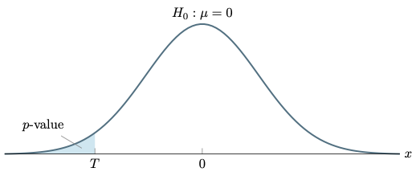
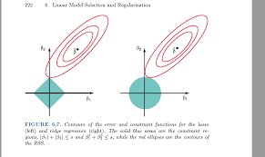
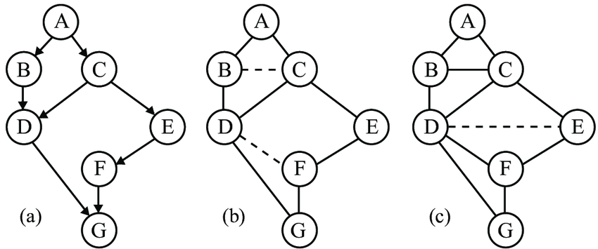

```{r setup, include=FALSE}
knitr::opts_chunk$set(echo = TRUE)

```

## Understanding Gene Expression and Lymphoma


From Wikipedia:

- Diffuse large B-cell lymphoma (DLBCL) is the most common lymphoid malignancy in adults

- Cancer of B cells, a type of lymphocyte

- Incidence: 7-8 cases per 100,000 people per year in the US

- occurs primarily in older individuals, with a median age of diagnosis at ~70 years

- it can occur in young adults and, in rare cases, children

- DLBCL can arise in virtually any part of the body and, depending on various factors, is often a very aggressive malignancy

- The causes of diffuse large B-cell lymphoma are not well understood

- Curable in < 50% of patients (in 2002)

- Here, we want to use gene expression or *microarray data* to predict DLBCL

- [Microarrays](https://en.wikipedia.org/wiki/Microarray) simultaneously detect the expression of thousands of genes from a sample


- This [paper](https://idp.nature.com/authorize/casa?redirect_uri=https://www.nature.com/articles/nm0102-68&casa_token=vw6a-r_uXz8AAAAA:PBI84ZmryGuDsD_exYAi6aTypeES0fxnpFfASvUwbJ7o_Ihb5FsyW_IvxXGlrCj4UlIyydKIpRIbH4rx8A) use a supervised learning model on 6817 gene expressions (microarray) from 71 patients to distinguish between DLBCL and follicular lymphoma (FL)

- This data is on [Github](https://github.com/ramhiser/datamicroarray/wiki/Shipp-%282002%29)

- In this data, each row corresponds to an individual

- Each column corresponds to gene expression using a microarray, one column gives the type of lymphoma


- **Goal**: Determine which genes are associated with with lymphoma type


- Start by looking at the data

```{r data}
load("./shipp.RData")
ls() # .RData files can include any R data structure.  The "ls()" command shows what it contains.
names(shipp)
dim(shipp$x)
names(shipp$x)[1:10]  #first 10 var names
shipp$x[1:10,1:6]
table(shipp$y)
```

- Note that there are far more columns than rows here


- For this, I would visually inspect data data


- It doesn't make sense to try to look at >7k plots


- Question: Will standard regression methods will not work?
  - A: Yes
  - B: No, there would be more parameters in the model than rows of data
  - C: No, $X^TX$ is a singular matrix
  - D: Not Sure

$$\\[1in]$$

- Question: Should we use a t-test to determine which genes are associated with DLBCL?
  - A: Yes
  - B: No
  - C: Not Sure

```{r naiveMultiple}
pvals <-c()
for(var in names(shipp$x)){
  pvals <- c(pvals, t.test(shipp$x[[var]] ~ shipp$y)$p.value)
}
hist(pvals, xlab = 'p-values', main='Histogram of p-values')
sum(pvals < 0.05)
sum(pvals < 0.05)/length(pvals) # pct significant at alpha = 0.05
```


- Question: Do you believe that all tests with p < 0.05 are actually statistically significant?
  - A: Yes
  - B: No
  - C: Not Sure

**Multiple testing error**

- What would happen if we ran many t-tests for columns where none are associated with the outcome?


- The data below are generated randomly and independent from the outcome


- Randomly generate each column independent of the outcome


- For each column, $V$ in the generated data set, we know that $V \perp Y$


```{r null}
set.seed(1234)
null_dat <- data.frame(matrix(rnorm(dim(shipp$x)[1] * dim(shipp$x)[2]), ncol=dim(shipp$x)[2]))
dim(null_dat)
null_pvals <-c()
for(var in names(null_dat)){
  null_pvals <- c(null_pvals, t.test(null_dat[[var]] ~ shipp$y)$p.value)
}
hist(null_pvals, xlab = 'p-values', main='Histogram of Null p-values')
```


- Question: What density does this look like?
  - A: Exponential
  - B: Beta
  - C: Negative Binomial
  - D: Uniform

$$\\[1in]$$

- Question: What proportion is less than 0.05?
  - Enter response as decimal

$$\\[2in]$$

```{r false discovery}
sum(null_pvals < 0.05)/length(null_pvals) # pct significant at alpha = 0.05
```


- Intuitively, what is the problem here?  Why are so many p-values $<0.05$ when none are associated with the outcome?


- Question: Did you expect the p-values to have a uniform distribution?
  - A: Yes
  - B: No
  - C: Not Sure


- Why do they look uniform?


**What is a hypothesis test/p-value?**

- Example:

  - Let $X_1, X_2,\dots, X_n$ be an independent, identically distributed sample 

  - Let $E[X_i]=\mu$ (unknown) and $E[(X_i-\mu)^2]=\sigma^2=1$ (known) for each $i=1,2,\dots,n$
  - Is $\mu$ positive or negative?
  - Let $H_0: \mu\geq0$ and $H_1: \mu< 0$
  - Let $\bar X_n = \frac{1}{n}\sum_{i=1}^n X_i$
  - Intuitively, if $\frac{\bar X_n -\mu}{\sigma/\sqrt n} = \sqrt n \bar X$ is small (too negative), then we can reject $H_0$
  - From the [central limit theorem](https://en.wikipedia.org/wiki/Central_limit_theorem), we know that $\frac{\bar X_n -\mu}{\sigma/\sqrt n} \leadsto N(0,1)$ (converges in distribution) as $n\rightarrow\infty$
  - That is, our test statistic, $T=\sqrt n \bar X$ is approximately $N(0,1)$ under $H_0$ (we're setting $\mu=0$)
  - p-value: $p= P[T<N(0,1)] = \Phi(T) = \int_{-\infty}^T \frac{1}{\sqrt{2\pi}} e^{-\frac{x^2}{2}}dx$



[other illustration](http://blog.analytics-toolkit.com/2017/statistical-significance-ab-testing-complete-guide/)

**Theorem:** p-values are uniformly distributed under the null hypothesis.

*Proof:*

1. Let $T$ be a test statistic of a hypothesis test and let $F$ be the CDF of T under $H_0$, the null hypothesis

2. p-value: $p= F(T)$

3. Claim: A random variable, $Y\sim G$, is uniformly distributed on $[0,1]$ $\Leftrightarrow$ $P[Y < y] = G(y) = y$ on $[0,1]$

4. Goal: show that $P[p < y] = y$ under the null hypothesis

5. Using $F^{-1}$, the inverse function of $F$

6. Assume that $F$ is montonically increasing, so that $F^{-1}$ is also monontically increasing
\[
\begin{align*}
P[p < y]
&=P[F(T) < y] & p=F(T)\\
&= P[F^{-1}(F(T)) < F^{-1}(y)] &\text{$F^{-1}$ monotonically increasing}\\
&= P[T < F^{-1}(y)] & F^{-1}(F(y)) = y\\
&= F(F^{-1}(y)) & F(t) = P(T<t)\\
&= y
\end{align*}
\]

6. So, under the null hypothesis, p-value $\sim$Unif(0,1) $\blacksquare$

- Question: Did this proof make sense?
  - 1 (not at all) to 5 (perfect sense)

## Multiple Testing

- Want to run $m$ tests


- Let $H_{0,i}$ be the null hypothesis for the $i$th test where $1 \leq i \leq m$


- Let $p_i$ be the p-value of the $i$th test for $H_{0,i}$


- Let $R_i = 1$ if we reject $H_{0,i}$ and $R_i = 0$ if we fail to reject $H_{0,i}$ (sometimes called a discovery or positive result)


- $R = \sum_{i=1}^m R_i$ be the number of rejected tests


- Let $V_i = 1$ if we wrongly reject $H_{0,i}$ (false positive or type 1 error or false discovery)


- Let $V = \sum_{i=1}^m V_i$ be the false positive (discovery) count


- Question: If we run $m=3$ *independent* hypotheses tests at an $\alpha=0.1$ significance level, and all null hypotheses, $H_{0,1}, H_{0,2}, H_{0,3}$, are true, what is $P(V=0)$, the probability that there are zero false discoveries?
$$\\[0.5in]$$

- Question: Using the same scenario, what is $P(V>0)$, the probability that there is at least one false discovery?

$$\\[0.5in]$$

- **Family-wise error rate (FWER)** 
\[P[V>0] \leq \alpha\]
  Same as $P[V=0] \geq 1-\alpha$
  
  
- Question: If $m=100$, and all tests are *independent*, and the null hypothesis is true for all, what is $E[V]?$, the expected number of false discoveries?

$$\\[0.5in]$$
  
- **Per family error rate (PFER)**
  \[E[V] \leq \alpha\]
- **False discovery rate (FDR)** controls
\[E\left[\frac{V}{R}\right]\]
  - If $R=0$, use $R=1$ instead

- **Global null**

  - Can we reject at least one of the $m$ null hypotheses?
  - The global null hypothesis is
\[H_0 = \bigcap_{i=1}^m H_{0,i}\]
  - Does not indicate which $H_{0,i}$ to reject, only that we can reject at least one $H_{0,i}$


- Note: We only know the distribution of a $p$-value under the null hypothesis; we typically won't know the distribution of the $p$-value under the alternative hypothesis.


- Note: We can only multiply $p$-values when their corresponding hypothesis tests are independent.


### Tests

**Bonferroni**

- Reject $H_{0,i}$ if $p_i \leq p_{\text{Bon}} := \frac{\alpha}{m}$


- uses FWER, tells us which $H_{0,i}$ we can reject


- Question: We have a standard, 52 playing cards (4 suits, 13 ranks).
$P[\text{Ace OR club}] \leq P[\text{Ace}] + P[\text{club}]$
  - A. True
  - B. False

$$\\[0.5in]$$

- Union bound: For a countable number of events, $A_1, A_2,\dots$,
$$P\left(\bigcup_{i=1}^\infty A_i\right) \leq \sum_{i=1}^\infty P(A_i)$$
More on [union bound](https://en.wikipedia.org/wiki/Boole%27s_inequality)


**Proof:**

Let $I := \{i: H_{0,i} = 1\}$ be the set of true null hypotheses.
\[
\begin{align}
P[V>0]
&= P\left[ \bigcup_{i\in I} \left\{ p_i \leq \frac{\alpha}{m} \right\} \right] & V>0\Leftrightarrow \text{ at least one $p_i$ significant in nulls}\\
&\leq \sum_{i\in I} P\left[p_i \leq \frac{\alpha}{m}\right] & \text{Union bound}\\
&= \sum_{i\in I} \frac{\alpha}{m} &\text{$p_i\sim$ Unif$(0,1)$ for $i\in I$}\\
&= \frac{\alpha |I|}{m} & |I|=\text{# true null hypotheses} \\
&\leq \alpha & \frac{|I|}{m}\leq 1
\end{align}
\]


- Because of union bound, even holds when p-values are statistically dependent


- We can also get all Bonferroni-corrected $p$-values: $\frac{p_i}{m}$ for all $i$


- Using Bonferroni, which gene's should I recommend are associated with lymphoma?

```{r bonferroni}
bcorrection <- 0.05/length(pvals)
bcorrection
sum(pvals <= bcorrection)
names(shipp$x)[pvals <= bcorrection]
```


- Question: Which of the following interpretations are acceptable? (can choose more than one)
  - A. The genes listed above are the most likely to be associated with lymphoma at an $\alpha = 0.05$ significance level
  - B. At an $\alpha = 0.05$ significance level, all of the genes listed above are associated with lymphoma
  - C. All of the genes above are significantly associated with lymphoma using a Bonferroni-corrected $\alpha = 0.05$ significance level
  - D. Controlling the aggregate probability of having at least one false discovery at an $\alpha=0.05$ significance level, the genes listed above are associated with lymphoma

$$\\[0.5in]$$

- What about the independent simulated data?

```{r bcorsim}
which(null_pvals<=bcorrection)
```

- Notice that test may be associated (knowing one p-value may give information about others)


- Bonferroni still works here


- How could we construct a global null hypothesis from Bonferroni?
  - If at least one $p_i \leq \frac{\alpha}{m}$, then we can reject global null


Bonferroni is conservative

- Types of error: false positives (type I error) and false negatives (type II error)


- Bonferroni is very good at limiting false positives but not limiting false negatives


- Power = 1-P(type II error), is the probability of rejecting the null hypothesis when the alternative hypothesis is true


- Bonferroni may not always be a powerful test

**Fisher Combination**

- Uses global null framework


- Assumes that each $p_i$ is independent (why might this not be reasonable in most settings?)


- If $H_{0,i}$ is true for each $i$ (and each test is independent), then
\[
T = \sum_{i=1}^m -2 \log(p_i) \sim \chi^2(2m)
\]


- uses that fact that transforming independent, uniform random variables this way will have a $\chi^2$ distribution


- This test does not indicate which $H_{0,i}$ to reject


- Question: Can we use Fisher combination test here?
  - A. Yes
  - B. No
  - C. Not sure

$$\\[0.5in]$$

- Question: We have 10 clinical trial studies on the same treatment on different study participants.
Can we use Fisher combination here?
  - A. Yes
  - B. No
  - C. Not sure


**Simes Test**

- Uses global null framework, i.e. at least one null hypothesis is false


- Order all p-values, $p_{(1)}\leq p_{(2)}\leq \dots \leq p_{(m)}$ for the $m$ hypotheses


- Simes test statistic
\[ p_{\text{Simes}} = \min_{i\in [m]} \left\{ \frac{m p_{(i)}}{i} \right\}\]


- Reject global null if $p_{\text{simes}} \leq \alpha$


- Equivalent: Reject global null if any $p_{(i)} \leq \frac{i\alpha}{m}$


- Proof is a little more complicated
  - Need to show that $p_{\text{Simes}} \sim \text{Unif}(0,1)$
  - Uses order statistics properties to show this


- Does not require all $p_i$ are independent


- More powerful (type II error is smaller) than Bonferroni global null test
  - Bonferroni will reject global null when $m p_{(1)} \leq \alpha$

```{r simes}
simes <- function(vec) length(vec)*min(sort(vec)/(1:length(vec)))

simes(pvals)
simes(null_pvals)
```

- Coding tip: DRY (don't repeat yourself)
  - if you're tempted to copy your own code to reuse it, write a function for it instead


**Kolmogorov-Smirnov Test**

- Assume we observe 10,000 $p$-values, all between 0.2 and 0.4.


- Question: Are there any significant Bonferroni-corrected $p$-values?
  - A. Yes
  - B. No
  - C. Not sure

$$\\[0.5in]$$

- Question: Would Simes test give a significant $p$-values?
  - A. Yes
  - B. No
  - C. Not sure

$$\\[0.5in]$$

- Question: Can we (logically) reject global null here?
  - A. Yes
  - B. No
  - C. Not sure


- Kolmogorov-Smirnov Test compares an empirical cdf to a theoretical cdf (not only uniform)


- Here: Assess fit of empirical p-value cumulative distribution compared to uniform


- Uses global null framework


- Empirical CDF of p-values is
\[\hat F_m(t) = \frac{1}{m} \sum_{i=1}^m I(p_i \leq t)\]
- Uniform CDF $F(t) = t$ for $t\in [0,1]$

```{r kst}
par(mfrow=c(1,2))
plot(ecdf(null_pvals), col='red', xlim=c(0,1), ylim=c(0,1), 
     main="Null Simulated")
abline(c(0,0), c(1,1))
plot(ecdf(pvals), col='red',
     main="Real p-values")
abline(c(0,0), c(1,1))
```

- Test statistic
\[T_m = \sup_{t\in [0,1]} \left| \hat F_m(t) - t \right|\]


- Reject global null when $T_m$ is large


- We don't know the CDF of the test statistic, but we *consentration inequality* above allows us to bound the $p$-value


- Using Hoeffding's inequality, under the null hypothesis
\[P\left[ T_m > \epsilon \right] \leq 2\exp\left(-2\epsilon^2\right)\]


- Want to find $\epsilon$ so that $2\exp\left(-2\epsilon^2\right)\leq \alpha$


- Reject global null if
\[T_m > \sqrt{\frac{1}{2}\log\left(\frac{2}{\alpha}\right)}\]

```{r ksttest}
ks.test(pvals, runif(100000))
ks.test(null_pvals, runif(100000))
```

See [ks.test documentation](https://stat.ethz.ch/R-manual/R-devel/library/stats/html/ks.test.html) for more info

**Benjamini-Hochberg**

- Method for controlling the false discovery rate (FDR), $E\left[\frac{V}{R}\right]$, the expected ratio of false discoveries to all discoveries


- Interpretation: At an FDR of $\alpha$, we would expect, at most, $\alpha$ of our significant tests to be false positives

- Method:
  1. Order all p-values, $p_{(1)}\leq p_{(2)}\leq \dots \leq p_{(m)}$ for the $m$ hypotheses
  2. Let $j= \max\left\{i: p_{(i)} < \frac{i\alpha}{m}\right\}, T_{\text{BH}}=p_{(j)}$
  3. Reject $H_{0,i}$ for $p_i\leq T_{\text{BH}}$
- Alternative:
  - adjust p-values using
  \[\frac{m p_{(i)}}{i}\]

*Proof outline*

- Recall
\[\text{FDR} = E\left[\frac{V}{R}\right] = E\left[\frac{\text{# Type 1 Error}}{\text{# Rejections}}\right]\]


- Let $W_i=1$ if $H_{0,i}$ is true and $W_i=0$ otherwise.


- Let $G$ be the true CDF of the p-values and let $\hat G$ be the empirical CDF as before.


- Let $t$ be the significance level.


\[
\begin{align}
\text{FDR} 
&= E\left[\frac{V}{R}\right] &\text{definition of FDR}\\
&= E\left[\frac{\sum_{i=1}^m W_i I(p_i < t)}{\sum_{i=1}^m I(p_i < t)}\right] & \frac{\text{# false discoveries}}{\text{# all discoveries}}\\
&\approx \frac{E\left[ \frac{1}{m} \sum_{i=1}^m W_i I(p_i < t) \right]}{E\left[ \frac{1}{m}\sum_{i=1}^m I(p_i < t)\right]} &\text{Approximately}\\
&= \frac{\frac{1}{m}\sum_{i=1}^m W_i E\left[ I(p_i < t) \right]}{\frac{1}{m} \sum_{i=1}^m E\left[I(p_i < t)\right]} & \text{linearity of expectation}\\
&= \frac{\frac{t}{m}\sum_{i=1}^m W_i}{G(t)} &\frac{\text{null hypothesis true}}{\text{true $p$-value CDF}}\\
&\leq \frac{t}{G(t)} & \frac{1}{m}\sum_{i=1}^m \leq 1\\
&\approx \frac{t}{\widehat G(t)} &\text{empirical CDF close to true CDF}
\end{align}
\]

- Let $t=p_{(i)}$ for some $i$.


- Notice that $\widehat G(p_{(i)})=\frac{i}{m}$, so that
$$\text{FDR}\leq \frac{p_{(i)}}{\widehat G(p_{(i)})} = \frac{p_{(i)} m}{i}$$

- We can use BH-adjusted p-values also: $\frac{p_{(i)} m}{i}$


```{r bh}
bh_adj <- p.adjust(pvals, 'BH')
round(bh_adj, 3)[1:10]
round(pvals[1:10], 3)
which(bh_adj < 0.05)[1:10]
sum(bh_adj<0.05)
```


- Question: Which interpretations are acceptable here?
  - A. Using Benjamini-Hochberg false discovery rate of 0.05, 1232 genes were associated with lymphoma
  - B. 1232 genes were associated with lymphoma allowing for a 5% false discovery rate


See [p.adjust documentation](https://stat.ethz.ch/R-manual/R-devel/library/stats/html/p.adjust.html) for more info

**Final thoughts on multiple testing**


- Family-wise error and false discovery


- Only Bonferroni and Benjamini-Hochberg indicate which null hypotheses to reject, all others are global null


- Many applied papers do not use multiple testing procedures but should


- Prediction, causation, and dependence
  - Smoking and cancer can both be used to predict death, but should we use both?

```{dot chain, echo=FALSE, out.width = '60%'}
digraph G {
  rankdir="LR"
  Smoking -> Cancer
  Cancer -> Death
}
```

- What about something more complex?

- Question: Should $D$ in the model below associated with Outcome?
  - A: Yes
  - B: No
  
- Question: Should $A$ in the model below associated with Outcome?
  - A: Yes
  - B: No
  
- Question: Should $Q$ in the model below associated with Outcome?
  - A: Yes
  - B: No
  
- Question: In a regression model (Outcome ~ A+B+C+D+E+F+G+H+Q+R+S+T), which variables should be associated/significant?
  - A: Red Only
  - B: Pink Only
  - C: Red and Pink Only
  - D: All Variables
  
- Question: In a regression model (Outcome ~ A+B+C+E+F+G+H+Q+R+S+T, D is removed), which variables should be associated/significant?
  - A: G only
  - B: A and G only
  - C: A, E, and G only
  - D: A, B, E, and G only
  

```{dot complex, echo=FALSE, out.width = '50%'}
digraph G {
  A -> D
  A -> E
  B -> E
  E -> G
  C -> G
  D -> Outcome
  F -> G
  F -> H
  G -> Outcome
  G -> H
  D [shape=circle, style=filled, fillcolor=red]
  G [shape=circle, style=filled, fillcolor=red]
  Outcome [shape=rectangle, style=filled, fillcolor=lightblue]
  A [shape=circle, style=filled, fillcolor=pink]
  B [shape=circle, style=filled, fillcolor=pink]
  C [shape=circle, style=filled, fillcolor=pink]
  E [shape=circle, style=filled, fillcolor=pink]
  F [shape=circle, style=filled, fillcolor=pink]
  H [shape=circle, style=filled, fillcolor=pink]
  Q -> R
  R -> S
  T -> R
}
```

- pink and red variables will be associated with Outcome
- D and G are sufficient for prediction
- if D and G are used, other variables provide no additional accuracy
- regression takes this into account
- $\beta = [\beta_A, \beta_B, \beta_C, \beta_D, \beta_E,\beta_F, \beta_G, \beta_H, \beta_Q, \beta_R,\beta_S, \beta_T] = [0,0,0,\beta_D,0,0, \beta_G, 0,0,0,0,0]$ where $\beta_D,\beta_G\neq 0$
- $\{\beta_D,\beta_G\}$ is the *active* set
- What should the active set be if $G$ were missing?
  
## Penalized Regression


- Using tests, we looked for *marginal* associations between each gene and lymphoma


- If we need to *control* for other variables, we have to use regression


- Penalized regression was developed for high dimensional data


**Ordinary least squares**
\[\text{Have }
\mathbf{X} = \begin{bmatrix}
X_{11} & X_{12} & \cdots & X_{1p}\\
X_{21} & X_{22} & \cdots & X_{2p}\\
\vdots & \vdots & \ddots & \vdots\\
X_{n1} & X_{n2} & \cdots & X_{np}\\
\end{bmatrix},
\mathbf{y}= \begin{bmatrix}
y_1\\
y_2\\
\vdots\\
y_n
\end{bmatrix}.
\text{  Want to estimate }
\mathbf{\beta}= \begin{bmatrix}
\beta_1\\
\beta_2\\
\vdots\\
\beta_p
\end{bmatrix}
\]
so that 
\[\hat\beta = \text{arg} \min_\beta \left\| \mathbf{y} - \mathbf{X}\mathbf{\beta}\right\|_2^2\]

Note: The Euclidean norm, $\|x\|_2=\sqrt{x_1^2+x_2^2+\cdots+x_p^2} = \sqrt{x^Tx}$ for $x\in \mathbb{R}^p$

Using calculus, it's easy to show that
\[\hat \beta = \left(\mathbf X^T \mathbf X\right)^{-1} \mathbf X^T \mathbf y\]

Proof:
Taking the gradient (derivative with respect to vector) and setting it equal to zero,
\begin{align}
\frac{\partial}{\partial\beta} \left\|\mathbf{y} - \mathbf{X}\mathbf{\beta}\right\|_2^2 
&= \frac{\partial}{\partial\beta} (\mathbf{y}-\mathbf{X}\beta)^T(\mathbf{y}-\mathbf{X}\beta)\\
&= \frac{\partial}{\partial\beta} \mathbf{y}^T\mathbf{y} -\frac{\partial}{\partial\beta}2\mathbf y^T\mathbf X\beta + \frac{\partial}{\partial\beta}\beta^TX^TX\beta \\
&= -2\mathbf y\mathbf X + 2\mathbf X^T\mathbf X\beta = 0~.
\end{align}

Solving for zero, we get the solution above.

OLS Pros:

- When true relationship between response and predictors is approximately linear, low bias
- When $n \gg p$, low variance

OLS Cons:

- When $n \not\gg p$, *overfitting* can be a problem
- $\left(\mathbf X^T \mathbf X\right)^{-1}$ only exists for $n >> p$.

### Ridge Regression


- Ridge regression uses the OLS optimization problem augmented with a penalty for the size of $\beta$
\[\hat\beta = \text{arg} \min_\beta \left\| y - X^T\mathbf{\beta}\right\|_2^2 + \lambda\|\beta\|_2^2\]
where $y$ is a $n\times 1$ vector and $X$ is a $n\times p$ matrix


- We can think of this optimization as a compromise between fit and size of $\beta$


- Similar to OLS, $\hat \beta$ also has a closed form
\[\hat \beta = \left(\mathbf X^T \mathbf X + \lambda I \right)^{-1} \mathbf X^T \mathbf y\]
where $I$ is the identity matrix


- Sometimes written differently
\[\hat\beta = \text{arg} \min_\beta \frac{1}{n}\sum_{i=1}^n\left( y_i - X_i^T\mathbf{\beta}\right)_2^2 + \lambda\|\beta\|_2^2\]


- This may change the size of $\lambda$ but $\lambda$ is a nuisance parameter


- Question: As $\lambda$ increases, $\beta$
  - A. increases
  - B. decreases
  - C. stays the same
  - D. not sure

$$\\[0.5in]$$

Proof:
Taking the gradient (derivative with respect to vector) and setting it equal to zero,
\begin{align}
\frac{\partial}{\partial\beta} \left[\left\|\mathbf{y} - \mathbf{X}\mathbf{\beta}\right\|^2 +\lambda\|\beta\|_2^2\right]
&= \frac{\partial}{\partial\beta} \left[(\mathbf{y}-\mathbf{X}\beta)^T(\mathbf{y}-\mathbf{X}\beta) +\lambda\beta^T\beta\right]\\
&= \frac{\partial}{\partial\beta} \mathbf{y}^T\mathbf{y} -\frac{\partial}{\partial\beta}2\mathbf y^T\mathbf X\beta + \frac{\partial}{\partial\beta}\beta^TX^TX\beta +\frac{\partial}{\partial\beta}\lambda\beta^T\beta\\
&= -2\mathbf y\mathbf X + 2\mathbf X^T\mathbf X\beta +2\lambda\beta = 0~.
\end{align}


- Solving for zero, we get the solution above.

### Using `GLMNET`


- `GLMNET` is typically the go-to R package for penalized regression


- Below: create a dataset where 10 variable are associated with the outcome and 20 are not


- We are choosing the true $\beta$ randomly from a uniform distribution


```{r makeHighDimData}
### Generating data
sample_size <- 50 # remember DRY
set.seed(1234)
num_active_vars <- 10 # 10 variables will be associated with the outcome
num_null_vars <- 20 # 20 variables will not be associated with the outcome
true_beta <- 2*runif(num_active_vars) # randomly choosing true beta
true_beta # printing out active beta values

# active_x values will be used to construct y
active_x <- matrix(rnorm(sample_size*num_active_vars), nrow=sample_size)

# null_x won't be used to construct y but will be included in the data
null_x <- apply(matrix(3*rnorm(sample_size*num_null_vars), nrow=sample_size), 2,
                function(x) x + 10*runif(1))

# constructing y with noise
y <- active_x %*% true_beta + rnorm(sample_size)

dim(y) #sanity check

# making data frame
dat <- data.frame(cbind(active_x, null_x, y))

dim(dat) # sanity check

names(dat) #sanity check
names(dat)[31] <- 'Y' # renaming response variable
head(dat)
```


- Using the `glmnet` function, run ridge regression (`alpha=0`) with various values for $\lambda$


- `glmnet` does not use the standard R convention `y ~ x1 + x2 + x3` formula


- must give it a y vector and X design matrix


- **Must standardize variables**:
  - standardizing a variable: $x \rightarrow \frac{x - \hat\mu}{\hat \sigma}$
  - constraints on the size of the coefficients associated to each variable
  - this value will depend on the magnitude of each variable
  - necessary to center and reduce, or standardize, the variables
  - already done here because all variables generated using standard normal


```{r runRidge}
# install.packages("glmnet", repos = "http://cran.us.r-project.org") # only need 1st time
library(glmnet)
design_mat <- cbind(active_x, null_x) # glmnet only takes matrices, not dataframes
l2_fit <- glmnet(design_mat, y, family="gaussian", alpha=0) # alpha = 0 gives Ridge regression
```


- Because of closed form, fast to compute


- Plot change in coefficient estimates with lambda


```{r ridgePlots}
plot(l2_fit, xvar='lambda', label=TRUE)
```


- As $\lambda$ gets bigger, coefficients shrink


- coefficients get closer to zero but are never exactly zero


- Question: Is this plot helpful for non-statistical experts?
  - A. No
  - B. Yes, with explanation
  - C. Yes, without explanation
  - D. Not sure

$$\\[0.5in]$$

- Let see what else `glmnet` gives us using `names`


```{r exploreglmnet}
names(l2_fit)
coef(l2_fit)[1:10,1:4]
l2_fit$lambda
```


- Let's see what happened to the active versus non-active coefficient estimates


```{r labeledRidgePlot}
glmnet_plot <- function(fit, num_active){ #assumes active vars are first
  plot(0, type='n', ylim = range(coef(fit)[-1,]), xlim = log(range(fit$lambda)),
     ylab = "Coefficient", xlab="log(lambda)")
  num_vars <- dim(coef(fit))[1]-1 # removing intercept
  for(itr in 1:num_vars){
    active = c(rep('red', num_active), rep('gray', num_vars-num_active))
    lines(log(fit$lambda), coef(fit)[itr+1,], col=active[itr])
    legend('topright', legend = c('True Non-Zero', 'True Zero'), col=c('red', 'gray'), lty = 1)
  }
}
glmnet_plot(l2_fit, num_active_vars)

true_beta
```


- Question: How should we choose $\lambda$?
  - A. AIC
  - B. Deviance
  - C. Cross validation
  - D. Not sure

$$\\[1in]$$

### LASSO


- LASSO (least absolute shrinkage and selection operator) uses an $L_1$ penalty, not an $L_2$ (Euclidean) penalty like ridge


\[\hat\beta = \text{arg} \min_\beta \left\| y - X^T\mathbf{\beta}\right\|_2^2 + \lambda\|\beta\|_1\]

- The $L_1$ norm or taxicab norm, $\|x\|_1=|x_1|+|x_2|+\cdots+|x_p|$ for $x\in \mathbb{R}^p$


- In $\mathbb R^2$, distance between $(x_1, y_1)$ and $(x_2, y_2)$ is $\|(x_1, y_1)-(x_2, y_2)\|_1 = |x_1-x_2|+|y_1-y_2|$


- Using `alpha=1` in `glmnet` gives lasso parameter estimates


```{r lasso}
l1_fit <- glmnet(design_mat, y, family="gaussian", alpha=1) # alpha=1 gives lasso 
glmnet_plot(l1_fit, num_active_vars)
```

- $L_1$ penalty generates sparse $\beta$ (many zeros)


- As $\lambda$ gets bigger, $\beta$ shrinks and some go to exactly zero


- Because of the absolute value, this function is not differentiable everywhere, standard optimization uses coordinate descent, also fast


- if $p>n$, lasso selects at most $n$ variables


- if using grouped (dummy) variables (like race or other categorical variables with more than 2 levles), lasso will ignore groups


- Question: Why is LASSO helpful?  (short answer)

$$\\[0.5in]$$

- Can be erratic on collinear data (covariates associated)

```{r lassoCollinear}
set.seed(1234)
dm_half <- design_mat[, c(1:5, 11:21)] # taking half of active and null columns
collin_vars <- dm_half+ 0.1*matrix(rnorm(dim(dm_half)[1]*dim(dm_half)[2]), nrow=sample_size) #collinear vars
collin_dm <- cbind(dm_half[,1:5], collin_vars[,1:5], dm_half[,6:16], collin_vars[,6:16])
l1_fit_collin <- glmnet(collin_dm, y, family="gaussian", alpha=1)
glmnet_plot(l1_fit_collin, num_active_vars)
```

### Difference between Ridge and LASSO

- Why does the $L_1$-norm penalty in LASSO zero out some $\beta$ values but not for the $L_2$-norm penalty in Ridge?



- Think of $xy$-plane as all possible values of $\beta = (\beta_1,\beta_2)$


- $z$-axis is the value of $\left\| y - X^T\mathbf{\beta}\right\|_2^2 + \lambda\|\beta\|_1$


- The optimization problem wants to make $\left\| y - X^T\mathbf{\beta}\right\|_2^2 + \lambda\|\beta\|_1$ small


- Least squares is quadratic as a function of $\beta$, $h(\beta_1,\beta_2) = \sum_{i=1}^n (y_i-X_i^T\beta)^2$, forms a [paraboloid](https://en.wikipedia.org/wiki/Paraboloid), or bowl shape


- $g(\beta_1,\beta_2) = \|\beta\|_1$ is an upside down square pyramid with its bottom point at the origin
  - e.g. a point, $b$, on the line between $(2,0)$ and $(0,2)$,  $\|b\|_1=2$
  - the level contours create empty diamond-shapes ($\{(x_1,x_2): \|(x_1,x_2)\|_1=z\}$ is a diamond-shape)


- By adding these two functions, the optimization must balance the contribution from each
  - $h$ wants the paraboid min and $g$ wants the origin
  - Because $g$ has a sharp point, the lowest contour of $h$ will likely hit there first
  
  

**Elastic Net**

\[\hat\beta = \text{arg} \min_\beta \left( y - X^T\mathbf{\beta}\right)^2 + \lambda\left[(1-\alpha)\|\beta\|_2^2/2 + \alpha|\beta\|_1\right]\]

```{r elastic}
l5_fit <- glmnet(design_mat, y, family="gaussian", alpha=0.5) 
glmnet_plot(l5_fit, num_active_vars)
```

](./elastic.png)


- $L_1$ penalty generates sparse model
- $L_2$ penalty
  - number of selected variables not bounded by $n$
  - stabilizes $L_1$ regularization path
  
### Penalized Regression as Bayesian Method


- Bayes' Theorem $$P(H|E)=\frac{P(E|H) P(H)}{P(E)}$$ where $P(E)\neq 0$


- Note: Bayes' theorem is also frequently used outside of Bayesian methods


- Bayesian: parameter, $\theta$ is a random variable


- Frequentist: parameter, $\theta$ unknown, but fixed value 


- Question: How well you feel like you already understand Bayesian inference?
  - A. Not at all
  - B. 
  - C. Somewhat
  - D. 
  - E. Very well

$$\\[1in]$$

- **Bayesian inference goal:** estimate $P(\theta|x_1,\dots, x_n)$, the probability of parameter given data, by estimating the likelihood $P(x_1,\dots, x_n|\theta)$ assuming the parameter has some prior density, $P(\theta)$


- $P(\theta|x_1,\dots, x_n) := \pi(\theta | x_1, \dots, x_n)$, the **posterior** probability, is the probability $\theta$ given evidence (data) $x_1,\dots, x_n$


- $P(\theta) := \pi(\theta)$, the **prior** probability, is the probability of $\theta$ before evidence (data) is observed


- $P(x_1,\dots, x_n|\theta)$ is the **likelihood**; density is $f(x;\theta)$, likeihood is $f(x_1,\dots, x_n;\theta) = \prod_{i=1}^n f(x_i;\theta)$ because of independence


- $P(x_1,\dots, x_n) := m(x)$ is the marginal likelihood but is frequently used to make sure that $\int_\theta \frac{f(x_1, \dots, x_n;\theta) \pi(\theta)}{m(x)}d\theta = 1$


- Set $m(x) = \int_\theta f(x_1, \dots, x_n;\theta) \pi(\theta) d\theta$, a constant in terms of $\theta$


- Calculate posterior: 
$$\pi(\theta|x_1,\dots, x_n) = \frac{f(x_1,\dots, x_n|\theta)\pi(\theta)}{m(x)} \propto \prod_{i=1}^n f(x_i;\theta) \pi(\theta)$$


- $\theta$ is still a random variable, with updated density:
$$\pi(\theta|x_1,\dots, x_n) = \frac{f(x_1,\dots, x_n|\theta)\pi(\theta)}{m(x)}$$

- Usually, only need mean and variance of posterior for point estimate and confidence interval


- Example:
Let $X_1,\dots,X_n\sim\text{Bernoulli}(p)$ and $Y=\sum_i X_i$ (binomial random variable).


- Goal: Estimate $p$.


- Assume $p\sim\text{Beta}(\alpha,\beta)$ is a prior distribution for $p$.
That is, $$\pi(p) = \frac{p^{\alpha-1}(1-p)^{\beta-1}}{B(\alpha,\beta)}$$ where $B$ is the beta function.
Then $$\pi(p|Y) \propto \underbrace{\binom{n}{Y}p^Y(1-p)^{n-Y}}_{\text{likelihood}} \times     \underbrace{\frac{p^{\alpha-1}(1-p)^{\beta-1}}{B(\alpha,\beta)}}_{\text{prior}} \propto p^{Y+\alpha-1}(1-p)^{n-Y+\beta-1}$$


- Then $$p|Y\sim\text{Beta}(Y+\alpha,n-Y+\beta)$$ so that $$\hat p = \frac{Y+\alpha}{\alpha+\beta+n}$$ using the mean of a [Beta distributed](https://en.wikipedia.org/wiki/Beta_distribution) random variable


- Penalized regression was introduced as a frequentist method in 1996


- [Park and Casella](https://people.eecs.berkeley.edu/~jordan/courses/260-spring09/other-readings/park-casella.pdf) showed that it was equivalent to a Bayesian paradigm where parameters have a mean-zero Gaussian prior (ridge regression) or a meanzero-Laplace prior (lasso)


- Lasso as an optimization: $$\beta_{\text{Lasso}} = \arg\min_\beta \|y-X\beta\|^2 + \lambda \|\beta\|_1$$


- Lasso as Bayesian: $y\sim\text{Gaussian}(X\beta, \sigma^2I_n)$ with prior, $\beta_j\sim \frac{\lambda}{2\sigma}e^{-\lambda|\beta_j|/\sigma}$ (Laplace distribution)


- Ridge as optimization: $$\beta_{\text{Ridge}} = \arg\min_\beta \|y-X\beta\|^2 + \lambda \|\beta\|_2^2$$


- Ridge as Bayesian: $y\sim\text{Gaussian}(X\beta,\sigma^2I_n)$ with prior, $\beta_j\sim \text{Gaussian}\left(0, \frac{\sigma^2}{\lambda^2}\right)$ (Gaussian distribution)


$$
\begin{align}
\text{Posterior Distribution}
&=\underbrace{\prod_{i=1}^n \text{Gaussian}(y_n|X\beta, \sigma^2I_n)}_{\text{likelihood}} \times \underbrace{\text{Gaussian}\left(\beta \middle|0, \frac{\sigma^2}{\lambda^2}I_p\right)}_{\text{prior}}\\
&\propto \exp\left(-\sum_{i=1}^n \frac{(y_i-X_i\beta)^2}{2\sigma}\right) \times \exp\left(-\frac{\lambda}{2\sigma}\sum_{j=1}^p \beta_j^2\right) \\
&= \exp\left(-\frac{1}{2\sigma}\|y-X\beta\|_2^2 - \frac{\lambda}{2\sigma}\| \beta\|_2^2\right)
\end{align}
$$

- Optimize the posterior over $\beta$:
$$\arg\max_\beta \exp\left(-\frac{1}{2\sigma}\|y-X\beta\|^2 - \frac{\lambda}{2\sigma}\| \beta\|_2^2\right) = \arg\min_\beta \left(\|y-X\beta\|^2 +\lambda \|\beta\|^2\right)$$


### Overfitting and Model Validation

](./overfitting.png)


- Question: Which of the following is likely going to overfit?  (select multiple)
  - A. Determining a GLM model and variables first, then fitting the model
  - B. Using the data with AIC to choose the best GLM model and subset of variables
  - C. Using the data with penalized regression to choose the best value of $\lambda$
  - D. Using the data to fit a regression tree

$$\\[0.5in]$$


- Data generation paradigm: 
$$Y = \underbrace{f(X)}_{\text{signal}} + \underbrace{\epsilon}_{\text{noise}}$$

- Signal: Typically want $f(X) = E[Y|X]$


- Noise: Variation in $Y$ that cannot be explained using $X$, generally $X\perp \epsilon$ 


- Prediction goal: estimate $f$ as closely as possible with a model $\hat f$


- Overfitting uses variation in $\epsilon$ to explain $Y$


- Question: Which model is most likely to overfit? (choose one)
  - A. `Y ~ X1 + X2`
  - B. `Y ~ X1 + X2 + X3`
  - C. `Y ~ X1 + X2 + X3 + X4`
  - D. Not sure


- Question: Which is most likely to underfit? (choose one)

$$\\[0.5in]$$

- Complex models, with more parameters, are more likely to overfit


- Simple models, with less parameters, are more likely to underfit (miss signal)


- Issue: how much complexity is too much?


- Question: Does a large $\lambda$ correspond more or less complexity?
  - A. More complexity
  - B. Less complexity
  - C. Not sure


- How do we assess fit?


**Validation**

- If a model has good fit, it should be able to make accurate predictions on *new* data


- Accuracy is determined by a *loss function* (typically chosen by $Y$ data type)
  - Mean squared error: $L(\hat Y, Y) = \frac{1}{n}\sum_{i=1}^n (\hat Y_i -Y_i)$
  - Zero-one loss: $L(\hat Y, Y) = \frac{1}{n}\sum_{i=1}^n I(\hat Y_i \neq Y_i)$


Held out validation:


1. Randomly split data into training set, $(X_\text{tr}, Y_\text{tr})$, and test set, $(X_\text{te}, Y_\text{te})$ (why random?)


2. Fit models, $\hat f_1, \dots, \hat f_K$, on the training set, $(X_\text{tr}, Y_\text{tr})$


3. For each model, $\hat f_1, \dots, \hat f_K$, use the $X$ values from the training set to get predicted $Y$ values, $\hat f_1(X_\text{te}), \dots, \hat f_k(X_\text{te})$


4. Evaluate predictions using loss function, $L(\hat f_1(X_\text{te}), Y_\text{te}) \dots, L(\hat f_K(X_\text{te}), Y_\text{te})$ and choose simplest model with smallest loss

  
```{r heldout}
# this code is for learning
# don't do it this way in practice
set.seed(1234)
# step 1
test_ind <- sample(1:sample_size, 10, replace=FALSE)
test_ind
train_ind <- (1:sample_size)[! 1:sample_size %in% test_ind]
train_ind

# step 2
lambdas <- 10^(seq(-2, 1, by=0.25))
train_fit <- glmnet(design_mat[train_ind,], y[train_ind], family="gaussian", alpha=0.5, lambda=lambdas)

# step 3
test_preds <- predict(train_fit, newx=design_mat[test_ind,], type='response')
test_preds

# step 4
# calculating mean squared error for each model
mses <- apply(test_preds, 2, function(x) mean((x-y[test_ind])^2))
lambdas <- train_fit$lambda
cbind(lambdas, mses) # showing MSE with lambda value
plot(log10(train_fit$lambda), mses, type='b', ylab='Empirical Mean Squared Error', xlab='log10(lambda)')
```

- Comparing estimated values with true values


- Which are bigger?


```{r}
true_vals <- c(0,true_beta, rep(0, 20))
cbind(coef(train_fit, s=0.56234133), true_vals)
```


**Cross Validation**

- Normally used over held out validation


- Runs held out validation $k$-fold times


Steps:


1. Partition data into $k$ folds


2. Run held out validation $k$ times:
  i. On step $j$, remove fold $j$, train models on all other folds
  ii. Get predictions with trained models on $j$th fold
  iii. Save predictions


3. Evaluate model using loss function


](./crossvalidation.png)


- glmnet does all of this for you

```{r glmnetcv}
cv_fit0 <- cv.glmnet(design_mat, y, family="gaussian", alpha=0, nfolds=5)
cv_fit1 <- cv.glmnet(design_mat, y, family="gaussian", alpha=1, nfolds=5)
cv_fit5 <- cv.glmnet(design_mat, y, family="gaussian", alpha=0.5, nfolds=5)

par(mfrow=c(1,3))
plot(cv_fit0, sub='Ridge')
plot(cv_fit1, sub='Lasso')
plot(cv_fit5, sub='Elastic Net')
```

- Number above plot indicates number of nonzero coefficients at current $\lambda$

**Gene data with penalized regression**

Question: Which penalized regression model should we use? (choose one)
  - A. Ridge
  - B. Lasso
  - C. Elastic Net
  - D. Not sure

$$\\[1in]$$
- Because there are not many rows of data (71), first using cross validation on all data to choose $\lambda$

- Then using the optimal $\lambda$ on entire dataset

- If there were more data, I would set aside more data to do the final fit


```{r elasticnetGenedat}
gene_mat <- as.matrix(shipp$x)
# changing outcome to 0's and 1's
lymph_type <-ifelse(shipp$y == 'FL', 1, 0)

# running cross validation using elastic net
gene_fit_cv <- cv.glmnet(gene_mat, shipp$y, family="binomial", alpha=0.5, nfolds=5)
plot(gene_fit_cv)
# optimal value of lambda
gene_fit_cv$lambda.min

# running Lasso on all data with optimal lambda
gene_fit <- glmnet(gene_mat, lymph_type, family="binomial", alpha=0.5, lambda = gene_fit_cv$lambda.min)
```

```{r}
nonzero <- order(gene_fit$beta, decreasing = T)[1:sum(gene_fit$beta >0)]
#nonzero <- which(gene_fit$beta >0)
exp_beta <- exp(gene_fit$beta[nonzero])
names(exp_beta) <- names(shipp$x)[nonzero]
plot(exp_beta, ylab='Shrinkage odds ratio', xlab='Gene', xaxt='n', pch=20, xlim=c(1,length(nonzero)+0.75), ylim=c(1, 1.0075), main='Gene Odds Ratios for Predicting FL vs DLBCL')
text(1:length(nonzero)+1, exp_beta, names(exp_beta), cex=0.6, pos=3, offset=0.6, srt=45)
data.frame(exp_beta)
```


- Interpretation: After controlling for all other genes, 38 genes were predictive for FL vs DLBCL.  Table 1 in the appendix give the shrinkage odds ratios for determining FL.  These values can be interpreted as magnitude controlled association with FL vs DLBCL.


### Graphical Lasso

- Lasso can also be used to construct *conditional independence graphs*


- Conditional independence graphs are graphical models that connect two variables (nodes) if they are dependent after conditioning on all other variables


- Given a Bayesian network, one can construct the corresponding conditional independence graph.





- Assume that $X = (X_1,\dots,X_p)$ is a random, $p\times 1$-vector $X\sim\text{Gaussian}(\mu, \Sigma)$, where $\mu$ is $p\times 1$ and $\Sigma$ is a $p\times p$ covariance matrix


- Let $\Omega = \Sigma^{-1}$


- We can show that $$X_j \perp X_k | \{X_1,\dots, X_p\}\backslash \{X_j, X_k\} \Leftrightarrow \Omega_{jk} = 0$$


- The log-likelihood of the inverse covariance matrix is $$p(\Omega) = -\frac{p}{2} \log(2\pi) +\log \textrm{det} \Omega - \textrm{tr}\left(\hat \Sigma \Omega\right) $$ where $\hat \Sigma = \frac{1}{n} \sum_{i=1}^n (x_i-\hat\mu)(x_i-\hat\mu)^T$


- Recall that the multivariate Gaussian distribution is
$$\begin{align}
p(x) 
&= \left[(2\pi)^p \textrm{det }(\Sigma)\right]^{-1/2} \exp\left( -\frac{1}{2} (x-\mu)^T \Sigma^{-1} (x-\mu) \right) \\
&= (2\pi)^{-p/2} \left[\textrm{det }(\Sigma^{-1})\right]^{1/2} \exp\left( -\frac{1}{2} \textrm{tr }\left((x-\mu)^T(x-\mu) \Sigma^{-1} \right) \right) \\
\log p(x)
&= -\frac{p}{2} \log(2\pi) +\frac{1}{2}\log\left[\textrm{det }(\Sigma^{-1})\right] -\frac{1}{2} \textrm{tr }\left(\hat\Sigma \Sigma^{-1} \right) \\
&= -\frac{p}{2} \log(2\pi) +\frac{1}{2}\log\left[\textrm{det }(\Omega)\right] -\frac{1}{2} \textrm{tr }\left(\hat\Sigma \Omega \right)
\end{align}$$


- Using a Lasso penalty on the likelihood, we the following optimization problem
$$\hat \Omega = \arg\max_{\Omega} \left[ \log \textrm{det } \Omega - \textrm{tr}\left(\hat \Sigma \Omega\right) -\lambda \|\Omega\|_1\right]$$
where $\|\Omega\|_1 =\sum_{j,k} |\Omega_{jk}|$


- The corresponding conditional independence graph will be constructed from $\hat\Omega$ where variables (nodes) $j$ and $k$ are connected if $\Omega_{jk} \neq 0$


- The code below is for running glasso the data may be too large for it


```{r}
#library(glasso)
#glasso(cov(shipp$x), rho=0.5, nobs=dim(shipp$x)[1])
```