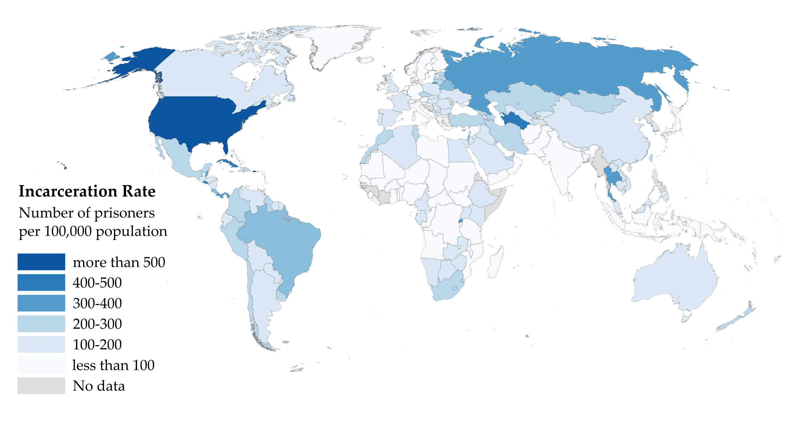

```{r setup, include=FALSE}
knitr::opts_chunk$set(echo = TRUE)
```


## Background

- US has more inmates, proportional to population size, than any other country.   While Black Americans make up 13% of the total US population, they account for 40% of incarcerated population in the US.

Image from [Wikipedia](https://en.wikipedia.org/wiki/Incarceration_in_the_United_States#/media/File:Prisoners_world_map_png2.png)

- In the US justice system, machine learning algorithms are sometimes used to assess a criminal defendant's risk of recidivism (arrest due to committing a future crime) are being used.


- Correctional Offenders Management Profiling for Alternative Sanctions (COMPAS) is the most widespread of these algorithms.
- Its goal according to COMPAS creators: assess "not just risk but also nearly two dozen so-called “criminogenic needs” that relate to the major theories of criminality, including “criminal personality,” “social isolation,” “substance abuse” and “residence/stability.” Defendants are ranked low, medium or high risk in each category."
- In 2014, then U.S. Attorney General Eric Holder warned that the risk scores might be injecting bias into the courts. He called for the U.S. Sentencing Commission to study their use. “Although these measures were crafted with the best of intentions, I am concerned that they inadvertently undermine our efforts to ensure individualized and equal justice,” he said, adding, “they may exacerbate unwarranted and unjust disparities that are already far too common in our criminal justice system and in our society.”
- The [questionnaire](https://www.documentcloud.org/documents/2702103-Sample-Risk-Assessment-COMPAS-CORE.html) for determining COMPAS does not directly ask for race, but some people question inherent racial bias in the algorithm.
- The COMPAS algorithm is proprietary and not available.
- More information in a [2016 ProPublica article on machine bias](https://www.propublica.org/article/machine-bias-risk-assessments-in-criminal-sentencing).


- Question: Have you heard of field of [algorithmic fairness](https://en.wikipedia.org/wiki/Fairness_(machine_learning))?
  - a) yes
  - b) no


## Data

- ProPublica requested two years of COMPAS scores from Broward County Sheriff's Office in Florida


- Discarded all but pre-trial COMPAS score assessments
- ProPublica matched COMPAS scores with criminal records from Broward County Clerk's Office website
- COMPAS score screening date and (original) arrest date frequently differed.  If they are too far apart, that may indicate an error.  The `days_b_screening_arrest` variable gives this difference in days.
- `is_recid` is rearrest at any time.  `two_year_recid` is rearrest within two years.  Here, `-1` indicates a COMPAS record could not be found and should probably be discarded
- COMPAS generates a general score, `decile_score`, (1, 2,...,10) where 1 indicates a low risk and 10 indicates a high risk of recidivism.  There is also a violence score as well, `v_decile_score`.

```{r}
dat<-read.csv("./compas-scores.csv")
dim(dat)
names(dat)
head(dat[,1:12])
summary(dat)
```

Are there multiple rows per person?

```{r}
length(unique(dat$id))
length(dat$id)
length(unique(dat$name))
sort(table(dat$name), decreasing=TRUE)[1:8]

```

- To me, these seem like common names, so it could be a coincidence, but I would check with the client as due diligence

- What else could we do to check?

What about other demographics?

```{r sex}
table(dat$sex)
table(dat$sex)/sum(!is.na(dat$sex))*100
```


```{r age}
library(ggplot2)
ggplot(dat, aes(x=age, color=sex, fill=sex)) +
  geom_histogram(position="dodge")
```

```{r race}
ggplot(dat, aes(race)) +
  geom_bar(fill='blue')
ggplot(dat, aes(x=race, fill=sex)) +
  geom_bar(position='dodge')
```

```{r compas}
ggplot(dat, aes(decile_score)) +
  geom_histogram()
table(!is.na(dat$decile_score))
```

General recommendations:

- Look at the raw data and different plots of the data before doing any modeling.


- Look for missing data and for values that might not make sense.
- Make sure you understand what observations (rows) are included in the data and which of those observations serve your data analysis goals
- Try to understand what the variables (columns) represent and which ones will serve your data analysis goals

## Quantifying racial bias

- Before doing any analysis, let's look at recidivism, COMPAS, and race

```{r Race and Recidivism}
df <- dat[dat$is_recid != -1,]
sum(is.na(df$race))
sum(is.na(df$is_recid))
table(df$race, df$is_recid)[,2]/t(table(df$race))*100
```
Above is the recidivism rate by race

- COMPAS also gave Black Americans greater scores on average:
```{r}
tapply(df$decile_score, df$race, mean)
```
Is this the best way to present this information?

## How to model algorithmic bias?

Question: Which are evidence of algorithmic bias? (select all that apply)

- a. Mean scores are higher in some groups than others
- b. Scores differ by group for individuals with the same recidivism risk
- c. In a regression modeling recidivism including score as a covariate, other demographic covariates are significant

$$\\[1in]$$


- Would COMPAS give someone a greater score solely due to being Black or some other demographic, without changing anything else?


- Stated differently, if two people have the same risk of recidivism, with race being their only difference, will the algorithm score them differently


- Remember COMPAS doesn't ask for race directly


- What does race affecting recidivism mean?
  - Incorrect: Someones race affects their behavior
  - Correct: The effect of race living in a racially biased society


- How could we quantify bias in this case?  Are race and COMPAS still associated after taking recidivism into account?


- It is tempting to use `decile_score ~ is_recid + race`
  - This regression could answer the following: Is race helpful for predicting COMPAS score while controlling for recidivism?
  - If race were significant, that would indicate that race contributes to COMPAS beyond recidivism itself, so COMPAS would be racially biased
  - But, this is not a valid model because `decile_score` is collected before `is_recid`

## Causation and Collider Bias


### Bayesian Network 1:

```{r chain, echo=FALSE, out.width = '40%', out.height= '40%'}
library(DiagrammeR)
grViz("digraph flowchart {A -> B -> C [constraint=false]}")
```

Mental Model: Think of a dataset where $A,B,C$ are collected

- $A$ = Alcohol
- $B$ = Hangover
- $C$ = Miss Class

Question: What would a regression model of `C ~ A + B` yield?

- a) Both $A$ and $B$ should be statistically significant
- b) Only $A$ should be statistically significant
- c) Only $B$ should be statistically significant
- d) Neither $A$ nor $B$ should be statistically significant

$$\\[1in]$$

```{r}
set.seed(1234)
size <- 1000
A <- 6*rnorm(size)+50
B <- -2*A - 25 + rnorm(size)
C <- 5*B + 3 +rnorm(size)
summary(lm(C~A+B))
```

Question: What about this regression model: `C ~ A`?

- a) $A$ should be statistically significant
- b) $A$ should not be statistically significant

$$\\[1in]$$

```{r}
summary(lm(C~A))
```

- Coefficient estimates:
$$\begin{align}
C &= 5B + 3 + \epsilon_B \\
&= 5(-2A - 25 + \epsilon_A) + 3 + \epsilon_B \\
&= -10A - 122 + 5\epsilon_A + \epsilon_B
\end{align}$$

Question: Does this coefficient and intercept estimate make sense?

- a) yes
- b) nope

$$\\[1in]$$

### Bayesian Network 2:
```{r fork, echo=FALSE, out.width = '40%', out.height='40%'}
grViz("digraph flowchart {A -> B; A -> C;}")
```

Mental Model:

- $A$ = Smoker
- $B$ = Yellow Teeth
- $C$ = Cancer

Question: What would a regression model of `C ~ A + B` yield?

- a) Both $A$ and $B$ should be statistically significant
- b) Only $A$ should be statistically significant
- c) Only $B$ should be statistically significant
- d) Neither $A$ nor $B$ should be statistically significant

$$\\[1in]$$

```{r}
set.seed(1234)
size <- 1000
A <- 6*rnorm(size)+50
B <- -2*A - 25 + rnorm(size)
C <- 2*A +5 +rnorm(size)
summary(lm(C~A+B))
```

Question: What about this regression model: `C ~ A`?

- a) $A$ should be statistically significant
- b) $A$ should not be statistically significant

$$\\[1in]$$

### Bayesian Network 3:
```{r collider, echo=FALSE, out.width = '40%', out.height='40%'}
grViz("digraph flowchart {A -> C; B -> C;}")
```

Mental Model:

- $A$ = Allergies
- $B$ = Flu
- $C$ = Sinus

Question: What would a regression model of `C ~ A + B` yield?

- a) Both $A$ and $B$ should be statistically significant
- b) Only $A$ should be statistically significant
- c) Only $B$ should be statistically significant
- d) Neither $A$ nor $B$ should be statistically significant

$$\\[1in]$$

```{r}
set.seed(1234)
size <- 1000
A <- 6*rnorm(size)+50
B <- -2*rnorm(size) - 25 + rnorm(size)
C <- -4*A + 5*B + 3 +rnorm(size)
summary(lm(C~A+B))
```

### Bayesian Network 3 (again) with `A` as the outcome:

```{r collider2, echo=FALSE, out.width = '40%', out.height='40%'}
grViz("digraph flowchart {A -> C; B -> C;}")
```

Question: What would a regression model of `A ~ B + C` yield?

- a) Both $B$ and $C$ should be statistically significant
- b) Only $B$ should be statistically significant
- c) Only $C$ should be statistically significant
- d) Neither $B$ nor $C$ should be statistically significant

$$\\[1in]$$

```{r}
summary(lm(A~B+C))
```

Question: What would a regression model of `A ~ B` yield?

- a) $B$ should be statistically significant
- b) $B$ should not be statistically significant

$$\\[1in]$$

```{r}
summary(lm(A~B))
```

- Even though `A` and `B` are independent, they are *conditionally dependent* if controlling for `C`.


- Why did this happen?  Let's take a simple example


- Assume $A\sim \text{Bernoulli}(0.4)$, and $B\sim \text{Bernoulli}(0.7)$


- Question: What is $P(B=1|A=1)$?


- Define $C = \begin{cases} 1 \text{ when } A=B \\ 0 \text{ when } A\neq B\end{cases}$


- Question: What is $P(B=1| A=1, C=0)$?


- $A$ and $B$ are independent; that is, knowledge of $B$ give no information on the value of $A$. But, additional knowledge of $C$ does give information about the value of $A$.

**Bayesian Network 4**
```{r shielded collider, echo=FALSE, out.width = '40%'}
grViz("digraph flowchart {A -> C; B -> C; A -> B}")
```

Mental Model:

- $A$ = Study into the night
- $B$ = Go to bed late
- $C$ = Fail Test

Question: What would a regression model of `C ~ A + B` yield?

- a) Both $A$ and $B$ should be statistically significant
- b) Only $A$ should be statistically significant
- c) Only $B$ should be statistically significant
- d) Neither $A$ nor $B$ should be statistically significant

$$\\[1in]$$

```{r}
set.seed(1234)
size <- 1000
A <- 6*rnorm(size)+50
B <- A - 25 - 2*rnorm(size)
C <- -4*A + 5*B + 3 +rnorm(size)
summary(lm(C~A+B))
```

Question: What about this regression model: `C ~ A`?

- a) $A$ should be statistically significant
- b) $A$ should not be statistically significant

$$\\[1in]$$

```{r}
summary(lm(C~A))
```

Question: What about this regression model: `B ~ A + C`?

- a) Both $A$ and $C$ should be statistically significant
- b) Only $A$ should be statistically significant
- c) Only $C$ should be statistically significant
- d) Neither $A$ nor $C$ should be statistically significant

$$\\[1in]$$

```{r}
summary(lm(B~A+C))
```

## COMPAS and possible collider bias

- COMPAS uses [questionnaire](https://www.documentcloud.org/documents/2702103-Sample-Risk-Assessment-COMPAS-CORE.html) responses to predict recidivism.  

- Because COMPAS is used in sentencing, it may actually impact recidivism as well.

- One way to quantify racial bias in COMPAS would be to isolate the link between race and COMPAS that is not associated with recidivism.  But, it is not clear how to untangle this from potential collider bias.

```{engine="dot", out.width = '40%'}
digraph {
  Race -> COMPAS [ label = "?"];
  COMPAS -> Recidivism [ label = "?"]; 
  Race -> Recidivism [ label = "?"]
  }
```

- If we used `decile_score ~ is_recid + race` as a model to quantify bias, it seems very likely that there will be collider bias

- IMPORTANT: The model below is NOT informative because of the possible causal structure of the data
  - Included for teaching purposes only

```{r compasColliderBias}
summary(lm(decile_score ~ is_recid + race, data=df))
```

In the regression above, several race indicator variables are significant.  But, because collider bias is possible here, we *cannot* conclude that COMPAS is racially biased.

## Survival Analysis

- Survival analysis is a set of statistical methods for modeling the time until an event occurs, especially when follow up is not complete for each observation.

- Example: Testing a new terminal cancer treatment, participants are either given the standard or test treatment.  The goal is to prolong the patient's life.  Each patient is followed until death from cancer.  During follow up some participants die from cancer but some drop out while others might die from something else.  Survival analysis allows us to use this data even though we do not have events for each participant.

**Set up**

- Assume that $T$ is the time until an event randomly occurs.

- For example, $T$ might be the duration from cancer treatment until remission or death.
- $T\sim f$
  - That is, $f(t)$ is the probability density function (pdf) of $T$ where $t$ is time
- $F(t)=P(T<t)=\int_0^tf(x)dx$ is cumulative distribution function (cdf) of $T$
- Survival function:
$$S(t)=P(T>t)=1-F(t)$$
- The survival function gives the probability of not having an event before time $t$ (survive until $t$)

- Hazard function:
\[
\lambda(t) =\lim_{h\rightarrow 0} \frac{P(T\leq t+h | T>t)}{h} = \lim_{h\rightarrow 0} \frac{P(t<T\leq t+h)}{h P(T>t)}= \frac{f(t)}{S(t)} = -\frac{d\log S(t)}{dt}.
\]
- Hazard function gives the instantaneous probability of an event at time $t$ given survival until time $t$
- Notice that $f(t)=\lambda(t)S(t)$
- Cumulative hazard function:
\[
\Lambda(t)= \int_0^t\lambda(x)dx=-\int_0^td\log S(x)=-\log S(t).
\]
- How to get the survival function from the hazard function:
\[
S(t)=\exp[-\Lambda(t)].
\]
- Side note: If $\lambda(t)=\lambda$ (constant function), then $f$ is the exponential distribution:
$$
\begin{align*}
  \lambda(t)=\lambda 
  &\Leftrightarrow \Lambda(t)=\lambda t \\
  &\Leftrightarrow S(t)=\exp(-\lambda t) \\
  &\Leftrightarrow f(t)= \lambda(t) S(t) = \lambda\exp(-\lambda t)
\end{align*}
$$

**Censoring at Random**

- Not always possible to wait for an event to occur for each participant before doing the analysis


- Cancer study example: participants may drop out of the study before an event is observed or the study may close before each participant experiences an event


- This is call right censored data: have start time but end times can either be at event or drop out time


- Question: For censored observations, how to make use of time duration without event?


- Model: $f(t|x; \theta)$ with corresponding hazard, $\lambda(t|x;\theta)$, and survival, $S(t|x;\theta)$

- Want $\theta$ to quantify difference in risk (until event) among observations
  - Note: $\theta$ quantifies how fast an event will likely occur for an observation but communicated in terms of risk of event

  
- Assumption: censoring occurs at random (in independently from $f$)


- Censoring cumulative probability distribution model:
$$G(t;\phi)$$


- Corresponding censoring pdf model:
$$g(t;\phi)$$


- Data:
$$(t_1, \delta_1),\dots, (t_n,\delta_n)$$
- $t_i$ for $i=1,\dots,n$ is duration of follow-up until either event or censor time
- $\delta_i$ is event indicator:
  - $\delta_i=1$ means that observation $i$ had an event and $t_i \sim f(t;\theta)$
  - $\delta_i=0$ means that observation $i$ was censored and $t_i \sim g(t;\phi)$
- Because $f$ and $g$ are independent (and because observations are independent), the likelihood is 
\[
\begin{align}
L(\theta,\phi) &= \prod_{i=1}^n [f(t_i;\theta)[1-G(t_i;\phi)]]^{\delta_i} [g(t_i;\phi)S(t_i;\theta)]^{1-\delta_i}\\
&=  \prod_{i=1}^n [f(t_i;\theta)]^{\delta_i}[S(t_i;\theta)]^{1-\delta_i} \prod_{i=1}^n [g(t_i;\phi)]^{1-\delta_1}[1-G(t_i;\phi)]^{\delta_i}\\
&= L(\theta) L(\phi) \propto L(\theta).
\end{align}
\]

- Observe an event for $i$ ($\delta_i=1$), then $t_i\sim f$ and censoring did not occur prior $[f(t_i;\theta)[1-G(t_i;\phi)]]^{\delta_i}$


- Observe censoring for $i$ ($\delta_i=1$), then $t_i\sim g$ and an event did not occur prior $[g(t_i;\phi)S(t_i;\theta)]^{1-\delta_i}$


- But, we do not care about the censoring distribution, only the time to event distribution.


- Partial likelihood 
$$L(\theta)=\prod_{i=1}^n [f(t_i;\theta)]^{\delta_i}[S(t_i;\theta)]^{1-\delta_i}= \prod_{i=1}^n \lambda(t_i)^{\delta_i} S(t_i)$$ 

## Kaplan-Meier Estimator

- Question: Have you heard of/seen Kaplan-Meier Curves before this?
  - A: Yes
  - B: No

- Visualize the percent of population surviving until time $t$ as $t$ increases


- Consider estimating survival: $S(t) = P(T>t)$ from sample $(t_1, \delta_1),\dots, (t_n,\delta_n)$

- Approximate $S(t)$ as a non-parametric decreasing step function
  - $S(t)$ is proportion of sample that has not experienced an event at time $t$
  - Problem: If $i$ censored prior to $t$, we cannot know if their event occurred before or after $t$

- Order sample by event times $t_i$ where $\delta_i=1$: 
$$t_{(1)}, t_{(2)}, \dots, t_{(J)}$$


- There are only $J$ sample points in time where events occur


- Question: For any events $A$ and $B$, we can factor their joint probability as $P(A,B) = P(A|B) P(B)$?
  - a. True
  - b. False


- Question: If $A\subseteq B$, then $P(A) = P(A,B)$?
  - a. True
  - b. False


- Because $t_{(j)} > t_{(j-1)}$,
$$S\left(t_{(j)}\right) = P\left(T > t_{(j)}\right) = P\left(T > t_{(j)}, T > t_{(j-1)}\right) = P\left(T > t_{(j)} | T > t_{(j-1)}\right) \times P\left(T > t_{(j-1)}\right)$$
- Repeating
$$\begin{align*}
S\left(t_{(j)}\right) 
&= P\left(T > t_{(j)} | T > t_{(j-1)}\right) \times P\left(T > t_{(j-1)} | T > t_{(j-2)}\right) \times P\left(T > t_{(j-2)}\right) \\
&= P\left(T > t_{(j)} | T > t_{(j-1)}\right) \times P\left(T > t_{(j-1)} | T > t_{(j-2)}\right) \times\dots\times P\left(T > t_{(2)} | T > t_{(1)}\right) \times P\left(T > t_{(1)}\right)\\
\end{align*}$$

- This seems [tautological](https://www.merriam-webster.com/dictionary/tautology), but it's helpful here because it allows us to include the censored observations in the denominator appropriately as $t$ increases

- For $j = 1,\dots, J$, the "instantaneous" probability of an event occurring at time $t_{(j)}$:
$$\pi_j = P\left(T \leq t_{(j)} | T > t_{(j-1)}\right) = 1-P\left(T > t_{(j)} | T > t_{(j-1)}\right)$$
- Then 
\[
S(t_{(j)}) = (1-\pi_j)(1-\pi_{j-1}) \dots (1-\pi_2)(1-\pi_1).
\]
- Calculate $\pi_j$:
  - Let $n_j = \#\{t_i \geq t_{(j)}\}$ be the number of participants who are still at risk (who haven't had an event or been censored) at time $t_{(j)}$
  
  - Note: that $n_j$ decreases as events occur or as they are censored.
  - Let $d_j = \#\{t_i=t_{(j)}, \delta_i=1\}$ be the number of events that occur at time $t_{(j)}$.
  - Maximizes the non-parametric likelihood
  $$\pi_j = \frac{d_j}{n_j}$$
- So, we can approximate the survival function as
\[
\hat S(t) = \prod_{j=1}^J \left( 1-\frac{d_j}{n_j}\right)^{I(t_{(j)}\leq t)}.
\]
- Using the delta-method, we can approxmiate the variance of the estimated survival function as 
\[
\hat V[\hat S(t)] = \hat S(t)^2 \sum_{j: t_{(j)}\leq t} \frac{d_j}{n_j(n_j-d_j)}
\]
- With the variance, we can run statistical tests

This [video](https://www.youtube.com/watch?v=NDgn72ynHcM) clearly illustrates how to calculate the KM survival function.

```{r km_curve}
library(survival)

dat <- read.csv(url('https://raw.githubusercontent.com/propublica/compas-analysis/master/cox-parsed.csv'))

dim(dat)
dat2 <- dat[dat$end > dat$start,]
dim(dat2)
dat3 <- dat2[!duplicated(dat2$id),]
dim(dat3)
ph <- dat3[dat3$decile_score>0,]
dim(ph)
ph$t_atrisk <- ph$end - ph$start

survobj <- with(ph, Surv(t_atrisk, event))
fit0 <- survfit(survobj~1, data=ph)
# summary(fit0)
plot(fit0, xlab="Time at Risk (Days)", 
   ylab="Percent Not Rearrested",
   main ="Survival Function (Overall)") 

ph$compas <- cut(ph$decile_score, breaks=c(0,3,6,10))
fitc <- survfit(survobj~compas, data=ph)
plot(fitc, xlab="Time at Risk (Days)", 
   ylab="Percent Not Rearrested", yscale=100, ylim=c(1, 0.4),
   main="Survival Function by COMPAS",
   col = c('red', 'blue', 'orange', 'yellow', 'green', 'purple'))
legend_text = c('1 to 3', '4 to 6', '7 to 10')
legend('bottomleft', legend=legend_text, title='COMPAS Score', bty='n',
       col=c('red', 'blue', 'orange'), lty=1)

ph$t_atrisk <- ph$end - ph$start

survobj_yr <- with(ph, Surv(t_atrisk/365.25, event))
fitr <- survfit(survobj_yr~race, data=ph)
# `fun` parameter only works here because plot is actually calling plot.survfit
plot(fitr, xlab="Time at Risk (Years)", 
   ylab="Recidivism (%)", yscale=100, ylim=c(0, 0.45), fun = function(x) {1 - x},
   main="Recidivism by Race over Time",
   col = c('red', 'blue', 'orange', 'yellow', 'green', 'purple'))
recid_order = c(1,3,5,4,6,2)
legend('topleft', legend=levels(as.factor(ph$race))[recid_order], bty='n',
       col = c('red', 'blue', 'orange', 'yellow', 'green', 'purple')[recid_order], lty=1)
text(2.5, 0.05, 'Log-Rank Test\n p<0.001')
```

- Remember: For publication, make plots as easy as possible to understand


- Question (opinion): Which plot type is easier to understand, Recidivism or Not Rearrested?
  - a. Recidivism
  - b. Not Rearrested


- Here $S(t)$ give the probability that rearrest will occur after time $t$; that is, someone will not be arrested before time $t$


- $F(t) = 1-S(t)$ is the cumulative probability of arrest before time $t$


- Each curve gives the proportion of recidivism in a racial group at time $t$


- Years seems easier to understand than day for this


- Question (Opinion): Which caption below is the best?
  - a. Cumulative Probabilities of Recidivism by Race
  - b. The plot above provides the cumulative probability of recidivism by race as time elapses
  - c. The plot above shows the transformed survival functions, $P_a(t) = 1-S_a(t)$, for recidivism by race
  - d. [no caption]


- We can use the [log-rank test](https://en.wikipedia.org/wiki/Logrank_test) to see if at least one curve is different from others


- $H_0:$ There is no different between the curves; $H_1:$ at least one curve is different from others


```{r}
survdiff(survobj~race, data=ph)
```


- Statistical interpretation: This significant $p$-value indicates that at least one survival curve is different from the other


- Research area interpretation: Recidivism rates differ by race


- Don't forget: [documentation](https://cran.r-project.org/web/packages/survival/survival.pdf) is your best friend


- As a consultant, you will probably need to read the documentation a lot.

## Cox proportional hazards model

- Difficult to work with censored data using generalized linear models


- Question: We can use use a GLM here?
  - A: Yes
  - B: No
  - C: Not Sure


- Assuming that each individual hazard function is proportional to some common baseline hazard function makes the problem workable:
\[
\lambda(t|x_i) = \lambda_0(t) \exp(\beta x_i)
\]
where $x_i$ is the covariate vector for participant $i$ and $\beta$ is the parameter vector to be estimated


- $\lambda_0(t)$ is the hazard function for $x_i=(0,\dots,0)$


- $\exp(\beta x_i)$ explains proportional differences in hazards as $x_i$ changes as in parametric regression


- Then the probability that individual $j$ experiences an event at $t_{(j)}$ given survival until $t_{(j)}$ is
$$\lambda(t_{(j)}|x_{(j)})=\lambda_0(t_{(j)})\exp(x_{(j)}\beta)$$


- The total probability within the sample of an event occurring at time $t_{(j)}$ given those who have survived until $t_{(j)}$ is 
$$\sum_{k: t_k\geq t_{(j)}} \lambda(t_{(j)}|x_k) = \sum_{k: t_k\geq t_{(j)}} \lambda_0(t_{(j)})\exp(x_k\beta)$$

- Then probability of an event occurring at $t_{(j)}$ conditioning on covariates $x_{(j)}$ (partial likelihood) is
$$\begin{align*}
\tilde L_j(\beta) &= P[(j)\text{ fails}|\text{1 failure from those at risk at $t_{(j)}$}]
= \frac{P[\text{$(j)$ fails}| \text{still at risk}]}{\sum_{k: t_k\geq t_{(j)}}P(\text{$k$ fails}| \text{still at risk})} \\
&= \frac{\lambda(t_{(j)}|x_{(j)})}{\sum_{k: t_k\geq t_{(j)}} \lambda(t_{(j)}|x_k)} = \frac{\lambda_0(t_{(j)})\exp(x_{(j)}\beta)}{\sum_{k: t_k\geq t_{(j)}} \lambda_0(t_{(j)})\exp(x_k\beta)}
= \frac{\exp(x_{(j)}\beta)}{\sum_{k: t_k\geq t_{(j)}} \exp(x_k\beta)}
\end{align*}$$


- Notice that the baseline hazard function, $\lambda_0(t)$, cancels.  So, now we can use use an optimization technique to maximize this function

- The joint likelihood for the sample is
$$\tilde L(\beta) = \prod_{j=1}^J L_j(\beta) = \prod_{j=1}^J \frac{\exp(x_{(j)}\beta)}{\sum_{k: t_k\geq t_{(j)}} \exp(x_k\beta)}
= \prod_{i=1}^n \left[\frac{\exp(x_i\beta)}{\sum_{\ell\in R(t_i)} \exp(x_\ell\beta)}\right]^{\delta_i}$$

- log- partial likelihood:
$$
\tilde \ell(\beta) = \sum_{j=1}^J\left[ x_{(j)}\beta - \log \left(\sum_{k: t_k\geq t_{(j)}} \exp(x_k\beta) \right)\right]
$$
where $R(t) = \left\{\ell: t_\ell \geq t\right\}$


- Maximize the likelihood with Newton-Raphson method


- Question: Can we use $\hat \beta$ to predict survival times?
  - a. Yes
  - b. No

### Is COMPAS racially biased?

- To determine this, we must use interactions.  Why?


- Without a race/COMPAS interaction
  - race parameter estimates would indicate average risk of recidivism compared to baseline group
  - decile score parameter would indicate average increase in risk for a unit increase in score


- Let $A$ and $B$ be binary, input variables and $Y$ a continuous outcome
  - assume linear regression


| Variable | Coef | p-value |
| --- | --- | ---  |
| A | 1.5 | 0.01 |
| B | 0.1 | 0.35 |
| A*B | 0.5 | 0.02 |


- For the questions below, a = True, b=False


- Question (T/F): On average, $Y$ increases by 1.5 when $A=1$ compared to $A=0$ while controlling for $B$ and this change is statistically significant at an $\alpha=0.05$ significance level.


- Question(T/F): There is no evidence to suggest that $B$ is associated with $Y$ while controlling for $A$


- Question(T/F): $Y$ increases by 0.5 when both $A$ and $B$ are both 1 compared to otherwise


- Question(T/F): When $B=0$, $Y$ increases by 1.5, on average, when $A=1$ compared to $A=0$


- It is a little easier to think of the model in terms of an equation


- Changing the baseline race
  - R uses alphabetical order so African-American (AA) would be the reference group without the `relevel` command
  - Now, Caucasian (white) is the reference group
  - In most medical literature, white is the reference racial group, but this has come under some criticism
  - Here, because AA is of particular interest, we probably don't want AA to be the reference group
- We divide age by 10 so that we can interpret change in risk per 10 years of age

```{r phmodel}
ph$race = relevel(as.factor(ph$race), ref="Caucasian")
ph$age10 = ph$age/10
summary(coxph(survobj~decile_score*race+sex+age10, data=ph))
```

| Factor | Hazard Rate (95% CI) | p-value |
| :---  | :----:   |  ---: |
| COMPAS |||
| &nbsp;&nbsp;&nbsp;&nbsp;&nbsp;&nbsp; Decile Score (per point) | 1.20 (1.17, 1.23) | <0.001 |
| Race (compared to White) | | |
| &nbsp;&nbsp;&nbsp;&nbsp;&nbsp;&nbsp;    Black | 1.32 (1.10, 1.57) | 0.003 |
| &nbsp;&nbsp;&nbsp;&nbsp;&nbsp;&nbsp;    Asian | 0.16 (0.03, 0.80) | 0.026 |
| &nbsp;&nbsp;&nbsp;&nbsp;&nbsp;&nbsp;    Hispanic | 1.08 (0.82, 1.42) | 0.601 |
| &nbsp;&nbsp;&nbsp;&nbsp;&nbsp;&nbsp;    Native American | 0.07 (0.00, 1.55) | 0.093 |
| &nbsp;&nbsp;&nbsp;&nbsp;&nbsp;&nbsp;    Other | 0.80 (0.57, 1.13) | 0.203 |
| Sex (compared to Female) |||
| &nbsp;&nbsp;&nbsp;&nbsp;&nbsp;&nbsp;    Male | 1.49, (1.34, 1.65) | <0.001 |
| Age |||
| &nbsp;&nbsp;&nbsp;&nbsp;&nbsp;&nbsp; (per 10 years) | 0.90 (0.87, 0.94) | <0.001 |
| COMPAS Decile Score by Race (compared to White) |||
| &nbsp;&nbsp;&nbsp;&nbsp;&nbsp;&nbsp;    Black (per one point) | 0.97 (0.94, 0.99) | 0.026 |
| &nbsp;&nbsp;&nbsp;&nbsp;&nbsp;&nbsp;    Asian (per one point) | 1.36 (1.06, 1.74) | 0.014 |
| &nbsp;&nbsp;&nbsp;&nbsp;&nbsp;&nbsp;    Hispanic (per one point) | 0.96 (0.91, 1.01) | 0.154 |
| &nbsp;&nbsp;&nbsp;&nbsp;&nbsp;&nbsp;    Native American (per one point) | 1.35 (0.94, 1.94) | 0.100 |
| &nbsp;&nbsp;&nbsp;&nbsp;&nbsp;&nbsp;    Other (per one point) | 1.05 (0.97, 1.12) | 0.218 |

- Question: Does this model indicate that COMPAS is racially biased?
  - A: Yes
  - B: No
  - C: Not Sure


- Interpretations:


- For each unit increase in COMPAS decile score, risk of recidivism increases, on average, by a factor 1.2 (p<0.001).


- Risk of recidivism is greater for Blacks (1.32, p=0.003) and smaller for Asians (0.16, p=0.026) compared to Whites; all other racial groups had similar risk to Whites.


- Risk is greater for men with 1.5 (p<0.001) times the risk of women.


- Risk decreases with age; for every 10 year increase, risk drops by a factor of 0.9 (10%) on average.


- Compared to Whites, a unit increase in the COMPAS decile score for African-Americans corresponds to a decrease in risk of recidivism by a factor of 0.97 (p=0.026). 


- Said differently, among African-Americans and Caucasians with similar COMPAS scores, African-Americans, on average, have a 3% lower risk of recidivism compared to Caucasians. This indicates that COMPAS may be assigning higher scores to African-American than to Caucasians with a similar risk of recidivism. 


- Asians, on the other hand, were assigned lower scores than Caucasians with a similar risk of recidivism (p=0.0128). There were no differences between other racial groups and Caucasians.


- Testing proportional hazards assumption


- Null Hypothesis: Proportional hazards


- Should consider transformation (next lecture)

```{r testAssumption}
test.ph <- cox.zph(coxph(survobj~race+age+decile_score, data=ph))
test.ph
```

- Using our knowledge of regression with causation (Bayesian Networks above), how can we determine if the COMPAS algorithm is racially biased?

**Time-Dependent Covariates**

- Because we are following observations over time, some covariates might change over time
  - For example, zip code, smoking status, etc
  - This change may have an effect on the hazard function


- Recall that $\lambda(t)$ is the instantaneous probability of an event at time $t$ given survival up to $t$


- If one or more covariates change over time, $x(t)$, we can model hazard as
$$\lambda(t|x(t)) = \lambda_0(t)\exp(\beta x(t))$$


- The partial likelihood become
$$\tilde L(\beta) = \prod_{i=1}^n \left[\frac{\exp(x_i(t_i)\beta)}{\sum_{\ell\in R(t_i)} \exp(x_\ell(t_i)\beta)}\right]^{\delta_i}$$

**Stratified Models**

- If a sample of $n$ observations are thought to have $S$ mutually exclusive baseline hazards, we can choose to use a stratified model
$$\lambda_h(t|x) = \lambda_{0h}(t)\exp(x\beta) \text{ for } h=1,\dots,S$$

- This assumes that the strata have different baseline hazard functions but the proportional hazards by covariate are the same, regardless of strata


- Partial likelihood:
$$\tilde L(\beta) = \prod_{h=1}^S \prod_{i=1}^{n_h} \left[\frac{\exp(x_{i(h)}\beta)}{\sum_{\ell\in R_h(t_{i(h)})} \exp(x_{\ell(h)}\beta))}\right]$$
where $n_h$ is the number in each strata, $i(h)$ is the $i$th observation in the $h$th stratam, $R_h$ is the stratam specific risk set


- Example: Want to assess effect of age and weight only on risk of death, we may want to stratify by gender


- Note: If we stratify baseline hazard function, we will no longer have a covariate estimate for the stratified variable(s)


- If covariates are assumed to be different in different strata, we can estimate strata-specific parameters, $\beta_h$, for each strata
$$\lambda_h(t|x) = \lambda_{0h}(t)\exp(x\beta_h) \text{ for } h=1,\dots,S$$

**Frailty and clustered models**

- Some data will have associations among the observations themselves


- Example: COMPAS data could have multiple arrests, their associated COMPAS score, and their own follow up


- It is reasonable to assume that past scores, and arrests may provide information (association) on future data


- If there are associations among the observations in the data, the parameter point estimates will be accurate


- But, standard error will not be correct, so any inference (p-values, confidence intervals) will not be valid


- Solution: modify the information sandwich for GLMs with associated observations to Cox PH


- This provides a consistent estimator for the covariance matrix


- Note: so far we have not discussed sandwich estimator


- Other Solution: use random effects


These notes are based on chapter 9 of Lachin, John M. Biostatistical methods: the assessment of relative risks. Vol. 509. John Wiley & Sons, 2009.

### Consulting Case Study: Treating Syphilis in People living with HIV

- The typically, the first line treatment for syphilis is penicillin


- But, people living with HIV are sometimes thought to be immunocompromised


- Because of this, it was common for physicians to administer two or more standard doses to treat syphilis for someone living with HIV


- US treatment guidelines in the US recommended one standard dose regardless of HIV status


- But, there was disagreement in the medical community on this guideline


- This type of disagreement (equipoise) frequently leads to research


**Background:** Treatment guidelines recommend the use of a single dose of benzathine penicillin G (BPG) for treating early syphilis in human immunodeficiency virus (HIV)-infected persons. However, data supporting this rec- ommendation are limited. We examined the efficacy of single-dose BPG in the US Military HIV Natural History Study.

**Methods:** Subjects were included if they met serologic criteria for syphilis (ie, a positive nontreponemal test [NTr] confirmed by treponemal testing). Response to treatment was assessed at 13 months and was defined by a ≥4-fold decline in NTr titer. Multivariate Cox proportional hazard regression models were utilized to examine factors associated with treatment response.

**Results:** Three hundred fifty subjects (99% male) contributed 478 cases. Three hundred ninety-three cases were treated exclusively with BPG (141 with 1 dose of BPG). Treatment response was the same among those receiving 1 or >1 dose of BPG (92%). In a multivariate analysis, older age (hazard ratio [HR], 0.82 per 10-year increase; 95% con- fidence interval [CI], .73–.93) was associated with delayed response to treatment. Higher pretreatment titers (refer- ence NTr titer <1:64; HR, 1.94 [95% CI, 1.58–2.39]) and CD4 counts (HR, 1.07 for every 100-cell increase [95% CI, 1.01–1.12]) were associated with a faster response to treatment. Response was not affected by the number of BPG doses received (reference, 1 dose of BPG; HR, 1.11 [95% CI, .89–1.4]).

**Conclusion:** In this cohort, additional BPG doses did not affect treatment response. Our data support the current recommendations for the use of a single dose of BPG to treat HIV-infected persons with early syphilis.

[Ganesan, Anuradha, Octavio Mesner, Jason F. Okulicz, Thomas O'Bryan, Robert G. Deiss, Tahaniyat Lalani, Timothy J. Whitman, Amy C. Weintrob, Grace Macalino, and Brian K. Agan. "A single dose of benzathine penicillin G is as effective as multiple doses of benzathine penicillin G for the treatment of HIV-infected persons with early syphilis." Clinical Infectious Diseases 60, no. 4 (2015): 653-660.](https://academic.oup.com/cid/article/60/4/653/2895840)

Look for in paper:

- Data inclusion criteria


- Baseline table for individuals


- Syphilis episodes table


- KM curves


- Cox PH Model


[Response Letter](http://citeseerx.ist.psu.edu/viewdoc/download?doi=10.1.1.864.7969&rep=rep1&type=pdf)

- Because of the disagreement, some clinicians wrote a negative response to our study
- The response focused mainly on the methods

[Our Response](https://academic.oup.com/cid/article/60/9/1444/404706)

### High Level Summary

- Always think about time that variables are collected and possible causal ordering


- Try to be aware of how underlying causal structure may affect parameters


- The causal network above work for any regression model but in general, may not work as well as the simulations because all association were linear in the network simulations


- For many inference problems, keeping non-significant variables in model gives additional information to reader


- Survival analysis tools, such as Kaplan-Meier curves and Cox PH regression, are helpful when follow times leading up to an event vary by observation, especially when censoring occurs.


### Questions
- For time to event data with no censoring, we can use Poisson regression?
  - a. True
  - b. False

$$\\[2in]$$

- With censored data, factoring the time-to-event density as hazard x survival allows us to make use of censored follow-up times.
  - a. True
  - b. False

$$\\[2in]$$

- KM curves visualize the hazard function
  - a. True
  - b. False

$$\\[2in]$$

- Log-rank test can determine if two survival curves are different while controlling for other variables.
  - a. True
  - b. False

$$\\[2in]$$

- For Cox PH regression, we typically care more about the number of events in the data than than the number of rows.
  - a. True
  - b. False

$$\\[2in]$$

- Interaction help determine if two factors jointly *affect* the outcome differently than can be explained additively by each factor alone.
  - a. True
  - b. False

$$\\[2in]$$

- When working with clustered data, it is usually helpful to include a cluster-level baseline table and a row-level table.
  - a. True
  - b. False

$$\\[2in]$$