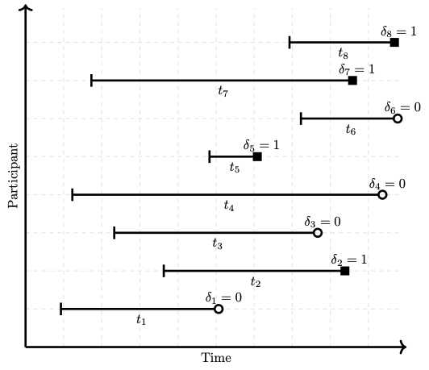
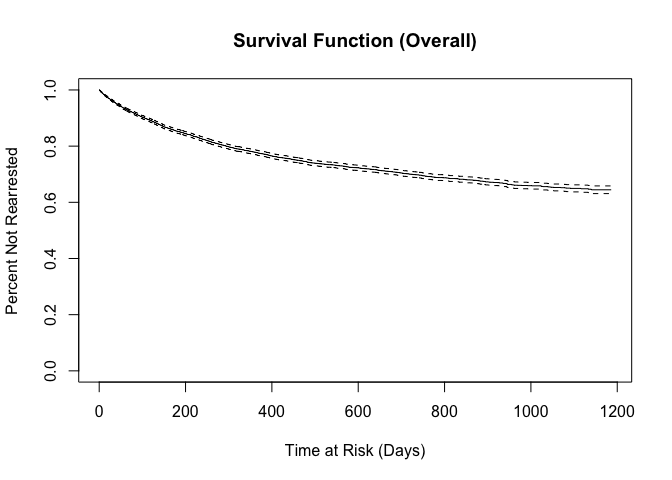
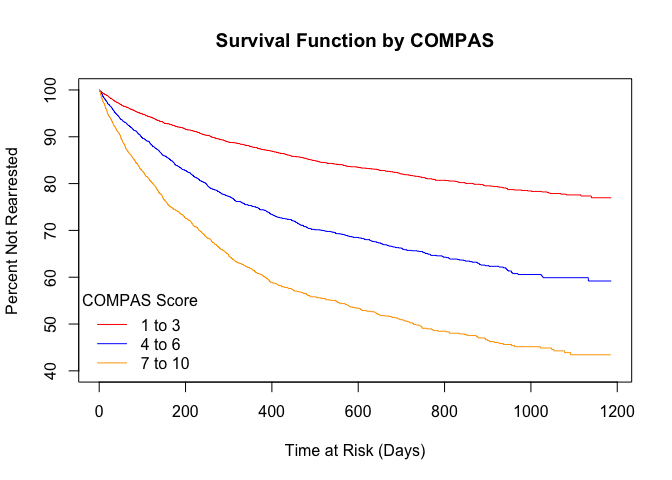

## Consulting Skills Focus

- In real life consulting, the client will frequently understand the data and surrounding research better than the data scientist/statistician.


- Analysis should center around a well-defined research question that drive the analysis and the data should be able to provide insight on the question of interest.
- Human bias and data analysis: We all have bias.  This can influence data analysis.  A data analyst, we should do our best to objectively present the data.  When necessary to make assumptions, state them explicitly.  
- Publication Bias example: Researchers frequently want "positive results."  Usually this means significant p-values.  Variable selection is a simple way to change p-values, p-hacking.  It's common to need to change variables in a model be it should be done a principled way.
- Question: Have you heard of field of [algorithmic fairness](https://en.wikipedia.org/wiki/Fairness_(machine_learning))?
  - a) yes
  - b) no

## Case Study Background

- US has more inmates, proportional to population size, than any other country.   While Black Americans make up 13% of the total US population, they account for 40% of incarcerated population in the US.

Image from [Wikipedia](https://en.wikipedia.org/wiki/Incarceration_in_the_United_States#/media/File:Prisoners_world_map_png2.png)

- In the US justice system, machine learning algorithms are sometimes used to assess a criminal defendant's risk of recidivism (arrest due to committing a future crime) are being used.


- Correctional Offenders Management Profiling for Alternative Sanctions (COMPAS) is the most widespread of these algorithms.
- Its goal according to COMPAS creators: assess "not just risk but also nearly two dozen so-called “criminogenic needs” that relate to the major theories of criminality, including “criminal personality,” “social isolation,” “substance abuse” and “residence/stability.” Defendants are ranked low, medium or high risk in each category."
- In 2014, then U.S. Attorney General Eric Holder warned that the risk scores might be injecting bias into the courts. He called for the U.S. Sentencing Commission to study their use. “Although these measures were crafted with the best of intentions, I am concerned that they inadvertently undermine our efforts to ensure individualized and equal justice,” he said, adding, “they may exacerbate unwarranted and unjust disparities that are already far too common in our criminal justice system and in our society.”
- The [questionnaire](https://www.documentcloud.org/documents/2702103-Sample-Risk-Assessment-COMPAS-CORE.html) for determining COMPAS does not directly ask for race, but some people question inherent racial bias in the algorithm.
- The COMPAS algorithm is proprietary and not available.
- More information in a [2016 ProPublica article](https://www.propublica.org/article/machine-bias-risk-assessments-in-criminal-sentencing).


## Data

- ProPublica requested two years of COMPAS scores from Broward County Sheriff's Office in Florida


- Discarded all but pre-trial COMPAS score assessments
- ProPublica matched COMPAS scores with criminal records from Broward County Clerk's Office website
- COMPAS score screening date and (original) arrest date frequently differed.  If they are too far apart, that may indicate an error.  The `days_b_screening_arrest` variable gives this difference in days.
- `is_recid` is rearrest at any time.  `two_year_recid` is rearrest within two years.  Here, `-1` indicates a COMPAS record could not be found and should probably be discarded
- COMPAS generates a general score, `decile_score`, (1, 2,...,10) where 1 indicates a low risk and 10 indicates a high risk of recidivism.  There is also a violence score as well, `v_decile_score`.


```r
dat<-read.csv("./compas-scores.csv")
dim(dat)
```

```
## [1] 11757    47
```

```r
names(dat)
```

```
##  [1] "id"                      "name"                   
##  [3] "first"                   "last"                   
##  [5] "compas_screening_date"   "sex"                    
##  [7] "dob"                     "age"                    
##  [9] "age_cat"                 "race"                   
## [11] "juv_fel_count"           "decile_score"           
## [13] "juv_misd_count"          "juv_other_count"        
## [15] "priors_count"            "days_b_screening_arrest"
## [17] "c_jail_in"               "c_jail_out"             
## [19] "c_case_number"           "c_offense_date"         
## [21] "c_arrest_date"           "c_days_from_compas"     
## [23] "c_charge_degree"         "c_charge_desc"          
## [25] "is_recid"                "num_r_cases"            
## [27] "r_case_number"           "r_charge_degree"        
## [29] "r_days_from_arrest"      "r_offense_date"         
## [31] "r_charge_desc"           "r_jail_in"              
## [33] "r_jail_out"              "is_violent_recid"       
## [35] "num_vr_cases"            "vr_case_number"         
## [37] "vr_charge_degree"        "vr_offense_date"        
## [39] "vr_charge_desc"          "v_type_of_assessment"   
## [41] "v_decile_score"          "v_score_text"           
## [43] "v_screening_date"        "type_of_assessment"     
## [45] "decile_score.1"          "score_text"             
## [47] "screening_date"
```

```r
head(dat[,1:12])
```

```
##   id               name   first        last compas_screening_date  sex
## 1  1   miguel hernandez  miguel   hernandez            2013-08-14 Male
## 2  2       michael ryan michael        ryan            2014-12-31 Male
## 3  3        kevon dixon   kevon       dixon            2013-01-27 Male
## 4  4           ed philo      ed       philo            2013-04-14 Male
## 5  5        marcu brown   marcu       brown            2013-01-13 Male
## 6  6 bouthy pierrelouis  bouthy pierrelouis            2013-03-26 Male
##          dob age         age_cat             race juv_fel_count decile_score
## 1 1947-04-18  69 Greater than 45            Other             0            1
## 2 1985-02-06  31         25 - 45        Caucasian             0            5
## 3 1982-01-22  34         25 - 45 African-American             0            3
## 4 1991-05-14  24    Less than 25 African-American             0            4
## 5 1993-01-21  23    Less than 25 African-American             0            8
## 6 1973-01-22  43         25 - 45            Other             0            1
```

```r
summary(dat)
```

```
##        id            name              first               last          
##  Min.   :    1   Length:11757       Length:11757       Length:11757      
##  1st Qu.: 2940   Class :character   Class :character   Class :character  
##  Median : 5879   Mode  :character   Mode  :character   Mode  :character  
##  Mean   : 5879                                                           
##  3rd Qu.: 8818                                                           
##  Max.   :11757                                                           
##                                                                          
##  compas_screening_date     sex                dob                 age       
##  Length:11757          Length:11757       Length:11757       Min.   :18.00  
##  Class :character      Class :character   Class :character   1st Qu.:25.00  
##  Mode  :character      Mode  :character   Mode  :character   Median :32.00  
##                                                              Mean   :35.14  
##                                                              3rd Qu.:43.00  
##                                                              Max.   :96.00  
##                                                                             
##    age_cat              race           juv_fel_count       decile_score   
##  Length:11757       Length:11757       Min.   : 0.00000   Min.   :-1.000  
##  Class :character   Class :character   1st Qu.: 0.00000   1st Qu.: 2.000  
##  Mode  :character   Mode  :character   Median : 0.00000   Median : 4.000  
##                                        Mean   : 0.06158   Mean   : 4.371  
##                                        3rd Qu.: 0.00000   3rd Qu.: 7.000  
##                                        Max.   :20.00000   Max.   :10.000  
##                                                                           
##  juv_misd_count     juv_other_count     priors_count    days_b_screening_arrest
##  Min.   : 0.00000   Min.   : 0.00000   Min.   : 0.000   Min.   :-597.000       
##  1st Qu.: 0.00000   1st Qu.: 0.00000   1st Qu.: 0.000   1st Qu.:  -1.000       
##  Median : 0.00000   Median : 0.00000   Median : 1.000   Median :  -1.000       
##  Mean   : 0.07604   Mean   : 0.09356   Mean   : 3.082   Mean   :  -0.878       
##  3rd Qu.: 0.00000   3rd Qu.: 0.00000   3rd Qu.: 4.000   3rd Qu.:  -1.000       
##  Max.   :13.00000   Max.   :17.00000   Max.   :43.000   Max.   :1057.000       
##                                                         NA's   :1180           
##   c_jail_in          c_jail_out        c_case_number      c_offense_date    
##  Length:11757       Length:11757       Length:11757       Length:11757      
##  Class :character   Class :character   Class :character   Class :character  
##  Mode  :character   Mode  :character   Mode  :character   Mode  :character  
##                                                                             
##                                                                             
##                                                                             
##                                                                             
##  c_arrest_date      c_days_from_compas c_charge_degree    c_charge_desc     
##  Length:11757       Min.   :   0.00    Length:11757       Length:11757      
##  Class :character   1st Qu.:   1.00    Class :character   Class :character  
##  Mode  :character   Median :   1.00    Mode  :character   Mode  :character  
##                     Mean   :  63.59                                         
##                     3rd Qu.:   2.00                                         
##                     Max.   :9485.00                                         
##                     NA's   :742                                             
##     is_recid       num_r_cases    r_case_number      r_charge_degree   
##  Min.   :-1.0000   Mode:logical   Length:11757       Length:11757      
##  1st Qu.: 0.0000   NA's:11757     Class :character   Class :character  
##  Median : 0.0000                  Mode  :character   Mode  :character  
##  Mean   : 0.2538                                                       
##  3rd Qu.: 1.0000                                                       
##  Max.   : 1.0000                                                       
##                                                                        
##  r_days_from_arrest r_offense_date     r_charge_desc       r_jail_in        
##  Min.   : -1.00     Length:11757       Length:11757       Length:11757      
##  1st Qu.:  0.00     Class :character   Class :character   Class :character  
##  Median :  0.00     Mode  :character   Mode  :character   Mode  :character  
##  Mean   : 20.41                                                             
##  3rd Qu.:  1.00                                                             
##  Max.   :993.00                                                             
##  NA's   :9297                                                               
##   r_jail_out        is_violent_recid  num_vr_cases   vr_case_number    
##  Length:11757       Min.   :0.00000   Mode:logical   Length:11757      
##  Class :character   1st Qu.:0.00000   NA's:11757     Class :character  
##  Mode  :character   Median :0.00000                  Mode  :character  
##                     Mean   :0.07502                                    
##                     3rd Qu.:0.00000                                    
##                     Max.   :1.00000                                    
##                                                                        
##  vr_charge_degree   vr_offense_date    vr_charge_desc     v_type_of_assessment
##  Length:11757       Length:11757       Length:11757       Length:11757        
##  Class :character   Class :character   Class :character   Class :character    
##  Mode  :character   Mode  :character   Mode  :character   Mode  :character    
##                                                                               
##                                                                               
##                                                                               
##                                                                               
##  v_decile_score   v_score_text       v_screening_date   type_of_assessment
##  Min.   :-1.000   Length:11757       Length:11757       Length:11757      
##  1st Qu.: 1.000   Class :character   Class :character   Class :character  
##  Median : 3.000   Mode  :character   Mode  :character   Mode  :character  
##  Mean   : 3.571                                                           
##  3rd Qu.: 5.000                                                           
##  Max.   :10.000                                                           
##                                                                           
##  decile_score.1    score_text        screening_date    
##  Min.   :-1.000   Length:11757       Length:11757      
##  1st Qu.: 2.000   Class :character   Class :character  
##  Median : 4.000   Mode  :character   Mode  :character  
##  Mean   : 4.371                                        
##  3rd Qu.: 7.000                                        
##  Max.   :10.000                                        
## 
```

Are there multiple rows per person?


```r
length(unique(dat$id))
```

```
## [1] 11757
```

```r
length(dat$id)
```

```
## [1] 11757
```

```r
length(unique(dat$name))
```

```
## [1] 11584
```

```r
sort(table(dat$name), decreasing=TRUE)[1:8]
```

```
## 
##     carlos vasquez         john brown michael cunningham      robert taylor 
##                  4                  4                  4                  4 
##    anthony jackson      anthony smith   gregory williams        james brown 
##                  3                  3                  3                  3
```

- To me, these seem like common names, so it could be a coincidence, but I would check with the client as due diligence

- What else could we do to check?

What about other demographics?


```r
table(dat$sex)
```

```
## 
## Female   Male 
##   2421   9336
```

```r
table(dat$sex)/sum(!is.na(dat$sex))*100
```

```
## 
##   Female     Male 
## 20.59199 79.40801
```


```r
library(ggplot2)
ggplot(dat, aes(x=age, color=sex, fill=sex)) +
  geom_histogram(position="dodge")
```

```
## `stat_bin()` using `bins = 30`. Pick better value with `binwidth`.
```

<!-- -->


```r
ggplot(dat, aes(race)) +
  geom_bar(fill='blue')
```

<!-- -->

```r
ggplot(dat, aes(x=race, fill=sex)) +
  geom_bar(position='dodge')
```

<!-- -->


```r
ggplot(dat, aes(decile_score)) +
  geom_histogram()
```

```
## `stat_bin()` using `bins = 30`. Pick better value with `binwidth`.
```

<!-- -->

```r
table(!is.na(dat$decile_score))
```

```
## 
##  TRUE 
## 11757
```

General recommendations:

- Look at the raw data and different plots of the data before doing any modeling.


- Look for missing data and for values that might not make sense.
- Make sure you understand what observations (rows) are included in the data and which of those observations serve your data analysis goals
- Try to understand what the variables (columns) represent and which ones will serve your data analysis goals

## Quantifying racial bias

- Before doing any analysis, let's look at recidivism, COMPAS, and race


```r
df <- dat[dat$is_recid != -1,]
sum(is.na(df$race))
```

```
## [1] 0
```

```r
sum(is.na(df$is_recid))
```

```
## [1] 0
```

```r
table(df$race, df$is_recid)[,2]/t(table(df$race))*100
```

```
##       
##        African-American    Asian Caucasian Hispanic Native American    Other
##   [1,]         39.53827 20.75472  28.52279 25.86720        36.11111 24.79871
```
Above is the recidivism rate by race

- COMPAS also gave Black Americans greater scores on average:

```r
tapply(df$decile_score, df$race, mean)
```

```
## African-American            Asian        Caucasian         Hispanic 
##         5.326850         2.735849         3.647459         3.313181 
##  Native American            Other 
##         4.805556         2.813205
```
Is this the best way to present this information?

## How to model algorithmic bias?
- What does bias mean here?


- Would COMPAS give someone a greater score solely due to being Black or some other demographic, without changing anything else?


- Stated differently, if two people have the same risk of recidivism, with race being their only difference, will the algorithm score them differently


- Remember COMPAS doesn't ask for race directly


- What does race affecting recidivism mean?
  - No: Someones race affects their behavior
  - Yes: The effect of race living in a racially biased society


- Question: how could this happen theoretically?


- How could we quantify bias in this case?  Are race and COMPAS still associated after taking recidivism into account?


- It is tempting to use `decile_score ~ is_recid + race` to quantify the association between COMPAS and race while controlling for recidivism.

## Causation and Collider Bias


### Bayesian Network 1:

<!--html_preserve--><div id="htmlwidget-26b68a3c4f9a3293bad6" style="width:40%;height:40%;" class="grViz html-widget"></div>
<script type="application/json" data-for="htmlwidget-26b68a3c4f9a3293bad6">{"x":{"diagram":"digraph flowchart {A -> B -> C [constraint=false]}","config":{"engine":"dot","options":null}},"evals":[],"jsHooks":[]}</script><!--/html_preserve-->

Mental Model: Think of a dataset where $A,B,C$ are collected

- $A$ = Alcohol
- $B$ = Hangover
- $C$ = Miss Class

Question: What would a regression model of `C ~ A + B` yield?

- a) Both $A$ and $B$ should be statistically significant
- b) Only $A$ should be statistically significant
- c) Only $B$ should be statistically significant
- d) Neither $A$ nor $B$ should be statistically significant


```r
set.seed(1234)
size <- 1000
A <- 6*rnorm(size)+50
B <- -2*A - 25 + rnorm(size)
C <- 5*B + 3 +rnorm(size)
summary(lm(C~A+B))
```

```
## 
## Call:
## lm(formula = C ~ A + B)
## 
## Residuals:
##      Min       1Q   Median       3Q      Max 
## -3.13161 -0.71957  0.03478  0.70215  3.05316 
## 
## Coefficients:
##             Estimate Std. Error t value Pr(>|t|)    
## (Intercept)  1.96001    0.87456   2.241   0.0252 *  
## A           -0.07084    0.06532  -1.085   0.2784    
## B            4.96310    0.03270 151.761   <2e-16 ***
## ---
## Signif. codes:  0 '***' 0.001 '**' 0.01 '*' 0.05 '.' 0.1 ' ' 1
## 
## Residual standard error: 1.013 on 997 degrees of freedom
## Multiple R-squared:  0.9997,	Adjusted R-squared:  0.9997 
## F-statistic: 1.739e+06 on 2 and 997 DF,  p-value: < 2.2e-16
```

Question: What about this regression model: `C ~ A`?

- a) $A$ should be statistically significant
- b) $A$ should not be statistically significant


```r
summary(lm(C~A))
```

```
## 
## Call:
## lm(formula = C ~ A)
## 
## Residuals:
##      Min       1Q   Median       3Q      Max 
## -15.9753  -3.4048  -0.0059   3.2714  16.5278 
## 
## Coefficients:
##               Estimate Std. Error t value Pr(>|t|)    
## (Intercept) -124.34246    1.31868  -94.29   <2e-16 ***
## A             -9.95096    0.02627 -378.80   <2e-16 ***
## ---
## Signif. codes:  0 '***' 0.001 '**' 0.01 '*' 0.05 '.' 0.1 ' ' 1
## 
## Residual standard error: 4.969 on 998 degrees of freedom
## Multiple R-squared:  0.9931,	Adjusted R-squared:  0.9931 
## F-statistic: 1.435e+05 on 1 and 998 DF,  p-value: < 2.2e-16
```

- Coefficient estimates:
$$\begin{align}
C &= 5B + 3 + \epsilon_B \\
&= 5(-2A - 25 + \epsilon_A) + 3 + \epsilon_B \\
&= -10A - 122 + 5\epsilon_A + \epsilon_B
\end{align}$$

Question: Does this coefficient and intercept estimate make sense?

- a) yes
- b) nope

### Bayesian Network 2:
<!--html_preserve--><div id="htmlwidget-86a7c320b6d9b96e2f10" style="width:40%;height:40%;" class="grViz html-widget"></div>
<script type="application/json" data-for="htmlwidget-86a7c320b6d9b96e2f10">{"x":{"diagram":"digraph flowchart {A -> B; A -> C;}","config":{"engine":"dot","options":null}},"evals":[],"jsHooks":[]}</script><!--/html_preserve-->

Mental Model:

- $A$ = Smoker
- $B$ = Yellow Teeth
- $C$ = Cancer

Question: What would a regression model of `C ~ A + B` yield?

- a) Both $A$ and $B$ should be statistically significant
- b) Only $A$ should be statistically significant
- c) Only $B$ should be statistically significant
- d) Neither $A$ nor $B$ should be statistically significant


```r
set.seed(1234)
size <- 1000
A <- 6*rnorm(size)+50
B <- -2*A - 25 + rnorm(size)
C <- 2*A +5 +rnorm(size)
summary(lm(C~A+B))
```

```
## 
## Call:
## lm(formula = C ~ A + B)
## 
## Residuals:
##      Min       1Q   Median       3Q      Max 
## -3.13161 -0.71957  0.03478  0.70215  3.05316 
## 
## Coefficients:
##             Estimate Std. Error t value Pr(>|t|)    
## (Intercept)  3.96001    0.87456   4.528 6.67e-06 ***
## A            1.92916    0.06532  29.533  < 2e-16 ***
## B           -0.03690    0.03270  -1.128    0.259    
## ---
## Signif. codes:  0 '***' 0.001 '**' 0.01 '*' 0.05 '.' 0.1 ' ' 1
## 
## Residual standard error: 1.013 on 997 degrees of freedom
## Multiple R-squared:  0.9929,	Adjusted R-squared:  0.9929 
## F-statistic: 6.996e+04 on 2 and 997 DF,  p-value: < 2.2e-16
```

Question: What about this regression model: `C ~ A`?

- a) $A$ should be statistically significant
- b) $A$ should not be statistically significant

### Bayesian Network 3:
<!--html_preserve--><div id="htmlwidget-a2dfdfdc59ba1874db31" style="width:40%;height:40%;" class="grViz html-widget"></div>
<script type="application/json" data-for="htmlwidget-a2dfdfdc59ba1874db31">{"x":{"diagram":"digraph flowchart {A -> C; B -> C;}","config":{"engine":"dot","options":null}},"evals":[],"jsHooks":[]}</script><!--/html_preserve-->

Mental Model:

- $A$ = Allergies
- $B$ = Flu
- $C$ = Sinus

Question: What would a regression model of `C ~ A + B` yield?

- a) Both $A$ and $B$ should be statistically significant
- b) Only $A$ should be statistically significant
- c) Only $B$ should be statistically significant
- d) Neither $A$ nor $B$ should be statistically significant


```r
set.seed(1234)
size <- 1000
A <- 6*rnorm(size)+50
B <- -2*rnorm(size) - 25 + rnorm(size)
C <- -4*A + 5*B + 3 +rnorm(size)
summary(lm(C~A+B))
```

```
## 
## Call:
## lm(formula = C ~ A + B)
## 
## Residuals:
##      Min       1Q   Median       3Q      Max 
## -3.03321 -0.68565  0.01655  0.66794  3.13811 
## 
## Coefficients:
##              Estimate Std. Error  t value Pr(>|t|)    
## (Intercept)  2.967859   0.430869    6.888    1e-11 ***
## A           -4.000487   0.005264 -759.946   <2e-16 ***
## B            4.998128   0.014068  355.283   <2e-16 ***
## ---
## Signif. codes:  0 '***' 0.001 '**' 0.01 '*' 0.05 '.' 0.1 ' ' 1
## 
## Residual standard error: 0.9947 on 997 degrees of freedom
## Multiple R-squared:  0.9986,	Adjusted R-squared:  0.9986 
## F-statistic: 3.641e+05 on 2 and 997 DF,  p-value: < 2.2e-16
```

### Bayesian Network 3 (again) with `A` as the outcome:

<!--html_preserve--><div id="htmlwidget-6f9dfeddc5c0ecdfc7c5" style="width:40%;height:40%;" class="grViz html-widget"></div>
<script type="application/json" data-for="htmlwidget-6f9dfeddc5c0ecdfc7c5">{"x":{"diagram":"digraph flowchart {A -> C; B -> C;}","config":{"engine":"dot","options":null}},"evals":[],"jsHooks":[]}</script><!--/html_preserve-->

Question: What would a regression model of `A ~ B + C` yield?

- a) Both $B$ and $C$ should be statistically significant
- b) Only $B$ should be statistically significant
- c) Only $C$ should be statistically significant
- d) Neither $B$ nor $C$ should be statistically significant


```r
summary(lm(A~B+C))
```

```
## 
## Call:
## lm(formula = A ~ B + C)
## 
## Residuals:
##      Min       1Q   Median       3Q      Max 
## -0.75638 -0.17022  0.00544  0.16841  0.80335 
## 
## Coefficients:
##               Estimate Std. Error  t value Pr(>|t|)    
## (Intercept)  0.8215779  0.1070244    7.677 3.89e-14 ***
## B            1.2470301  0.0039408  316.439  < 2e-16 ***
## C           -0.2495388  0.0003284 -759.946  < 2e-16 ***
## ---
## Signif. codes:  0 '***' 0.001 '**' 0.01 '*' 0.05 '.' 0.1 ' ' 1
## 
## Residual standard error: 0.2484 on 997 degrees of freedom
## Multiple R-squared:  0.9983,	Adjusted R-squared:  0.9983 
## F-statistic: 2.893e+05 on 2 and 997 DF,  p-value: < 2.2e-16
```

Question: What would a regression model of `A ~ B` yield?

- a) $B$ should be statistically significant
- b) $B$ should not be statistically significant


```r
summary(lm(A~B))
```

```
## 
## Call:
## lm(formula = A ~ B)
## 
## Residuals:
##      Min       1Q   Median       3Q      Max 
## -19.9644  -3.8309  -0.0804   3.8547  19.3418 
## 
## Coefficients:
##             Estimate Std. Error t value Pr(>|t|)    
## (Intercept) 46.99023    2.12137  22.151   <2e-16 ***
## B           -0.11401    0.08452  -1.349    0.178    
## ---
## Signif. codes:  0 '***' 0.001 '**' 0.01 '*' 0.05 '.' 0.1 ' ' 1
## 
## Residual standard error: 5.982 on 998 degrees of freedom
## Multiple R-squared:  0.00182,	Adjusted R-squared:  0.0008198 
## F-statistic:  1.82 on 1 and 998 DF,  p-value: 0.1777
```

- Even though `A` and `B` are independent, they are *conditionally dependent* if controlling for `C`.
- Why did this happen?  Does it make sense?
- Consider $A\sim \text{Bernoulli}(0.5), B\sim \text{Bernoulli}(0.5)$ (independent coin flips), and $C = A\cdot B$.  
- $A$ and $B$ are independent; that is, knowledge of $B$ give no information on the value of $A$. But, additional knowledge of $C$ does give information about the value of $A$.

**Bayesian Network 4**
<!--html_preserve--><div id="htmlwidget-566127b5017001482f26" style="width:40%;height:480px;" class="grViz html-widget"></div>
<script type="application/json" data-for="htmlwidget-566127b5017001482f26">{"x":{"diagram":"digraph flowchart {A -> C; B -> C; A -> B}","config":{"engine":"dot","options":null}},"evals":[],"jsHooks":[]}</script><!--/html_preserve-->

Mental Model:

- $A$ = Study into the night
- $B$ = Go to bed late
- $C$ = Fail Test

Question: What would a regression model of `C ~ A + B` yield?

- a) Both $A$ and $B$ should be statistically significant
- b) Only $A$ should be statistically significant
- c) Only $B$ should be statistically significant
- d) Neither $A$ nor $B$ should be statistically significant


```r
set.seed(1234)
size <- 1000
A <- 6*rnorm(size)+50
B <- A - 25 - 2*rnorm(size)
C <- -4*A + 5*B + 3 +rnorm(size)
summary(lm(C~A+B))
```

```
## 
## Call:
## lm(formula = C ~ A + B)
## 
## Residuals:
##      Min       1Q   Median       3Q      Max 
## -3.13161 -0.71957  0.03478  0.70215  3.05316 
## 
## Coefficients:
##             Estimate Std. Error  t value Pr(>|t|)    
## (Intercept)  3.34366    0.47704    7.009 4.41e-12 ***
## A           -4.01550    0.01692 -237.358  < 2e-16 ***
## B            5.01845    0.01635  306.907  < 2e-16 ***
## ---
## Signif. codes:  0 '***' 0.001 '**' 0.01 '*' 0.05 '.' 0.1 ' ' 1
## 
## Residual standard error: 1.013 on 997 degrees of freedom
## Multiple R-squared:  0.992,	Adjusted R-squared:  0.9919 
## F-statistic: 6.153e+04 on 2 and 997 DF,  p-value: < 2.2e-16
```

Question: What about this regression model: `C ~ A`?

- a) $A$ should be statistically significant
- b) $A$ should not be statistically significant


```r
summary(lm(C~A))
```

```
## 
## Call:
## lm(formula = C ~ A)
## 
## Residuals:
##      Min       1Q   Median       3Q      Max 
## -30.7632  -6.7266  -0.2299   6.3962  31.5156 
## 
## Coefficients:
##               Estimate Std. Error t value Pr(>|t|)    
## (Intercept) -117.61814    2.62464  -44.81   <2e-16 ***
## A              0.90975    0.05229   17.40   <2e-16 ***
## ---
## Signif. codes:  0 '***' 0.001 '**' 0.01 '*' 0.05 '.' 0.1 ' ' 1
## 
## Residual standard error: 9.889 on 998 degrees of freedom
## Multiple R-squared:  0.2327,	Adjusted R-squared:  0.232 
## F-statistic: 302.7 on 1 and 998 DF,  p-value: < 2.2e-16
```

Question: What about this regression model: `B ~ A + C`?

- a) Both $A$ and $C$ should be statistically significant
- b) Only $A$ should be statistically significant
- c) Only $C$ should be statistically significant
- d) Neither $A$ nor $C$ should be statistically significant


```r
summary(lm(B~A+C))
```

```
## 
## Call:
## lm(formula = B ~ A + C)
## 
## Residuals:
##      Min       1Q   Median       3Q      Max 
## -0.61703 -0.13791 -0.00305  0.14136  0.62353 
## 
## Coefficients:
##               Estimate Std. Error t value Pr(>|t|)    
## (Intercept) -0.9117518  0.0924550  -9.862   <2e-16 ***
## A            0.8020461  0.0012115 662.016   <2e-16 ***
## C            0.1971777  0.0006425 306.907   <2e-16 ***
## ---
## Signif. codes:  0 '***' 0.001 '**' 0.01 '*' 0.05 '.' 0.1 ' ' 1
## 
## Residual standard error: 0.2007 on 997 degrees of freedom
## Multiple R-squared:  0.999,	Adjusted R-squared:  0.9989 
## F-statistic: 4.747e+05 on 2 and 997 DF,  p-value: < 2.2e-16
```

## COMPAS and possible collider bias

- COMPAS uses [questionnaire](https://www.documentcloud.org/documents/2702103-Sample-Risk-Assessment-COMPAS-CORE.html) responses to predict recidivism.  

- Because COMPAS is used in sentencing, it may actually impact recidivism as well.

- One way to quantify racial bias in COMPAS would be to isolate the link between race and COMPAS that is not associated with recidivism.  But, it is not clear how to untangle this from potential collider bias.


- If we used `decile_score ~ is_recid + race` as a model to quantify bias, it seems very likely that there will be collider bias

- IMPORTANT: The model below is NOT informative because of the possible causal structure of the data
  - Included for teaching purposes only


```r
summary(lm(decile_score ~ is_recid + race, data=df))
```

```
## 
## Call:
## lm(formula = decile_score ~ is_recid + race, data = df)
## 
## Residuals:
##    Min     1Q Median     3Q    Max 
## -7.225 -2.224 -0.225  1.776  7.555 
## 
## Coefficients:
##                     Estimate Std. Error t value Pr(>|t|)    
## (Intercept)          4.73952    0.04127 114.848  < 2e-16 ***
## is_recid             1.48548    0.05345  27.794  < 2e-16 ***
## raceAsian           -2.31198    0.36300  -6.369 1.98e-10 ***
## raceCaucasian       -1.51576    0.05569 -27.217  < 2e-16 ***
## raceHispanic        -1.81059    0.09033 -20.043  < 2e-16 ***
## raceNative American -0.47038    0.43961  -1.070    0.285    
## raceOther           -2.29469    0.11157 -20.566  < 2e-16 ***
## ---
## Signif. codes:  0 '***' 0.001 '**' 0.01 '*' 0.05 '.' 0.1 ' ' 1
## 
## Residual standard error: 2.629 on 11031 degrees of freedom
## Multiple R-squared:  0.1656,	Adjusted R-squared:  0.1652 
## F-statistic: 364.9 on 6 and 11031 DF,  p-value: < 2.2e-16
```

In the regression above, several race indicator variables are significant.  But, because collider bias is possible here, we *cannot* conclude that COMPAS is racially biased.

## Survival Analysis

- Survival analysis is a set of statistical methods for modeling the time until an event occurs, especially when follow up is not complete for each observation.

- Example: Testing a new terminal cancer treatment, participants are either given the standard or test treatment.  The goal is to prolong the patient's life.  Each patient is followed until death from cancer.  During follow up some participants die from cancer but some drop out while others might die from something else.  Survival analysis allows us to use this data even though we do not have events for each participant.

**Set up**

- Assume that $T$ is the time until an event randomly occurs.

- For example, $T$ might be the duration from cancer treatment until remission or death.
- $T\sim f$
  - That is, $f(t)$ is the probability density function (pdf) of $T$ where $t$ is time
- $F(t)=P(T<t)=\int_0^tf(x)dx$ is cumulative distribution function (cdf) of $T$
- Survival function:
$$S(t)=P(T>t)=1-F(t)$$
- The survival function gives the probability of not having an event before time $t$ (survive until $t$)

- Hazard function:
\[
\lambda(t) =\lim_{h\rightarrow 0} P(T\leq t+h | T>t) =\lim_{h\rightarrow 0} \frac{P(t<T\leq t+h)}{P(T>t)}= \frac{f(t)}{S(t)} = -\frac{d\log S(t)}{dt}.
\]
- Hazard function gives the instantaneous probability of an event at time $t$ given survival until time $t$
- Notice that $f(t)=\lambda(t)S(t)$
- Cumulative hazard function:
\[
\Lambda(t)= \int_0^t\lambda(x)dx=-\int_0^td\log S(x)=-\log S(t).
\]
- How to get the survival function from the hazard function:
\[
S(t)=\exp[-\Lambda(t)].
\]
- Side note: If $\lambda(t)=\lambda$ (constant function), then $f$ is the exponential distribution:
$$
\begin{align*}
  \lambda(t)=\lambda 
  &\Leftrightarrow \Lambda(t)=\lambda t \\
  &\Leftrightarrow S(t)=\exp(-\lambda t) \\
  &\Leftrightarrow f(t)= \lambda(t) S(t) = \lambda\exp(-\lambda t)
\end{align*}
$$

**Censoring at Random**

- Not always possible to wait for an event to occur for each participant before doing the analysis


- Cancer study example: participants may drop out of the study before an event is observed or the study may close before each participant experiences an event


- This is call right censored data: have start time but end times can either be at event or drop out time


- Question: For censored observations, how to make use of time duration without event?





- Model: $f(t|x; \theta)$ with corresponding hazard, $\lambda(t|x;\theta)$, and survival, $S(t|x;\theta)$

- Want $\theta$ to quantify difference in risk (until event) among observations
  - Note: $\theta$ quantifies how fast an event will likely occur for an observation but communicated in terms of risk of event

  
- Assumption: censoring occurs at random (in independently from $f$)


- Censoring cumulative probability distribution model:
$$G(t;\phi)$$


- Corresponding censoring pdf model:
$$g(t;\phi)$$


- Data:
$$(t_1, \delta_1),\dots, (t_n,\delta_n)$$
- $t_i$ for $i=1,\dots,n$ is duration of follow-up until either event or censor time
- $\delta_i$ is event indicator:
  - $\delta_i=1$ means that observation $i$ had an event and $t_i \sim f(t;\theta)$
  - $\delta_i=0$ means that observation $i$ was censored and $t_i \sim g(t;\phi)$
- Because $f$ and $g$ are independent (and because observations are independent), the likelihood is 
\[
\begin{align}
L(\theta,\phi) &= \prod_{i=1}^n [f(t_i;\theta)[1-G(t_i;\phi)]]^{\delta_i} [g(t_i;\phi)S(t_i;\theta)]^{1-\delta_i}\\
&=  \prod_{i=1}^n [f(t_i;\theta)]^{\delta_i}[S(t_i;\theta)]^{1-\delta_i} \prod_{i=1}^n [g(t_i;\phi)]^{1-\delta_1}[1-G(t_i;\phi)]^{\delta_i}\\
&= L(\theta) L(\phi) \propto L(\theta).
\end{align}
\]

- Observe an event for $i$ ($\delta_i=1$), then $t_i\sim f$ and censoring did not occur prior $[f(t_i;\theta)[1-G(t_i;\phi)]]^{\delta_i}$


- Observe censoring for $i$ ($\delta_i=1$), then $t_i\sim g$ and an event did not occur prior $[g(t_i;\phi)S(t_i;\theta)]^{1-\delta_i}$


- But, we do not care about the censoring distribution, only the time to event distribution.


- Partial likelihood 
$$L(\theta)=\prod_{i=1}^n [f(t_i;\theta)]^{\delta_i}[S(t_i;\theta)]^{1-\delta_i}= \prod_{i=1}^n \lambda(t_i)^{\delta_i} S(t_i)$$ 

## Kaplan-Meier Estimator

- Question: Have you heard of/seen Kaplan-Meier Curves before this?
  - A: Yes
  - B: No

- Visualize the percent of population surviving until time $t$ as $t$ increases


- Consider estimating survival: $S(t) = P(T>t)$ from sample $(t_1, \delta_1),\dots, (t_n,\delta_n)$

- Approximate $S(t)$ as a non-parametric decreasing step function
  - $S(t)$ is proportion of sample that has not experienced an event at time $t$
  - Problem: If $i$ censored prior to $t$, we cannot know if their event occurred before or after $t$

- Order sample by event times $t_i$ where $\delta_i=1$: 
$$t_{(1)}, t_{(2)}, \dots, t_{(J)}$$


- There are only $J$ sample points in time where events occur


- Recall conditional probability rule $P(A|B)=\frac{P(A,B)}{P(B)}$


- Because $t_{(j)} > t_{(j-1)}$,
$$S\left(t_{(j)}\right) = P\left(T > t_{(j)}\right) = P\left(T > t_{(j)}, T > t_{(j-1)}\right) = P\left(T > t_{(j)} | T > t_{(j-1)}\right) \times P\left(T > t_{(j-1)}\right)$$
- Repeating
$$\begin{align*}
S\left(t_{(j)}\right) 
&= P\left(T > t_{(j)} | T > t_{(j-1)}\right) \times P\left(T > t_{(j-1)} | T > t_{(j-2)}\right) \times P\left(T > t_{(j-2)}\right) \\
&= P\left(T > t_{(j)} | T > t_{(j-1)}\right) \times P\left(T > t_{(j-1)} | T > t_{(j-2)}\right) \times\dots\times P\left(T > t_{(2)} | T > t_{(1)}\right) \times P\left(T > t_{(1)}\right)\\
\end{align*}$$

- This seems [tautological](https://www.merriam-webster.com/dictionary/tautology), but it's helpful here because it allows us to include the censored observations in the denominator appropriately as $t$ increases

- For $j = 1,\dots, J$, the "instantaneous" probability of an event occurring at time $t_j$:
$$\pi_j = P\left(T \leq t_{(j)} | T > t_{(j-1)}\right) = 1-P\left(T > t_{(j)} | T > t_{(j-1)}\right)$$
- Then 
\[
S(t_{(j)}) = (1-\pi_j)(1-\pi_{j-1}) \dots (1-\pi_2)(1-\pi_1).
\]
- Calculate $\pi_j$:
  - Let $n_j = \#\{t_i \geq t_{(j)}\}$ be the number of participants who are still at risk (who haven't had an event or been censored) at time $t_{(j)}$
  
  - Note: that $n_j$ decreases as events occur or as they are censored.
  - Let $d_j = \#\{t_i=t_{(j)}, \delta_i=1\}$ be the number of events that occur at time $t_{(j)}$.
  - Maximizes the non-parametric likelihood
  $$\pi_j = \frac{d_j}{n_j}$$
- So, we can approximate the survival function as
\[
\hat S(t) = \prod_{j=1}^J \left( 1-\frac{d_j}{n_j}\right)^{I(t_{(j)}\leq t)}.
\]
- Using the delta-method, we can approxmiate the variance of the estimated survival function as 
\[
\hat V[\hat S(t)] = \hat S(t)^2 \sum_{j: t_{(j)}\leq t} \frac{d_j}{n_j(n_j-d_j)}
\]
- With the variance, we can run statistical tests

This [video](https://www.youtube.com/watch?v=NDgn72ynHcM) clearly illustrates how to calculate the KM survival function.


```r
library(survival)

dat <- read.csv(url('https://raw.githubusercontent.com/propublica/compas-analysis/master/cox-parsed.csv'))
names(dat)
```

```
##  [1] "id"                      "name"                   
##  [3] "first"                   "last"                   
##  [5] "compas_screening_date"   "sex"                    
##  [7] "dob"                     "age"                    
##  [9] "age_cat"                 "race"                   
## [11] "juv_fel_count"           "decile_score"           
## [13] "juv_misd_count"          "juv_other_count"        
## [15] "priors_count"            "days_b_screening_arrest"
## [17] "c_jail_in"               "c_jail_out"             
## [19] "c_case_number"           "c_offense_date"         
## [21] "c_arrest_date"           "c_days_from_compas"     
## [23] "c_charge_degree"         "c_charge_desc"          
## [25] "is_recid"                "r_case_number"          
## [27] "r_charge_degree"         "r_days_from_arrest"     
## [29] "r_offense_date"          "r_charge_desc"          
## [31] "r_jail_in"               "r_jail_out"             
## [33] "violent_recid"           "is_violent_recid"       
## [35] "vr_case_number"          "vr_charge_degree"       
## [37] "vr_offense_date"         "vr_charge_desc"         
## [39] "type_of_assessment"      "decile_score.1"         
## [41] "score_text"              "screening_date"         
## [43] "v_type_of_assessment"    "v_decile_score"         
## [45] "v_score_text"            "v_screening_date"       
## [47] "in_custody"              "out_custody"            
## [49] "priors_count.1"          "start"                  
## [51] "end"                     "event"
```

```r
dim(dat)
```

```
## [1] 13419    52
```

```r
dat2 <- dat[dat$end > dat$start,]
dim(dat2)
```

```
## [1] 13356    52
```

```r
dat3 <- dat2[!duplicated(dat2$id),]
dim(dat3)
```

```
## [1] 10325    52
```

```r
ph <- dat3[dat3$decile_score>0,]
dim(ph)
```

```
## [1] 10314    52
```

```r
ph$t_atrisk <- ph$end - ph$start

survobj <- with(ph, Surv(t_atrisk, event))
fit0 <- survfit(survobj~1, data=ph)
# summary(fit0)
plot(fit0, xlab="Time at risk of recidivism in Days", 
   ylab="% not rearrested", yscale=100,
   main ="Survival Distribution (Overall)") 
```

<!-- -->

```r
fitr <- survfit(survobj~race, data=ph)
plot(fitr, xlab="Time at risk of recidivism in Days", 
   ylab="% not rearrested", yscale=100,
   main="Survival Distribution by race",
   col = c('red', 'blue', 'orange', 'yellow', 'green', 'purple')) 
legend('bottomleft', legend=levels(as.factor(ph$race)), col = c('red', 'blue', 'orange', 'yellow', 'green', 'purple'), lty=1)
```

<!-- -->

```r
survdiff(survobj~race, data=ph)
```

```
## Call:
## survdiff(formula = survobj ~ race, data = ph)
## 
##                          N Observed Expected (O-E)^2/E (O-E)^2/V
## race=African-American 5147     1607  1293.97    75.725   142.951
## race=Asian              51        8    16.22     4.167     4.195
## race=Caucasian        3569      814   994.40    32.727    51.230
## race=Hispanic          944      206   275.38    17.480    19.438
## race=Native American    32        6     8.26     0.618     0.621
## race=Other             571      118   170.77    16.305    17.397
## 
##  Chisq= 147  on 5 degrees of freedom, p= <2e-16
```

```r
ph$compas <- cut(ph$decile_score, breaks=c(0,3,6,10))
fitc <- survfit(survobj~compas, data=ph)
plot(fitc, xlab="Time at risk of recidivism in Days", 
   ylab="% not rearrested", yscale=100,
   main="Survival Distribution by COMPAS",
   col = c('red', 'blue', 'orange', 'yellow', 'green', 'purple')) 
legend('bottomleft', legend=levels(as.factor(ph$compas)), col = c('red', 'blue', 'orange', 'yellow', 'green', 'purple'), lty=1)
```

<!-- -->

Note: I haven't used this package in a long time so I needed to look how to use the functions in [documentation](https://cran.r-project.org/web/packages/survival/survival.pdf).  As a consultant, you will probably need to read the documentation a lot.

## Cox proportional hazards model

- Difficult to work with censored data using generalized linear models


- Question: We can use use a GLM here?
  - A: Yes
  - B: No
  - C: Not Sure


- Assuming that each individual hazard function is proportional to some common baseline hazard function makes the problem workable:
\[
\lambda(t|x_i) = \lambda_0(t) \exp(\beta x_i)
\]
where $x_i$ is the covariate vector for participant $i$ and $\beta$ is the parameter vector to be estimated


- $\lambda_0(t)$ is the hazard function for $x_i=(0,\dots,0)$


- $\exp(\beta x_i)$ explains proportional differences in hazards as $x_i$ changes as in parametric regression


- Then the probability that individual $j$ experiences an event at $t_{(j)}$ given survival until $t_{(j)}$ is
$$\lambda(t_{(j)}|x_{(j)})=\lambda_0(t_{(j)})\exp(x_{(j)}\beta)$$


- The total probability within the sample of an event occurring at time $t_{(j)}$ given those who have survived until $t_{(j)}$ is 
$$\sum_{k: t_k\geq t_{(j)}} \lambda(t_{(j)}|x_k) = \sum_{k: t_k\geq t_{(j)}} \lambda_0(t_{(j)})\exp(x_k\beta)$$

- Then probability of an event occurring at $t_{(j)}$ conditioning on covariates $x_{(j)}$ (the likelihood) is
$$\begin{align*}
L_j(\beta) &= P[(j)\text{ fails}|\text{1 failure from those at risk at $t_{(j)}$}]
= \frac{P[\text{$(j)$ fails}| \text{still at risk}]}{\sum_{k: t_k\geq t_{(j)}}P(\text{$k$ fails}| \text{still at risk})} \\
&= \frac{\lambda(t_{(j)}|x_{(j)})}{\sum_{k: t_k\geq t_{(j)}} \lambda(t_{(j)}|x_k)} = \frac{\lambda_0(t_{(j)})\exp(x_{(j)}\beta)}{\sum_{k: t_k\geq t_{(j)}} \lambda_0(t_{(j)})\exp(x_k\beta)}
= \frac{\exp(x_{(j)}\beta)}{\sum_{k: t_k\geq t_{(j)}} \exp(x_k\beta)}
\end{align*}$$


- Notice that the baseline hazard function, $\lambda_0(t)$, cancels.  So, now we can use use an optimization technique to maximize this function

- The joint likelihood for the sample is
$$\tilde L(\beta) = \prod_{j=1}^J L_j(\beta) = \prod_{j=1}^J \frac{\exp(x_{(j)}\beta)}{\sum_{k: t_k\geq t_{(j)}} \exp(x_k\beta)}
= \prod_{i=1}^n \left[\frac{\exp(x_i\beta)}{\sum_{\ell\in R(t_i)} \exp(x_\ell\beta)}\right]^{\delta_i}$$

- log-likelihood:
$$
\tilde \ell(\beta) = \sum_{j=1}^J\left[ x_{(j)}\beta - \log \left(\sum_{k: t_k\geq t_{(j)}} \exp(x_k\beta) \right)\right]
$$
where $R(t) = \left\{\ell: t_\ell \geq t\right\}$

- Maximize the likelihood with Newton-Raphson method

### Is COMPAS racially biased?

- To determine this, we must use interactions


- Let $A$ and $B$ be binary, input variables and $Y$ a continuous outcome
  - assume linear regression


- How do we read the output?

| Variable | Coef | p-value |
| --- | --- | ---  |
| A | 1.5 | 0.01 |
| B | 0.1 | 0.35 |
| A*B | 0.5 | 0.02 |

- On average, $Y$ increases by 1.5 when $A=1$ compared to $A=0$ while controlling for $B$ and this change is statistically significant at an $\alpha=0.05$ signifiance level
- There is no evidence to suggest that $B$ is associated with $Y$ (while controlling for $A$)
- Additionally, $Y$ increases by 0.5 when both $A$ and $B$ are 1

- Changing the baseline race
  - R uses alphabetical order so African-American (AA) would be the reference group without the `relevel` command
  - Now, Caucasian (white) is the reference group
  - In most medical literature, white is the reference racial group, but this has come under some criticism
  - Here, because AA is of particular interest, we probably don't want AA to be the reference group
- We divide age by 10 so that we can interpret change in risk per 10 years of age


```r
ph$race = relevel(as.factor(ph$race), ref="Caucasian")
ph$age10 = ph$age/10
summary(coxph(survobj~race*decile_score+age10, data=ph))
```

```
## Call:
## coxph(formula = survobj ~ race * decile_score + age10, data = ph)
## 
##   n= 10314, number of events= 2759 
## 
##                                       coef exp(coef) se(coef)      z Pr(>|z|)
## raceAfrican-American               0.25736   1.29351  0.09147  2.814   0.0049
## raceAsian                         -1.81253   0.16324  0.83302 -2.176   0.0296
## raceHispanic                       0.07436   1.07719  0.14092  0.528   0.5977
## raceNative American               -2.44849   0.08642  1.52191 -1.609   0.1077
## raceOther                         -0.21598   0.80575  0.17696 -1.220   0.2223
## decile_score                       0.18448   1.20260  0.01306 14.129  < 2e-16
## age10                             -0.09567   0.90877  0.01875 -5.102 3.36e-07
## raceAfrican-American:decile_score -0.02812   0.97227  0.01560 -1.802   0.0715
## raceAsian:decile_score             0.31320   1.36779  0.12583  2.489   0.0128
## raceHispanic:decile_score         -0.03159   0.96890  0.02780 -1.137   0.2557
## raceNative American:decile_score   0.28200   1.32578  0.17978  1.569   0.1167
## raceOther:decile_score             0.04658   1.04768  0.03587  1.299   0.1941
##                                      
## raceAfrican-American              ** 
## raceAsian                         *  
## raceHispanic                         
## raceNative American                  
## raceOther                            
## decile_score                      ***
## age10                             ***
## raceAfrican-American:decile_score .  
## raceAsian:decile_score            *  
## raceHispanic:decile_score            
## raceNative American:decile_score     
## raceOther:decile_score               
## ---
## Signif. codes:  0 '***' 0.001 '**' 0.01 '*' 0.05 '.' 0.1 ' ' 1
## 
##                                   exp(coef) exp(-coef) lower .95 upper .95
## raceAfrican-American                1.29351     0.7731  1.081223    1.5475
## raceAsian                           0.16324     6.1259  0.031898    0.8354
## raceHispanic                        1.07719     0.9283  0.817225    1.4199
## raceNative American                 0.08642    11.5708  0.004377    1.7064
## raceOther                           0.80575     1.2411  0.569597    1.1398
## decile_score                        1.20260     0.8315  1.172211    1.2338
## age10                               0.90877     1.1004  0.875973    0.9428
## raceAfrican-American:decile_score   0.97227     1.0285  0.942989    1.0025
## raceAsian:decile_score              1.36779     0.7311  1.068836    1.7504
## raceHispanic:decile_score           0.96890     1.0321  0.917530    1.0232
## raceNative American:decile_score    1.32578     0.7543  0.932054    1.8858
## raceOther:decile_score              1.04768     0.9545  0.976552    1.1240
## 
## Concordance= 0.661  (se = 0.005 )
## Likelihood ratio test= 866.1  on 12 df,   p=<2e-16
## Wald test            = 841.2  on 12 df,   p=<2e-16
## Score (logrank) test = 906.8  on 12 df,   p=<2e-16
```

- Question: Does this model indicate that COMPAS is racially biased?
  - A: Yes
  - B: No
  - C: Not Sure


- How can we interpret this model?

- Testing proportional hazards assumption
- Null Hypothesis: Proportional hazards
- Should consider transformation (next lecture)


```r
test.ph <- cox.zph(coxph(survobj~race+age+decile_score, data=ph))
test.ph
```

```
##              chisq df      p
## race          6.79  5 0.2367
## age           4.66  1 0.0308
## decile_score  2.98  1 0.0841
## GLOBAL       18.89  7 0.0085
```

- Using our knowledge of regression with causation (Bayesian Networks above), how can we determine if the COMPAS algorithm is racially biased?

**Time-Dependent Covariates**

- In cases, covariates can change over time
  - Here, zip code, or age can change over time
  - This change may have an effect on the hazard function
- Recall that $\lambda(t)$ is the instantaneous probability of an event at time $t$ given survival up to $t$
- If one or more covariates change over time, $x(t)$, we can model hazard as
$$\lambda(t|x(t)) = \lambda_0(t)\exp(\beta x(t))$$
- The partial likelihood become
$$\tilde L(\beta) = \prod_{i=1}^n \left[\frac{\exp(x_i(t_i)\beta)}{\sum_{\ell\in R(t_i)} \exp(x_\ell(t_i)\beta)}\right]^{\delta_i}$$

**Stratified Models**

- If a sample of $n$ observations are thought to have $S$ mutually exclusive baseline hazards, we can choose to use a stratified model
$$\lambda_h(t|x) = \lambda_{0h}(t)\exp(x\beta) \text{ for } h=1,\dots,S$$
- Example: Want to assess effect of age and weight only on risk of death, we may want to stratify by gender
- If covariates are assumed to be different in different strata, we can estimate strata-specific parameters, $\beta_h$, for each strata
$$\lambda_h(t|x) = \lambda_{0h}(t)\exp(x\beta_h) \text{ for } h=1,\dots,S$$
- Partial likelihood:
$$\tilde L(\beta) = \prod_{h=1}^S \prod_{i=1}^{n_h} \left[\frac{\exp(x_{i(h)}\beta_h)}{\sum_{\ell\in R_h(t_{i(h)})} \exp(x_{\ell(h)\beta_h}))}\right]$$
where $n_h$ is the number in each strata, $i(h)$ is the $i$th observation in the $h$th stratam, $R_h$ is the stratam specific risk set

**Frailty model**

- Some data will have associations among the observations themselves
- Example: COMPAS data could have multiple arrests, their associated COMPAS score, and their own follow up
- It is reasonable to assume that past scores, and arrests may provide information (association) on future data
- If there are associations among the observations in the data, the parameter point estimates will be accurate
- But, standard error will not be correct, so any inference (p-values, confidence intervals) will not be valid
- Solution: modify the information sandwich for GLMs with associated observations to Cox PH
- This provides a consistent estimator for the covariance matrix
- Note: so far we have not discussed sandwich estimator

These notes are based on chapter 9 of Lachin, John M. Biostatistical methods: the assessment of relative risks. Vol. 509. John Wiley & Sons, 2009.

### Consulting Case Study: Treating Syphilis in People living with HIV

- The typically, the first line treatment for syphilis is penicillin
- But, people living with HIV are sometimes thought to be immunocompromised
- Because of this, it was common for physicians to administer two or more standard doses to treat syphilis for someone living with HIV
- US treatment guidelines in the US recommended one standard dose regardless of HIV status
- But, there was disagreement in the medical community on this guideline
- This type of disagreement (equipoise) frequently leads to research

**Background:** Treatment guidelines recommend the use of a single dose of benzathine penicillin G (BPG) for treating early syphilis in human immunodeficiency virus (HIV)-infected persons. However, data supporting this rec- ommendation are limited. We examined the efficacy of single-dose BPG in the US Military HIV Natural History Study.

**Methods:** Subjects were included if they met serologic criteria for syphilis (ie, a positive nontreponemal test [NTr] confirmed by treponemal testing). Response to treatment was assessed at 13 months and was defined by a ≥4-fold decline in NTr titer. Multivariate Cox proportional hazard regression models were utilized to examine factors associated with treatment response.

**Results:** Three hundred fifty subjects (99% male) contributed 478 cases. Three hundred ninety-three cases were treated exclusively with BPG (141 with 1 dose of BPG). Treatment response was the same among those receiving 1 or >1 dose of BPG (92%). In a multivariate analysis, older age (hazard ratio [HR], 0.82 per 10-year increase; 95% con- fidence interval [CI], .73–.93) was associated with delayed response to treatment. Higher pretreatment titers (refer- ence NTr titer <1:64; HR, 1.94 [95% CI, 1.58–2.39]) and CD4 counts (HR, 1.07 for every 100-cell increase [95% CI, 1.01–1.12]) were associated with a faster response to treatment. Response was not affected by the number of BPG doses received (reference, 1 dose of BPG; HR, 1.11 [95% CI, .89–1.4]).

**Conclusion:** In this cohort, additional BPG doses did not affect treatment response. Our data support the current recommendations for the use of a single dose of BPG to treat HIV-infected persons with early syphilis.

[Ganesan, Anuradha, Octavio Mesner, Jason F. Okulicz, Thomas O'Bryan, Robert G. Deiss, Tahaniyat Lalani, Timothy J. Whitman, Amy C. Weintrob, Grace Macalino, and Brian K. Agan. "A single dose of benzathine penicillin G is as effective as multiple doses of benzathine penicillin G for the treatment of HIV-infected persons with early syphilis." Clinical Infectious Diseases 60, no. 4 (2015): 653-660.](https://academic.oup.com/cid/article/60/4/653/2895840)

Look for in paper:

- Data inclusion criteria
- Baseline table for individuals
- Syphilis episodes table
- KM curves
- Cox PH Model

[Response Letter](http://citeseerx.ist.psu.edu/viewdoc/download?doi=10.1.1.864.7969&rep=rep1&type=pdf)

- Because of the disagreement, some clinicians wrote a negative response to our study
- The response focused mainly on the methods

[Our Response](https://academic.oup.com/cid/article/60/9/1444/404706)

## High Level Summary

- Always explore the data before running regressions and other statistical tests.  Look at the raw data itself, try to understand variable names, variable distributions, missing data, etc
- Survival analysis tools, such as Kaplan-Meier curves and Cox PH regression, are helpful when follow times leading up to an event vary by observation, especially when censoring occurs.
- It is important to be aware of possible causal pathways. But, most of the time, it is not possible to use statistical models alone to attribute a causal relationships.
